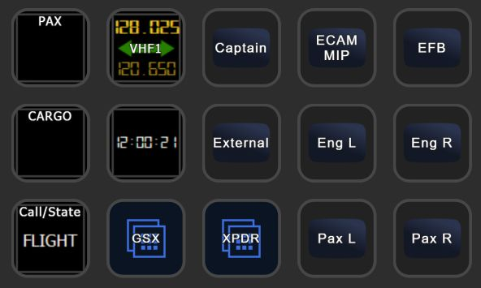

# Fenix A320 Files for PilotsDeck
Here you'll find a ready to use Example I use myself for the Fenix A320. A registered Version of FSUIPC7 is required.<br/>
My Setup consists of a XL Deck as the "Main Deck", the Plus Deck for FCU/Radio/EFIS and a SD Deck with supplementary/supportive Actions (GSX, Camera Buttons), so there are three Profiles designed to be used together:
- **MSFS-Fenix320-XL:** XL Profile with Folders for the different Flight Phases and Folders for Lights (Int+Ext), Overhead, EFIS/Glareshield, FCU, MCDU (Full Keyboard) and MIP/Pedestal
- **MSFS-Fenix320-Plus:** Plus Profile with Pages for EFIS, FCU, RMP, ACP, WXR, Displays and Lights (like Integral, Flood and Cabin). The EFIS, FCU and RMP Pages are directly near each other, so you can easily swipe-to-switch between them.
- **MSFS-Fenix320:** SD (15 Buttons) Profile for GSX-Actions/-State, XPRD, Clock and Camera Views<br/>

The *MSFS-Fenix320-SDLIB* Profile was removed and is discontinued: It is too Time consuming to update a Profile which Use-Case is debatable.

Mix and match as you like :relaxed:<br/>

<br/>
<br/>
<br/>
<br/>
<br/>
<br/>
<br/>

# Requirements / Installation
- Tested with Fenix **1.0.6.146** (07.11.22)
- Update PilotsDeck to at least **[0.7.8](https://github.com/Fragtality/PilotsDeck/releases)**!
- Fonts required are **"Digital 7"** and **"Alte Din 1451 Mittelschrift"** - you can find them freely on the Internet
- Just double-click on the Profiles you want to use to add them to your StreamDeck Software
- Place the Lua-Files in your FSUIPC7 Folder (the Folder where your FSUIPC7.ini is located respectively the Folder you have installed FSUIPC7 into)
- Add this to the myOffsets.txt File in your FSUIPC7 Folder for the Cabin Lights (create the File if it does not exist)
```
0x58AB, 4, LIGHT POTENTIOMETER:13, I32, percent
```
- The cameras.cfg is optional for the View-Buttons (they require the Installation of the vJoy-Driver, see below)! If you want to use it place it there: %appdata%\Microsoft Flight Simulator\SimObjects\Airplanes\FNX320
- Optional but recommended: Install at least Version **0.8** of the PilotsDeck_FNX Tool or else the FCU and other Displays won't work. Follow the Instructions [here](https://github.com/Fragtality/PilotsDeck_FNX).
- Either start the Scripts (Auto + Sync) manually ...
- ... or add them as Auto-Scripts to your FSUIPC7.ini. Start MSFS/FSUIPC7 once so the Files are added (if you're not familiar with adding them manually). Then add the following to your FSUIPC7.ini:<br/>
```
[Auto]
1=Lua GSX_AUTO

[Auto.FNX320]
1=Lua FNX320_AUTO
2=Lua FNX320_SYNC
```
Assuming your FSUIPC Profile associated with the Fenix is named "FNX320"! Replace that with the Name you use. If already using Auto-Scripts, change the Numbers accordingly (these Scripts don't need to be run first).<br/>
If you don't have a FSUIPC Profile for the Fenix, start them all as "Global" Scripts:
```
[Auto]
1=Lua GSX_AUTO
2=Lua FNX320_AUTO
3=Lua FNX320_SYNC
```
<br/>

# Description / Configuration
The Sync-Script synchronizes the FD-Buttons for both Captain and FO. If you don't want that, comment out (--) Line 16 (the call for the Function FNX_SYNC_FD)
<br/>

## Profiles
The View Buttons use the vJoy Device Driver and Custom Cameras. You have to install the vJoy Device Driver (and configure a Joystick), map the vJoy's Buttons to the "Load Custom Camera" Bindings and Save/Create your Custom Cameras for the respective Button. If you want to use these! When you don't want to use the View-Buttons you don't need the vJoy Driver installed. You could also build something similar with the Default StreamDeck "HotKey" Action (under System) - but this requires MSFS to have Input-Focus. The vJoy-Driver Buttons work regardless of which Application has Input-Focus, like your normal Joystick Buttons.<br/>
The Mapping for the provided Camera-Configuration:<br/>
| vJoy Button# | Mapping in MSFS | Title in Profile |
| --- | --- | --- | 
| 1 | Load Custom Camera 1 | Captain |
| 2 | Load Custom Camera 2 | Overhead |
| 3 | Load Custom Camera 3 | Pedestal |
| 4 | Load Custom Camera 4 | ECAM / MIP |
| 5 | Load Custom Camera 5 | MCDU |
| 6 | Load Custom Camera 6 | EFB |
| 7 | Load Custom Camera 7 | Eng L (Passenger, front of Engine) |
| 8 | Load Custom Camera 8 | Eng R (Passenger, front of Engine) |
| 9 | Load Custom Camera 9 | Pax L (Passenger View, behind Wing) |
| 10 | Load Custom Camera 0 | Pax R (Passenger View, behind Wing) |
| 11 | Toggle External View | External |
| 12 | Toggle Cockpit View | Cockpit |
<br/>

## FNX320_AUTO
This Script contains the Functions addressed by some Actions in the StreamDeck Profiles, it is essential for the StreamDeck Buttons to work. Some Functions are not used in the Profile (like Engine Masters) - I'll use them for my Thrustmaster TCA.<br/>
They are addressed via "LuaToggle:FNX320_AUTO:*NUM*" in PilotsDeck (or "LuaToggle FNX320_AUTO" with *NUM* as Parameter in FSUIPC). Which *NUM*ber maps to which Function can be found at the End of the File, if you want to use these Functions for own Buttons or FSUIPC-Mappings!<br/>

It contains also a "INIT" Function that helps when starting in the Cold and Dark State: it applies Power to Plane and sets some Basic Knobs and Switches and calls the Jetway/Stairs (like e.g. Integ/Flood Lights and Display Brightness).<br/>
<br/>

## FNX320_SYNC
This Script is essential for some Buttons / Displays from the StreamDeck Profiles to show their State / Value (Gear Indication, Baro, Landing Light).<br/>
The Script (and the Binary) use Offsets at 0x5400 and above to generate Informations for some Buttons - if these are used by some other Addon you have to change them in the Lua and the Profile (and the Configuration File of the Binary). This Offset-Range is normally associated with "Project Magenta".<br/>
<br/>

## GSX_AUTO and GSX_AUTO_FNX
These Scripts are used to integrate with GSX Pro and you only need them if you own it. The GSX_AUTO Script is not tied to the Fenix only, it can also be used with GSX and other Aircrafts!<br/>
With these Scripts you can call the GSX Services via LuaToggle Functions so they can be called via StreamDeck (or Joystick). They also generate 3 Values that can be displayed on the StreamDeck: Current Service State, Passenger De/Boarding Progress and Cargo Un/Loading Progress.<br/>
The easiest way is to use the "Call/State" Action on the StreamDeck, it always calls the next available Service: Refuel -> Cater -> Board -> Push -> Push Confirm ... Deboard (and then it starts over).<br/>
It operates the Jetways and Stairs automatically, so disable the automatic Jetway Handling in the Fenix EFB Sim/Plane Options!<br/>
<br/>

# Usage
I hope/think most Buttons should be self-explanatory. They are generaly configured in such a way to trigger the most common Action in the respective Phase. If applicable, they have a long Press for Off, Reset or a second Key:<br/>
- The 3-State (Off, Mid, On) Light Switches in the different Folders (XL-Profile) behave differently (to toggle the most common State for the according Flight-Phase):
  - In "Gate" they default to Off and toggle between Off<>Mid
  - In "Taxi" they toggle between Mid<>On. A long Press will set to Off.
  - In "Flight" they toggle between Off<>On. (Except Strobes)
  - In the Lights Folder it is Off->Mid->On->Off.
- The MDCU Menu Keys have long Presses: "INIT DATA" for Example will select the INIT-Page on a normal Press and the DATA-Page on a long Press.
- The FCU-Displays (on the XL-Profile) are also Buttons. They either toggle between Managed/Selected (normal Press) or toggle things like SPD/MACH, HDG/TRK, Alt Scale. The VS Display/Button is Pull (normal) or Push (long).
- For the FCU on the Plus-Profile works similar: Pushing the Knob wil toggle Managed/Selected and a Touch-Tap will toggle SPD/MACH and other Stuff. For VS it is: the Knob is Pull and the Touch-Display is Push.
<br/>
The GSX Integration is best use this way at the Moment:
- When starting your Session (cold and dark) power up the Plane with the "INIT" Button (it will call the Jetway or Stairs and connects the Ground AC)
- Call Refueling and Catering via the Call/State Button early (Fuel-Truck tends to drive long ways on some Airports)
- When the Fuel-Truck is in Position (and Hose is connected) you can call Boarding via the Call/State Button. Only then start the Loading from the EFB (Realtime, Fast, Instant). Else it could happen that the Fuel Truck is not leaving.
- Call Push via the Call/State Button - Chocks have to be removed manually! (GPU and Ground AC is disconnected automatically)
- (GSX) Deboarding is automatically called when the Plane has arrived (Engines are stopped). Fenix Deboarding has to be triggered manually, though.
- Turn Around possible! Start over with Refuel ;)
