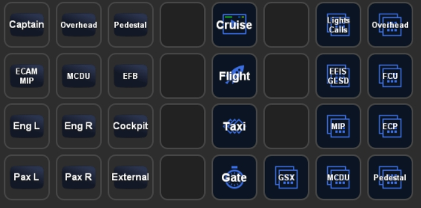

# Fenix A320 Files for PilotsDeck
Here you'll find a mostly working / ready to use Example I use myself for the Fenix A320. A registered Version of FSUIPC7 is required.<br/>
My Setup consists of a XL Deck as the "Main Deck" and a SD Deck with supplementary/supportive Actions (e.g. showing the FCU while being in the "Flight" Folder on the XL), so there are two Profiles designed to be used together:
- **MSFS-Fenix320-XL:** XL Profile with Folders for the different Flight Phases and Folders for Lights (Int+Ext), Overhead, EFIS/Glareshield, FCU, MCDU and MIP/Pedestal
- **MSFS-Fenix320:** SD (15 Buttons) Profile FCU, Radio and Transponder<br/>

There is also a third Profile for the SD called **MSFS-Fenix320-SDLIB**: It has most of the Buttons from the XL Profile in a Format openable on the SD. Not to be meant for direct use, but to allow SD Users to create their own Profile with that (copy & paste). It misses the MCDU Keyboard, FWD/AFT Calls and the ACP.

Mix and match as you like :relaxed:<br/>

<br/>
<br/>
<br/>
<br/>
<br/>
<br/>


# Installation
- Tested with Fenix 1.0.3.128 (25.09.22)
- Update to at least PilotsDeck 0.7.4!
- Uses the Fonts *"Digital 7"* and *"Alte Din 1451 Mittelschrift"* - you can find them freely on the Internet
- Just double-click on the Profiles you want to use to add them to your StreamDeck Software
- Place the Lua-Files in your FSUIPC7 Folder (the Folder where your FSUIPC7.ini is located)
- The cameras.cfg is optional (for the Views via vJoy-Driver Buttons)! If you want to use it: %appdata%\Microsoft Flight Simulator\SimObjects\Airplanes\FNX320
- Optional / Your choice: Install the PilotsDeck_FNX2PLD Binary for the FCU / Displays to work. Follow the Instructions [here](https://github.com/Fragtality/PilotsDeck_FNX).
- Either start the Scripts (Auto + Sync) manually ...
- ... or add them as Auto-Scripts to your FSUIPC7.ini. Start MSFS/FSUIPC7 once so the Files are added (if you're not familiar with adding them manually). Then add the following to your FSUIPC7.ini:<br/>
```
[Auto]
1=Lua GSX_AUTO

[Auto.FNX320]
1=Lua FNX320_AUTO
2=Lua FNX320_SYNC
```
Assuming your FSUIPC Profile is named "FNX320"! Replace that with the correct Name. If already using Auto-Scripts, change the Numbers accordingly (these Scripts don't need to be run first).<br/>
If you don't have a FSUIPC Profile for the Fenix, start them as "Global" Scripts:
```
[Auto]
1=Lua FNX320_AUTO
2=Lua FNX320_SYNC
```

# Configuration
The Sync-Script synchronizes the FD-Buttons for both Captain and FO. If you don't want that, comment out (--) Line 4 (the call for the Function FNX_SYNC_FD)

## Profiles
The View Buttons use the vJoy Device Driver and Custom Cameras. You have to install the vJoy Device Driver (and configure a Joystick), map the vJoy's Buttons to the "Load Custom Camera" Bindings and Save/Create your Custom Cameras for the respective Button. If you want to use these! When you don't want to use the View-Buttons you don't need the vJoy Driver installed. You could also build something similar with the Default StreamDeck "HotKey" Action (under System) - but this requires MSFS to have Input-Focus (the vJoy-Driver Buttons work regardless of which Application has Input-Focus - like your normal Joystick Buttons)<br/>
The Mapping I use:<br/>
| vJoy Button# | Mapping in MSFS | Title in Profile |
| --- | --- | --- | 
| 1 | Load Custom Camera 1 | Captain |
| 2 | Load Custom Camera 2 | Overhead |
| 3 | Load Custom Camera 3 | Pedestal |
| 4 | Load Custom Camera 4 | ECAM / MIP |
| 5 | Load Custom Camera 5 | MCDU |
| 6 | Load Custom Camera 6 | EFB |
| 7 | Load Custom Camera 7 | Eng L (Passenger, front of Engine) |
| 8 | Load Custom Camera 8 | Eng R (Passenger, front of Engine) |
| 9 | Load Custom Camera 9 | Pax L (Passenger View, behind Wing) |
| 10 | Load Custom Camera 0 | Pax R (Passenger View, behind Wing) |
| 11 | Toggle External View | External |
| 12 | Toggle Cockpit View | Cockpit |

## FNX320_AUTO
This Script contains the Functions addressed by some Actions in the Profiles. They are addressed via "LuaToggle:FNX320_AUTO:*NUM*" in PilotsDeck. Which *NUM*ber maps to which Function can be found at the End of the File! This Script is essential for these Buttons to work.
Some Functions are not used in the Profile (like Engine Masters) - I'll use them for my Thrustmaster TCA.<br/>
It contains also a "INIT" Function that helps when starting in the Cold and Dark State: it applies Power to Plane and sets some Basic Knobs and Switches (like e.g. Integ/Flood Lights).<br/>

## FNX320_SYNC
This Script is essential for some Buttons / Displays from the Profiles to show their State / Value (Gear Indication, Baro, Landing Light).<br/>
The Script (and the Binary) use Offsets at 0x5400 and above to generate Informations for some Buttons - if these are used by some other Addon you have to change them in the Lua and the Profile (and the Configuration File of the Binary). This Offset-Range is normally associated with "Project Magenta".<br/>

## GSX_AUTO and GSX_AUTO_FNX
These Scripts are used to integrate with GSX Pro and you only need them if you own it. The GSX_AUTO Script is not tied to the Fenix only, it can also be used with GSX and other Aircrafts! <br/>
With these Scripts you can call the GSX Services via LuaToggle Functions so they can be called via StreamDeck (or Joystick). They also generate 3 Values that can be displayed on the StreamDeck: Current Service State, Passenger De/Boarding Progress and Cargo Un/Loading Progress.<br/>
The easiest way is to use the "Call/State" Action on the StreamDeck, it always calls the next available Service: Refuel -> Cater -> Board -> Push -> Push Confirm ... Deboard (and then it starts over). <br/>

# Usage
I hope/think most Buttons should be self-explanatory. Some Buttons use a Long-Press Actions, for Example:<br/>
- Light Switches which have 3 States. The normal Action is to switch from Off to mid-Position with the Long Press Action to switch from mid-Position to On. In the "Taxi" Folder this is swapped (so that you can quickly toggle all Lights when entering/leaving the Runway).
- The FCU-Displays (between the +/- Buttons) are also Buttons. They either toggle between Managed/Selected (normal Press) or toggle things like SPD/MACH, HDG/TRK, Alt Scale. The VS Display/Button is Pull (normal) or Push (long).
