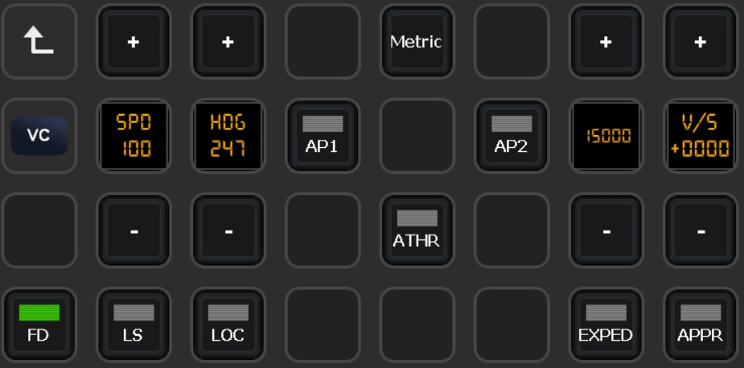

# FBW A32NX Files for PilotsDeck
Here you'll find a mostly working / ready to use Example I use myself for the FlyByWire A320 Neo. A registered Version of FSUIPC7 is required.<br/>
My Setup consists of a XL Deck as the "Main Deck" and a SD Deck with supplementary/supportive Actions (e.g. showing the FCU while being in the "Flight" Folder on the XL), so there are two Profiles designed to be used together:
- **MSFS-FBW32N-XL:** XL Profile with Folders for the different Flight Phases and Folders for Lights (Int+Ext), Overhead, EFIS, MCP, CDU and MIP/Pedestal
- **MSFS-FBW32N:** SD (15 Buttons) Profile FCU, Radio and Transponder

Mix and match as you like :relaxed:<br/>

<br/>
<br/>
<br/>

# Installation
- Current / latest Developing Build is required and .NET 6 Runtime required (x64 Core and Desktop).
- Uses the Fonts from FSLabs - you have to costumize all Actions yourself if you don't have them installed. Sorry! :/
- Just double-click on the Profiles to add them to your StreamDeck Software
- Place the Lua-Files in your FSUIPC7 Folder (the Folder where your FSUIPC7.ini is located)
- Either start the Scripts (Auto + Sync) manually ...
- ... or add them as Auto-Scripts to your FSUIPC7.ini. Start MSFS/FSUIPC7 once so the Files are added (if you're not familiar with adding them manually). Then add the following to your FSUIPC7.ini:<br/>
```
[Auto.FBW320]
1=Lua FBW320_AUTO
2=Lua FBW320_SYNC
```
Assuming your FSUIPC Profile is named "FBW320"! Replace that with the correct Name. If already using Auto-Scripts, change the Numbers accordingly (these Scripts don't need to be run first).<br/>
If you don't have a FSUIPC Profile for the FlyByWire, start them as "Global" Scripts:
```
[Auto]
1=Lua FBW320_AUTO
2=Lua FBW320_SYNC
```

# Configuration

## Profiles
As already stated, if you don't have the FSLabs Fonts you have to customize the Fonts-Settings for every Action. From my testing, the Plugin/.NET should default to another Font (like Sans Serif or something). So the Plugin/Profile should basically work.<br/>
The View Buttons use the vJoy Device Driver and Custom Cameras. You have to install the vJoy Device Driver (and configure a Joystick), map the vJoy's Buttons to the "Load Custom Camera" Bindings and Save/Create your Custom Cameras for the respective Button. If you want to use these! When you don't want to use the View-Buttons you don't need the vJoy Driver installed.

## FBW320_AUTO
This Script contains the Functions addressed by some Actions in the Profiles. They are addressed via "LuaToggle:FBW320_AUTO:*NUM*" in PilotsDeck. Which *NUM*ber maps to which Function can be found at the End of the File! This Script is essential for these Buttons to work.

## FBW320_SYNC
This Script is essential for some Buttons / Displays from the Profiles to show their State / Value (Gear Indication, Baro, Landing Light).

# Usage
I hope/think most Buttons should be self-explanatory. Some Buttons use a Long-Press Actions, for Example:<br/>
- Light Switches which have 3 States. The normal Action is to switch from Off to mid-Position with the Long Press Action to switch from mid-Position to On. In the "Taxi" Folder this is swapped (so that you can quickly toggle all Lights when entering/leaving the Runway).
- The FCU-Display (between the +/- Buttons) are also Buttons. They either toggle between Managed/Selected (normal Press) or toggle things like SPD/MACH, HDG/TRK, Alt Scale. The VS Display/Button is Pull (normal) or Push (long).
