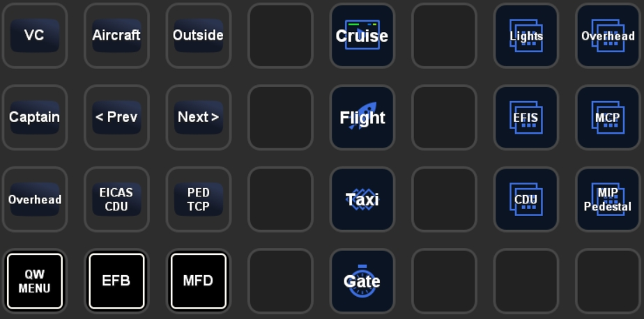
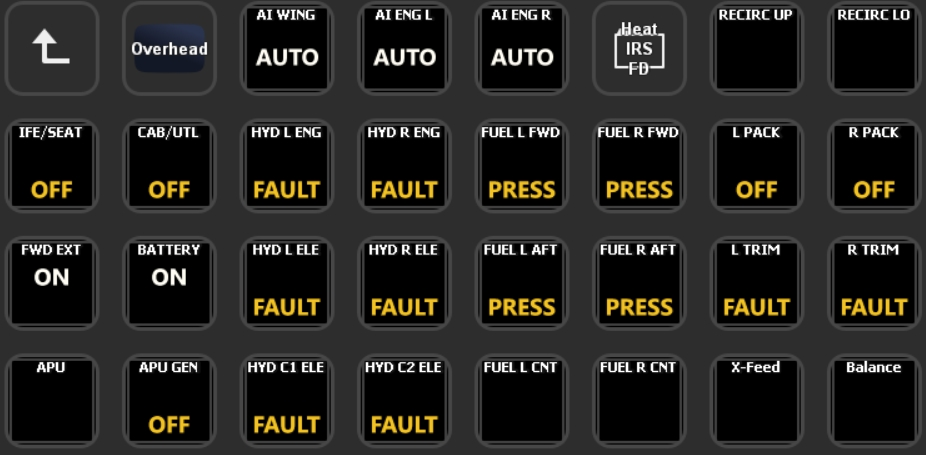

# QualityWings 787 Files for PilotsDeck
Here you'll find a working / ready to use Example I use myself for the QualityWings 787. A registered Version of FSUIPC is required.<br/>
My Setup consists of a XL Deck as the "Main Deck" and a SD Deck with supplementary/supportive Actions (e.g. showing the MCP while being in the "Flight" Folder on the XL), so there are two Profiles designed to be used together:
- **PilotsDeck_QW787-XL:** XL Profile with Folders for the different Flight Phases and Folders for Lights (Int+Ext), Overhead, EFIS, MCP, CDU and MIP/Pedestal
- **PilotsDeck_QW787-SD:** SD (15 Buttons) Profile with GSX Integration (see QualityWings2GSX), MCP, Radio and Transponder

Since not everyone has a XL Deck, I made the third Profile **PilotsDeck_QW787-Lib** which contains the Contents of the XL Profile so that they are visble on the SD.<br/>
Mix and match as you like :relaxed:<br/>

<br/>
<br/>
<br/>
<br/><br/>

# Installation
- Update to at least PilotsDeck 0.6.3
- Make sure the QualityWings Fonts are available System-Wide (should be the Case). The Profiles / the Actions are configured to use these Fonts to add more "Style" :wink:
- Just double-click on the Profiles to add them to your StreamDeck Software
- Place the Files from the FSUIPC6 Folder in your FSUIPC6 Addon-Folder (the Folder where your FSUIPC6.ini is located)
- Either start the Scripts (Auto + Sync) manually ...
- ... or add them as Auto-Scripts to your FSUIPC6.ini. Start P3D/FSUIPC6 once so the Files are added (if you're not familiar with adding them manually). Then add the following to your FSUIPC6.ini:<br/>
```
[Auto.QW787]
1=Lua QW787_AUTO
2=Lua QW787_SYNC
```
Assuming your FSUIPC Profile is named "QW787"! Replace that with the correct Name. If already using Auto-Scripts, change the Numbers accordingly (these Scripts don't need to be run first).<br/>
If you don't have a FSUIPC Profile for the QW787, start them as "Global" Scripts:
```
[Auto]
1=Lua QW787_AUTO
2=Lua QW787_SYNC
```

# Configuration
Both Scripts have several Options which can be either set to "true" or "false". They are located directly at the Beginning.
## Profiles
When you use the Scripts as provided and made the QW Fonts available System-wide you don't need to change anything here - they should work right away.<br/>
Only the View Buttons might need Attention, if you want to keep/use them: I modified the Views/Cameras in my Aircraft.cfg, so the Actions don't switch to the labeled View with the Default Aircraft.cfg. You have to change the Control-Sequences accordingly. I've added my Aircraft.cfg (for the Dash9) here as a Reference, if interested (don' use it to override your Aircraft.cfg!).

## QW787_AUTO
This Script contains the Functions addressed by some Actions in the Profiles. They are addressed via "LuaToggle:QW787_AUTO:*NUM*" in PilotsDeck. Which *NUM*ber maps to which Function can be found at the End of the File! This Script is essential for these Buttons to work.
The File in this Repository is configured for "PilotsDeck only" Usage - so *qwInitGSX* and all other Options are disabled.
- *qwSyncP2Axpdr*: Let the "QW_XPDR_CYCLE" Function set Pilot2ATC's Transponder State. You need to set a Hotkey for that in P2A to "F20" (you can "push" that Key with the Script).<br/>Can't test it myself, but for the User who shared that with me it seems to work fine :sweat_smile:
- *qwInitAItoggle*: The "QW_INIT" Function can toggle the AI Traffic off and then on - so that it uses the (hopefully now) injected Weather from your Weather Engine.<br/>You have to set CTRL+X in FSUIPC as Hotkey for "Traffic Density Toggle" with the Parameter being the Percentage of AI Traffic.
- *qwInitBaroHPA*: The "QW_INIT" Function will set your Baro to hPa when executed.
- *qwInitGSX*: The "QW_INIT" Function will also intialize GSX (Reset at current Position, Call Jetway/GPU, Open L1 Door). Only usable with the GSX_AUTO (from QualityWings2GSX) and QW787_SYNC Scripts running!

## QW787_SYNC
This Script is essential for some Buttons / Displays from the Profiles to show their State / Value. On top of that it can do some Automations. When used with QualityWings2GSX/GSX_AUTO it is an essential Part of the GSX Integration. Look in the [QualityWings2GSX-Repo](https://github.com/Fragtality/QualityWings2GSX) for more Information.<br/>
The File in this Repository is configured for "PilotsDeck only" Usage - only *syncPilotsDeck* is set.
The Script uses the Offset-Range 0x5400 to 0x5445 (PMDG CDU0 / Project Magenta). If you use these already, you have to edit the Script and the Actions to other Offsets.
- *syncPilotsDeck*: The essential Setting for these StreamDeck Profiles to display something meaningfull on the MCP (Displays + Buttons) and Baro Actions :wink:
- *syncCabin*: Turn the Cabin Lights on/off with the Overhead Cab/Util Button
- *syncBrake*: If you have have a Joystick/Input Device like the TCA, the Parking Brake will be synced to that Buttons State. Configure both brake-Variables accordingly.
- *syncFD*: Set the FO's FD Switch to the State of the Captain's Switch
- *syncGSX*: Sync to Ground-Service Animations/Handling (External Power, Chocks, Pax & Service Doors, Cargo Doors & Lights). Only usable with the GSX_AUTO Script (from QualityWings2GSX) running!
- *syncChocksAndPower*: Set or Remove External Power available and Chocks when Jetway/GPU is connected or removed. *syncGSX* has to be true for that. Can be temporarily overidden when Tow Power is ON.
- *operateJetways*: Automatically remove or call Jetway/GPU.

# Usage
I hope/think most Buttons are self-explanatory, but the most confusing can be the MCP/AP. Always keep in Mind these Profiles where designed by a (virtual) "Bus-Driver" who only knews two Modes 😆<br/>

**MCP**

- All Plus/Minus Buttons belong to the respective Display - So the Plus/Minus above the Speed Display will increase/decrease the Speed, and so on.<br/>
- All Plus/Minus Buttons have an "increase/decrease Fast" configured as Long Press
- Speed-Window @ SD: Short for IAS<>MACH Display toggle, Long to toggle between VNAV and FLCH
- Speed-Window @ XL: Short for IAS<>MACH Display toggle, no Long Press
- Heading-Window @ SD: Short to toggle between HDG SEL and HDG HOLD, Long to toggle between HDG SEL/HOLD and LNAV
- Heading-Window @ XL: Short for HDG SEL, Long for HDG<>TRK Toggle
- VS-Window @ SD & XL: Short to activate VS Mode, Long to toggle between VS<>FPA Display
- Alt-Window @ SD: Short for Push ("Alt Intervention"? when in VNAV or else FLCH, Long to toggle between Auto/1000. The Display will insert a Space-Sign in the Altitude to indicate Auto/100 Mode.
- Alt-Window @ XL: Short for Push (always), Long to toggle between Auto/1000.
- A/T ARM L & R: Have a white Frame when armed
- "Unlabeled Button": This is the AP Disengage Bar - disenaged will show yellow/black Markings 😉

**Overhead**

- Left/Center/Right Hydraulic Pumps: Short for OFF to AUTO, then Short will toggle between AUTO/ON (On is not displayed, will still show "Auto"). Long for AUTO to OFF (must be in Auto for this)
- Auto-Brake: Only allows Toggle between RTO and OFF while on Ground. In the Air it goes Off->1->2->3->4->Max->Disarm/Off.
- XPDR: Short to toggle between XPDR<>TARA, Long to toggle between XPDR<>STBY
 

# Troubleshooting
The QW787 is very vulnerable to "Loading Order Issues" it seems. For Reasons unknown, some Combination of QW and (GSX or FSUIPC Auto Scripts or RAAS Pro or whatever) can trigger the 787 being loaded with all Indication Lights on (the Switch is permanently in On/Test Position). The Plane is working normally, so let the Init-Script take care of that or move the Switch manually.<br/>
I've tried to avoid it as much as I can with the Scripts sleeping the first 30 Seconds before doing anything. You might try playing with the the FSUIPC Options "InitDelay" (30-45) and "InitialStallTime" (15-20), I could at least reduce this Effect with that.<br/>
Should I EVER find the real Root-Cause, I'll let you know and will fix or at least try to workaround that! So far FSDT and FS2Crew denied that GSX/RAAS could trigger something like that. QualityWings does not have answered yet.
