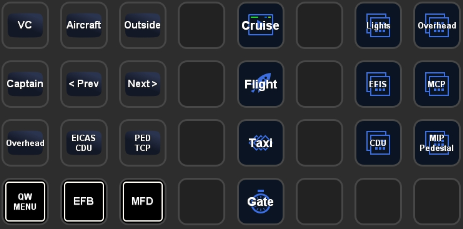
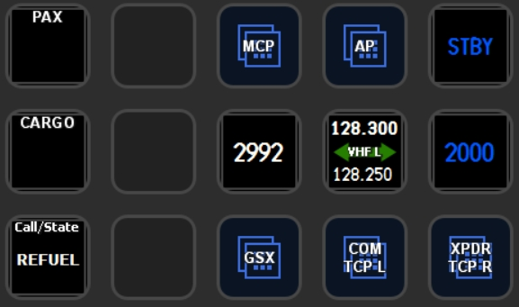
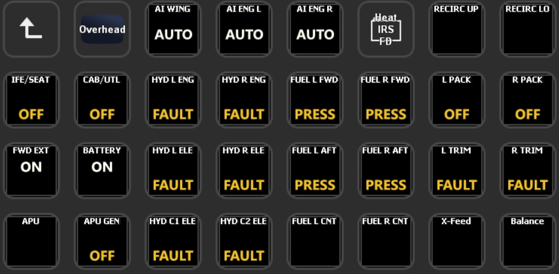
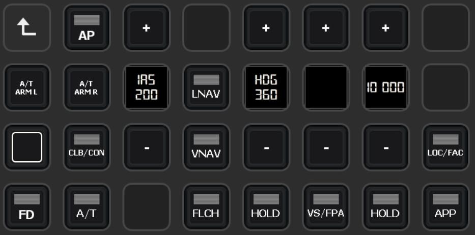

# QualityWings 787 Files for PilotsDeck
Here you'll find a working / ready to use Example I use myself for the QualityWings 787. A registered Version of FSUIPC is required.<br/>
My Setup consists of a XL Deck as the "Main Deck" and a SD Deck with supplementary/supportive Actions (e.g. showing the MCP while being in the "Flight" Folder on the XL), so there are two Profiles designed to be used together:
- **PilotsDeck_QW787-XL:** XL Profile with Folders for the different Flight Phases and Folders for Lights (Int+Ext), Overhead, EFIS, MCP, CDU and MIP/Pedestal
- **PilotsDeck_QW787-SD:** SD (15 Buttons) Profile with GSX Integration (see QualityWings2GSX), MCP, Radio and Transponder

Since not everyone has a XL Deck, I made a third Profile ("PilotsDeck_QW787-Lib") which contains the Contents of the XL Profile so that they are visble on the SD.<br/>
Mix and match as you like :relaxed:<br/>

<br/>
<br/>
<br/>
<br/><br/>

# Installation
- Update to at least PilotsDeck 0.6.3
- Just double-click on the Profiles to add them to your StreamDeck Software
- Place the Files from the FSUIPC6 Folder in your FSUIPC6 Addon-Folder (the Folder where your FSUIPC6.ini is located)
- Either start the Scripts (Auto + Sync) manually ...
- ... or add them as Auto-Scripts to your FSUIPC6.ini. Start P3D/FSUIPC6 once so the Files are added (if you're not familiar with adding them manually). Then add the following to your FSUIPC6.ini:<br/>
```
[Auto.QW787]
1=Lua QW787_AUTO
2=Lua QW787_SYNC
```
Assuming your FSUIPC Profile is named "QW787"! Replace that with the correct Name. If already using Auto-Scripts, change the Numbers accordingly (these Scripts don't need to be run first).<br/>
If you don't have a FSUIPC Profile for the QW787, start them as "Global" Scripts:
```
[Auto]
1=Lua QW787_AUTO
2=Lua QW787_SYNC
```

# Configuration
Both Scripts have several Options which can be either set to "true" or "false". They are located directly at the Beginning.
## QW787_AUTO
This Script contains the Functions addressed by some Actions in the Profiles. They are addressed via "LuaToggle:QW787_AUTO:*NUM*" in PilotsDeck. Which *NUM*ber maps to which Function can be found at the End of the File! This Script is essential for these Buttons to work.
The File in this Repository is configured for "PilotsDeck only" Usage - so *qwInitGSX* and all other Options are disabled.
- *qwSyncP2Axpdr*: Let the "QW_XPDR_CYCLE" Function set Pilot2ATC's Transponder State. You need to set a Hotkey for that in P2A to "F20" (you can "push" that Key with the Script).<br/>Can't test it myself, but for the User who shared that with me it seems to work fine :sweat_smile:
- *qwInitAItoggle*: The "QW_INIT" Function can toggle the AI Traffic off and then on - so that it uses the (hopefully now) injected Weather from your Weather Engine.<br/>You have to set CTRL+X in FSUIPC as Hotkey for "Traffic Density Toggle" with the Parameter being the Percentage of AI Traffic.
- *qwInitBaroHPA*: The "QW_INIT" Function will set your Baro to hPa when executed.
- *qwInitGSX*: The "QW_INIT" Function will also intialize GSX (Reset at current Position, Call Jetway/GPU, Open L1 Door). Only usable with the GSX_AUTO (from QualityWings2GSX) and QW787_SYNC Scripts running!

## QW787_SYNC
This Script is essential for some Buttons / Displays from the Profiles to show their State / Value. On top of that it can do some Automations. When used with QualityWings2GSX/GSX_AUTO it is an essential Part of the GSX Integration.
The File in this Repository is configured for "PilotsDeck only" Usage - only *syncPilotsDeck* is set.
- *syncPilotsDeck*: The essential Setting for these StreamDeck Profiles to display something meaningfull on the MCP (Displays + Buttons) and Baro Actions :wink:
- *syncCabin*: Turn the Cabin Lights on/off with the Overhead Cab/Util Button
- *syncBrake*: If you have have a Joystick/Input Device like the TCA, the Parking Brake will be synced to that Buttons State. Configure both brake-Variables accordingly.
- *syncFD*: Set the FO's FD Switch to the State of the Captain's Switch
- *syncGSX*: Sync to Ground-Service Animations/Handling (External Power, Chocks, Pax & Service Doors, Cargo Doors & Lights). Only usable with the GSX_AUTO Script (from QualityWings2GSX) running!
- *syncChocksAndPower*: Set or Remove External Power available and Chocks when Jetway/GPU is connected or removed. *syncGSX* has to be true for that. Can be temporarily overidden when Tow Power is ON.
- *operateJetways*: Automatically remove or call Jetway/GPU.

# Customization
