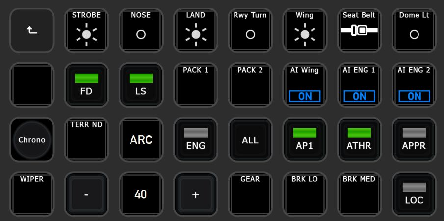
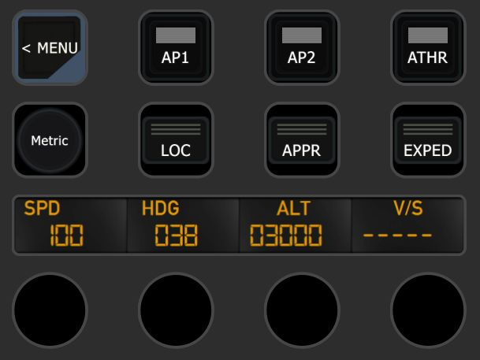
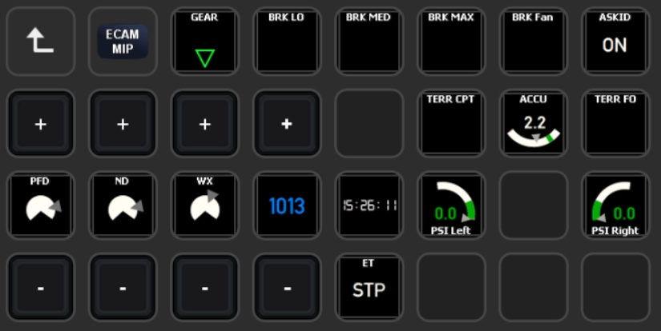
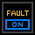
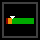
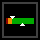
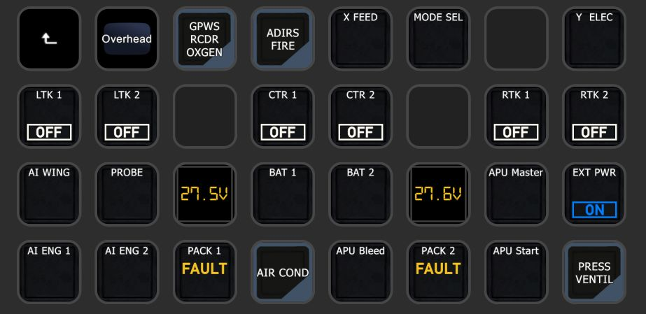
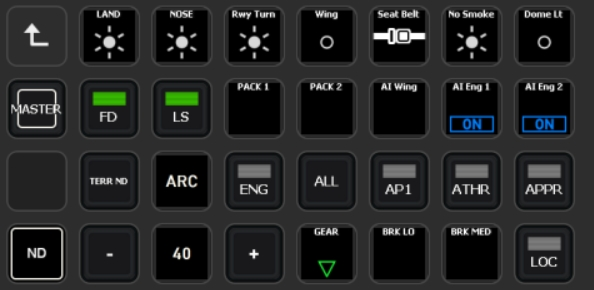
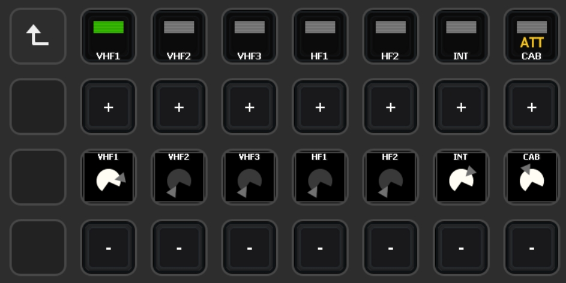
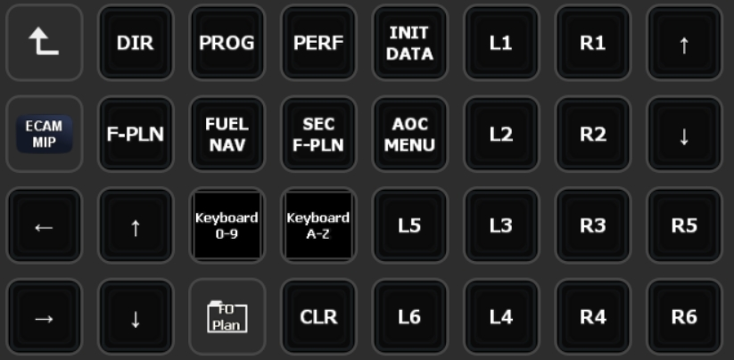

# Pilot's Deck
Directly check & control the FlightSim from your StreamDeck!
<br/><br/>

# 1 - Introduction
PilotsDeck is a Plugin for Elegato's StreamDeck with the Ability to **trigger Cockpit-Controls** in different Ways and especially reading & **displaying a Control's State** on the StreamDeck as Text, Image or even Bar/Arc. It is lean & mean, flexible, completely Open-Source and Free-to-Use. It does not do any fancy Stuff like a PFD - it does exactly what is needed to support smooth Flight Operations 😎<br/>

StreamDeck-wise it behaves like any other StreamDeck Plugin: it runs alongside other Plugins and you can Drag, Drop, Copy, Paste the Actions like any other Action in the StreamDeck Software between your Folders, Pages or even different StreamDecks. The Action Configuration is done through the standard "Property Inspector" of the StreamDeck UI and it is saved in the StreamDeck Profile. You can create, export and share Profiles with the Plugin's Actions to share their Configuration.<br/>
It can also switch StreamDeck Profiles based on the current Aircraft loaded (which is a bit tricky since not intended by the StreamDeck Software).<br/>
The Plugin supports different StreamDeck Models: **Mini**, **Standard**/15-Key, **XL**, **Mobile** and **Plus**. Other Models might work, but an indented Support for Non-Display Models is not planned. The Plugin runs only on **Windows**. There no Plans for Linux or macOS Support (the first is not supported by StreamDeck at all, both do not run or support all Sims and some essential .NET Libraries are only available on Windows).<br/>

Simulator-wise it supports all major Platforms on Windows - **MS Flight Simulator**, **X-Plane** and **Prepar3D**. For MS Platforms it connects through **FSUIPC** to the Simulator, for X-Plane it connects directly via **UDP** Sockets. Either way it will connect automatically as soon as a Simulator is running. All Variables and Commands these Connections allow are usable with the Plugin. You can can directly connect to another Sim without reconfiguring anything.<br/>
Not all Variables and Commands require a registered Version of FSUIPC, but a registered (bought) Copy of FSUIPC is recommended to use the full Potential. If you only fly in X-Plane, FSUIPC is not needed at all.<br/><br/>
It is designed for **advanced Sim-Users** which "know how to do Stuff": it does not make any unnecessary complicated Stuff, but doesn't have Features allowing to do anything without knowing anything 😅 If you know how to read Control-States for your Plane and how to trigger these Controls, you can quickly define Actions for that on the StreamDeck. If you don't: be eager to read & learn. 😉 I'll try to give some Background in the Readme, but you have to take it from there!<br/>

Predefined StreamDeck Profiles are available under [Integrations](Integrations/), but there are not much. Either your Plane is among these for direct Use or they can at least serve as Example:<br/>
<br/>
<br/>
<br/>
Other Examples can be found under [here](#examples).<br/>
<br/><br/><br/>

## 1.1 - Supported Simulator Versions

| Simulator | Supported | Tested | Requirement |
| :-------------|:-------------:|:-----:|:-----|
| **Flight Simulator 2020** | **yes** | **yes** | FSUIPC 7 & MobiFlight WASM |
| Flight Simulator X | yes | no | FSUIPC4 |
| Flight Simulator 2004 | yes | no | FSUIPC 3 |
| **Prepar3D v5** | **yes** | **yes** | FSUIPC 6 |
| Prepar3D v4 | yes | no | FSUIPC 5/6 |
| Prepar3D v1-3 | yes | no | FSUIPC 4 |
| **X-Plane 12** | **yes** | **yes** | None - does not use XUIPC |
| X-Plane 11 | yes | yes | None - does not use XUIPC |
| X-Plane <=10 | yes | no | None - does not use XUIPC |

Supported is understood as "technical and basically supported by the Connection Method". Support in Terms of ensured Compatibility, Fixing Issues and giving Support exists only for the latest Version of the three Major Simulators: MSFS2020, X-Plane 12, P3D v5. I'm happy if it works for older Versions, but I won't make any Effort for them. It is time to go back to the Future! 😅
<br/><br/><br/>

## 1.2 - Supported Sim-Commands & -Variables
Here a quick Overview of what you can send to the Simulator ("**Command**") or from what you can read Values from the Simulator ("**Variable**"). One of the Things which make the Plugin flexible: Variables can also be used as Commands. For Example to move a Cockpit-Control by writing a different Value to a Variable.<br/><br/>
How Commands and Variables are configured and the different Options how they can be executed is described under [2.1 - Defining Commands & Variables](#21---defining-commands--variables).<br/>

| ID | Description | Command | Variable | Simulators               | 
| :---: | :------------ | :---: | :---: | :-------------------- | 
| [**MACRO**](#macro) | Execute any Macro known to FSUIPC | ✔️ | ✖️ | MSFS*, P3D, FSX |
| [**SCRIPT**](#script) | Run any Lua-Code known to FSUIPC | ✔️ | ✖️ | MSFS, P3D, FSX |
| [**CONTROL**](#control) | Send any SimEvent defined by its numerical ID (also known as FS-Controls, Control-Codes. Numerical Variant of a K-Variable/K-Event) | ✔️ | ✖️ | MSFS, P3D, FSX, FS9 |
| [**LVAR**](#lvar) | Read from / Write to any L-Var ("Local Variable") | ✔️ | ✔️ | MSFS, P3D, FSX |
| [**OFFSET**](#offset) | Read from / Write to any FSUIPC Offset | ✔️ | ✔️ | MSFS, P3D, FSX, FS9 |
| [**VJOY**](#vjoy) | Toggle/Clear/Set a Button of a virtual Joystick from *FSUIPC* | ✔️ | ✖️ | MSFS, P3D, FSX |
| [**VJOYDRV**](#vjoydrv) | Toggle/Clear/Set a Button of a virtual Joystick from the known *vJoy Device Driver* (if installed) | ✔️ | ✖️ | ALL |
| [**HVAR**](#hvar) | Activate any H-Variable in the Simulator | ✔️ | ✖️ | MSFS |
| [**CALCULATOR**](#calculator) | Run any Calculator/Gauge Code in the Simulator - either direct RPN Code or as Template for Increasing/Decreasing L-Vars or triggering K-Vars | ✔️ | ✖️ | MSFS |
| [**XPCMD**](#xpcmd) | Send any Command known to X-Plane (as command_once) | ✔️ | ✖️ | XP |
| [**XPWREF**](#xpwref) | Read from / Write to any X-Plane DataRef | ✔️ | ✔️ | XP |
| [**AVAR**](#avar) | Read from / Write to any Simulation Variable (also known as A-Var) | ✔️ | ✔️ | MSFS |

\* = MSFS does not support Mouse-Macros<br/>
:grey_exclamation: Please mind that the Command Types Script, Macro, Lvar and vJoy can only work with a **registered** Version of FSUIPC!<br/>
:grey_exclamation: Both **vJoy** Command Types are independent of each other and are two different Things! "VJOY" can only be assigned within FSUIPC (and not in the Simulator). The "VJOYDRV" can be assigned by anything which understands a Joystick Button (Simulator, FSUIPC, Addons, ...).
<br/><br/><br/>

## 1.3 - Available StreamDeck Actions
All Actions work on the **Keypads** (the normal/square StreamDeck Buttons). The Dial/Touchpad (aka **Encoder**) on the SD+ is only supported by some Actions (the ones which make the most Sense).<br/><br/>
On Keypads you can assign **two** different Commands, based on how long you hold it: A **Short**/Normal and **Long** Press (>= 600ms). Only one of the available Actions can be put in StreamDeck Multi-Actions.<br/>
On Encoders you can assign **five** different Commands for each Interaction: **Left** Turn, **Right** Turn, **Touch** Tap and a **Short** & **Long** Press on the Dial. The Actions can be put in StreamDeck Encoder-Stacks, but will then lose their Short/Long Press Function.<br/><br/>
How these Actions can be configured and customized is described under [2.3 - Action specific Options](#23---action-specific-options). How to add Custom Images is described under [2.2.3 - Display Behavior & Custom Images](#223---display-behavior--custom-images)<br/>

|  | Action Name | Keypad / Encoder | Description |
| :---: | :-------------- | :---------: | :----------- |
|  | [**Display Value**](#display-value--display-value-with-switch) | Keypad | Display a Sim Variable as Number or Text (display "ON" instead of "1"). You can scale/round/format the Value as needed and customize the Font-Settings. Only for Display. |
|  | [**Display Value with Switch**](#display-value--display-value-with-switch) | Keypad / Encoder | Like before, but this Action also send Commands. |
|  | [**Simple Button**](#simple-button) | Keypad | Can only send Commands and always shows the same (configurable) Image. Supported in StreamDeck Multi-Actions! |
|  | [**Dynamic Button**](#dynamic-button) | Keypad | This Action dynamically changes the displayed Image based on a Variable (in Addition to sending Commands). Different Values trigger different Images. |
|  | [**Korry Button**](#korry-button) | Keypad | Intended for Korry-Switches in the Cockpit: the Action displays two "Sub-Images" independently of each other. They are shown/hidden based on their own Variable, but will not change the Image based on the Value. Can be adapted to other Use-Cases. |
|  | [**COM Radio**](#com-radio) | Keypad / Encoder | Intended for Com Frequencies: the Action shows two different Variables which can be independently scaled/rounded/formatted but share the same Font-Settings. Can be adapted to other Use-Cases. |
|  | [**Display Gauge**](#display-gauge) | Keypad / Encoder | This Actions renders the Value dynamically on a Bar or Arc. Size, Color, Position and Font-Settings can be tweaked. It can optionally send Commands. |
|  | [**Display Gauge (Dual)**](#display-gauge-dual) | Keypad | As before, but it renders two Values dynamically on the same Bar or Arc. |
|  | [**Profile Switcher**](#31---profile-switching) | Keypad | This not a "real" Action like the others, it is only there to map Profiles used for Switching. |

<br/><br/>

## 1.4 - Installation & Requirements
The best Way to Install and Update the Plugin is via the **Installer**: Download, Execute and click Install! It will check the Requirements, informs & links what it missing and installs the Plugin in the correct Location if the Requirements are met (the StreamDeck Software will be automatically stopped).<br/>
It is highly likely that you need to **Unblock/Exclude** the Installer & Plugin from BitDefender and other AV-/Security-Software. It's the number one Reason for "the Plugin is not working"-Issues.<br/>
If it still does not work right or at all, please check [3.3 - Troubleshooting](#33---troubleshooting).<br/><br/>
The Requirements for the Plugin to run:
- Windows **10** or **11** (updated)
- [**StreamDeck Software v6**](https://www.elgato.com/downloads)
- [**.NET 7**](https://dotnet.microsoft.com/en-us/download/dotnet/7.0) x64 Runtime (.NET Runtime and .NET Desktop Runtime. Do not confuse it with arm64!) installed & updated. Reboot when installing the Runtimes for the first Time.
- If used for MSFS/P3D/FSX: The **latest** Release of the [**FSUIPC**](http://fsuipc.com/) Major Version specific to your Simulator (e.g. FSUIPC 7 for MSFS2020)
- If used for MSFS: The **latest** Release of the WASM-Module from [**MobiFlight**](https://github.com/MobiFlight/MobiFlight-WASM-Module/releases) installed in your Community-Folder
- Optional: If you want to use **VJOYDRV** Commands you need Version [v2.2.1.1](https://github.com/njz3/vJoy/releases/tag/v2.2.1.1) for Windows 10 and Version [2.1.9.1](https://github.com/jshafer817/vJoy/releases/tag/v2.1.9.1) for Windows 11. It is not checked by the Installer (since it is not a Requirement for the Plugin).


<br/><br/>
If you want to install it manually (not recommened), just put the Contents of the Zip in your Plugin-Folder here:

 > %appdata%\Elgato\StreamDeck\Plugins

When Updating manually, delete all Binaries/Libraries in the Plugin's Folder before unzipping.<br/>
If you don't know what that means, why there is a Percent-Sign in the Path or don't know which Software Versions you have installed: Use the Installer!!! 😅<br/>
(Number 2 & 3 Reasons the Plugin is not working: Missing/outdated Requirements and wrong Location)

<br/><br/><br/>
# 2 - Action Configuration
Since the Plugin is very flexible, there is a "little" Learning Curve 😳 So I tried to break it down into 3 Parts:
- First of starting with the various Commands and Variables that can be defined in [2.1 - Defining Commands & Variables](#21---defining-commands--variables). Since triggering Actions in the Sim and reading Values from it is the Foundation to get any Use out of the Plugin, I try to give some basic Examples, Tips and Background as a basic starting Point. But I can't give you a full basic 101-Course here!
- The second Part [2.2 - Common Options](#22---common-options) describes the Common Options & Behavior which all or most Actions share. There you can also find how to add and use [Custom Images](#223---display-behavior--custom-images) with the Plugin.
- In the third Part [2.3 - Action specific Options](#23---action-specific-options) you'll find a Description of each Action on how they work and how they can be customized with their specific Options

<br/>

## 2.1 - Defining Commands & Variables
One of PilotsDeck's Core-Concepts is: everthing has/is an Address. So whether it is a Variable to read (e.g. L-Var/DataRef/Offset) or a Command to send (e.g. Control, Script, Calculator-Code): it is identified by the Address. A Command is defined by its Type and Address in the UI. A Variable for reading only by the Address.<br/>
Every Type needs a specific [Address Syntax](#211---address-syntax) to be used in the **Command Address** Field. Some Commands/Variables require extra Parameter and some Commands can also be **sequenced**. That means the Plugin will send multiple Commands with just one Button-Press!<br/><br/>
The Property Inspector UI has a Syntax-Check build in for every Type except for Calculator: When the Syntax is correct, you see a little Check-Mark in the Input Field. Everything you enter will also checked more thourougly by the Plugin before it executes a Command (if possible/trackable).<br/>
If a Command could not be executed by any Reason (invalid Syntax, Sim not connected) the Keypad will show an yellow Alert Sign briefly on the Display. On an Encoder the Touch-Display will shortly flash in red in that Case. (The standard StreamDeck Mechanic how Actions can show an Error/Warning)
<br/><br/>
Actions on Keypads have a **Main Command** and an optional **Second Command** when pressed longer (>= 600ms).<br/>
Actions on Encoders have the **Dial Left Command**, **Dial Right Command** and the **Touch Command** in Addition to Main and Second - these two will be used when you press the Encoder.<br/>
Based on the current Experience, the best Command Types to use on the Encoder (Left/Right) are CONTROL, HVAR, XPCMD and CALCULATOR (one of the Templates). That does not mean the others won't work, but these 4 give the "smoothest" or "direct" Feel when turning a Knob in the Cockpit (AP/FCU/MCP for Example).<br/>
The different Commands can each use a different Type, they don't need to be the same - the Main Command could be SCRIPT, the Left/Right Command could be CALCULATOR and the Touch Command LVAR for Example.
<br/><br/>

### 2.1.1 - Address Syntax

#### MACRO
| Command | MSFS, P3D, FSX | `File:Macro(:Macro)*` |
| --- | --- | --- |
- *File*: The Filename without Extension of the FSUIPC Macro-File.
- *Macro*: One or more Macros from that File to be executed in sequence.

*Examples*:
- `QW787_MAIN:QW_ENG1_START` - Run Macro *QW_ENG1_START* from Macro-File *QW787_MAIN.MCRO*.
- `FSLA3XX_MAIN:ACPACK1:ACPACK2` - Run Macro *ACPACK1* from Macro-File *FSLA3XX_MAIN.MCRO* and then *ACPACK2* from the same File.

<br/>

*Background*: Macro Files are a rather "rudimentary and legacy" Way to Script Actions in FSUIPC. In my Profiles I only use them in Prepar3D for "Mouse-Macros" which are able to Click Controls that can only be triggered with the Mouse (Mouse-Macros are not supported on MSFS). So if you don't know and have Macros, your Time is better invested to look at Lua (or maybe even RPN) :wink:<br/>
If you want to learn more about Macros, look at the "*FSUIPC7 for Advanced Users*" Document in your *My Documents\FSUIPC7* Folder (or \FSUIPC6 for P3D)!
<br/><br/><br/>


#### SCRIPT
| Command | MSFS, P3D, FSX | `(Lua\|LuaToggle\|LuaSet\|LuaClear\|LuaValue):File(:Flag)*` |
| --- | --- | --- |

- *Lua...*: The different Lua Controls defined by FSUIPC, you need to define exactly one.
- *File*: The Filename without Extension of the Lua-File known (!) to FSUIPC.
- *Flag*: Zero or more optional numeric Parameters to pass to the Lua-Script in sequence (for Toggle, Set, Clear or Value).

*Examples*:
- `Lua:Baro_Toggle` - Run Lua-Script *Baro_Toggle.lua*.
- `LuaToggle:FNX320_AUTO:12` - Toggle Flag *12* for Script *FNX320_AUTO.lua*.
- `LuaValue:Pilotsdeck_FSL:271:1` - Send Value *271* to Script *Pilotsdeck_FSL.lua* and then send Value *1* to the same Script.

<br/>

*Background*: The ability to run Lua Files is a Core-Feature of FSUIPC (at least for me!). Lua-Code is easier to write, understand and are more flexible than Marcos or RPN for Calculator-Code for Example. It greatly extends the Things you're able to do when pressing a Button on the StreamDeck - like automating GSX Calls or setting up your Aircraft from Cold & Dark for Example.<br/>
It also extends the Things you are able to read: you can run a Script in the Background which writes Values to the FSUIPC Custom Offset Range - for Example the combined State of both Landing Lights or the Contents of the Barometer Display. The Plugin can then read and display this Offset - with the Value which you generated/calculated in Lua. You can find real-world Examples form my Integrations under [Lua Examples](#32---lua-examples).<br/>
If you want to learn more about Lua-Scripts, look at the "*FSUIPC Lua Plug-Ins*" and "*FSUIPC Lua Library*" Documents in your *My Documents\FSUIPC7* Folder (or \FSUIPC6 for P3D)! Look at the Scripts that come with my Integrations or from other Users to understand how Lua can be used for different Things. Look at the *event.flag* and *event.param* Functions to understand how to use the LuaToggle and LuaValue Lua-Controls.<br/>

*Note for X-Plane Users*: You can achieve the same (and sometimes more) with the FlyWithLua Plugin for X-Plane! The Lua-Scripts there can define "Custom Commands" and "Custom DataRefs" which then can be used from the Plugin like any other X-Plane Command or DataRef.
<br/><br/><br/>


#### CONTROL
| Command | MSFS, P3D, FSX, FS9 | `Control=Parameter(:Parameter)*(:Control=Parameter(:Parameter)*)*` |
| --- | --- | --- |
- *Control*: The numerical ID of the Control (aka Event-ID). Multiple Controls can be separated with a `:` Sign.
- *Parameter*: Zero or more optional Parameters for that Control. The first Parameter needs a preceding `=` and following Parameter are separated with `:` again.

*Examples*:
- `66168:65567` - Send Control *66168* and then send Control *65567*.
- `66587=72476:72478` - Send Control *66587* with Parameter *72476* and then Control *66587* with Parameter *72478*.
- `67195=3:67191=3:4` - Send Control *67195* with Parameter *3* and then Send Control *67191* with Parameter *3* and after that with Parameter *4*.

<br/>

*Background*: In Essence, these Control-Codes are the numerical ID of the standard SimEvents documented in the MSFS/P3D/FSX SDK. You can find their numerical Values in the "*Controls List...*" Text-File in your *My Documents\FSUIPC7* Folder (or \FSUIPC6 for P3D)!<br/>
It is often used for Planes which are controlled via *Rotorbrake-Codes* like FSLabs: you need to send specific Parameters to the standard Rotor-Brake Control (hence the Name) to trigger a Cockpit-Control. Like in the second Example: That is how a LeftClick & Release is done on the Beacon-Switch (on FSL).<br/>
Note that these are the same as "Simconnect Events", "K-Vars" or "Key-Events" - So you can achieve the same with using Calculator-Code and the textual ID of that Event! It's two different Sides of the same Coin :wink:
<br/><br/><br/>


#### LVAR
| Command & Variable | MSFS, P3D, FSX | `(L:)Name` |
| --- | --- | --- |
- *Name*: The Name of the L-Var with or without preceding `L:`.

*Examples*:
- `I_OH_FUEL_CENTER_1_U` - Read from the L-Var *I_OH_FUEL_CENTER_1_U*.

When used as **Command**, you need to specify the **On Value** and the **Off Value**. The Plugin will toggle between these two Values and writes them to the Variable.<br/>
In addition to writing plain Values, the Plugin can also do simple Operations like increasing/decreasing the Value or toggling the Value in a defined Sequence. Look under [Command Options](#212---command-options) for Details.<br/><br/>

*Background*: Local Variables (sometimes "Local Gauge Variables") are created and updated by the Plane. There are no standard L-Vars which could be used on every Plane. There is also no communality if and which L-Vars a specific Plane has. For some Planes it is the official Way to Read and Trigger Cockpit-Controls (e.g. Fenix, QualityWings). For some it is only for Read (e.g. PMDG). For some they exist, but are not really supported or usable sometimes (e.g. FSLabs).<br/>
But they are not only used by Planes. Some Addons like GSX also create and update L-Vars which can be used to interface with them! You can list all (up to 3066) currently used L-Vars in the **FSUIPC7 UI**.
<br/><br/><br/>


#### OFFSET
| Command & Variable | MSFS, P3D, FSX, FS9 | `(0x)Address:Size(:Type:Signedness\|BitNum)` |
| --- | --- | --- |
- *Address*: The Address of the FSUIPC Offset as 4-Digit Hexadecimal Number, as documented in FSUIPC. The Hex Prefix `0x` is Optional.
- *Size*: The Size of this Offset in Bytes. A 1-digit (Decimal) Number.
- *Type*: Specify if the Offset is an Integer `i`, Float/Double `f`, Bit `b` or String `s`. Defaults to `:i` if not specified.
- *Signedness*: Specify if the Offset is Signed `s` or Unsigned `u`. Defaults to `:u` if not specified (only relevant for Integers).
- *BitNum*: Only for Offset-Type Bit, the Number/Index of the Bit to read from or write to.

*Examples*:
- `2118:8:f` - Read a *8* Byte long *float* Number from Address *2118* ("Turbine Engine 2 corrected N1").
- `3544:4:i:s` - Read a *4* Byte long *signed* *integer* Number from Address *3544* ("standby alitmeter in feet").
- `0x0ec6:2:i` - Read a *2* Byte long *unsigned* *integer* Number from Address *0EC6* ("Pressure QNH").
- `0x5408:10:s` - Read a *10* Byte long *String* from Address *5408*.
- `0x0D0C:2:b:1` - Read Bit *1* from the *2* Byte long Bitmask at Address *0D0C* (Nav Lights).

Before you use an Offset as **Command**, make sure that it is writeable (some are read-only)! When used as Command, you need to specify the **On Value** and the **Off Value**. The Plugin will toggle between these two Values and writes them to the Variable. Use only 1 or 0 for Bit-Offsets.<br/>
In addition to writing plain Values, the Plugin can also do simple Operations like increasing/decreasing the Value or toggling the Value in a defined Sequence. Look under [Command Options](#212---command-options) for Details.<br/><br/>

*Background*: These Offsets are the way how FSUIPC makes Simulator Variables (also known as A-Vars) accessible to outside Applications (like my Plugin for Example). FSUIPC sticks with that Concept for historical and compatibility Reasons. But not all Offsets are Simulator Variables: the Benefit of that System is that Applications can exchange Data through FSUIPC Offsets. For Example PMDG or Project Magenta use assigned Offset Ranges to share their Data. I use some of these Offset Ranges in my Integrations to exchange Data between Lua-Scripts and the Plugin.<br/>
You can find the **full List** of available/official Offsets in the "*FSUIPC Offsets Status*" Document in your *My Documents\FSUIPC7* Folder (or \FSUIPC6 for P3D)!<br/>
Since most Offsets represent Simulator Variables, you can achieve the same Thing with the *AVAR* Type in MSFS. Not all Simulator Variables are exported by FSUIPC (like "FUELSYSTEM PUMP SWITCH" for Example) - in that Cases you need to read this Variable via *AVAR*.
<br/><br/><br/>


#### VJOY
| Command | MSFS, P3D, FSX | `Joystick:Button(:t)` |
| --- | --- | --- |
- *Joystick*: The Number of the virtual Joystick to use, as documented in FSUIPC (Joystick 64 - 72).
- *Button*: The Number of the Button on that Joystick (Button 0 - 31).
- *Toggle*: The specified Button is handled as toggleable Button: The Plugin toggles the State of that Button between pressed and unpressed (it will remain in that State). Without this Option, the Keypad works like a normal Joystick-Button (it stays pressed as long as you press the Keypad).

*Examples*:
- `64:4` - The Keypad on the StreamDeck is recognized as Joystick *64*, Button *4* in FSUIPC.
- `72:2:t` - The Keypad on the StreamDeck will toggle Joystick *72*, Button *2* between pressed and unpressed in FSUIPC.

The additional **Long Press** Command will not be available when you use a non-toggling vJoy for the normal/short Press!<br/>
The VJOY Command can also be used on the **Encoders** and the Touch-Display. On these Interactions a non-toggle vJoy will be shortly pressed. A toggling vJoy will be toggled on every Interaction.<br/><br/>

*Background*: The virtual Joystick Facility of FSUIPC has nothing to do with the System Driver and can be used independently. So the Use-Cases are very narrow, but it can be a useful Feature. When you want to stick of doing your Mappings and Assignement mainly in the FSUIPC UI, you could use these vJoys to map the StreamDeck Keypads/Encoders.
<br/><br/><br/>


#### VJOYDRV
| Command | ALL | `Joystick:Button(:t)` |
| --- | --- | --- |
- *Joystick*: The Number of the virtual Joystick to use, as you configured in vJoyConf (Joystick 1 - 16).
- *Button*: The Number of the Button on that Joystick (Button 1 - 128).
- *Toggle*: The specified Button is handled as toggleable Button: The Plugin toggles the State of that Button between pressed and unpressed (it will remain in that State). Without this Option, the Keypad works like a normal Joystick-Button (it stays pressed as long as you press the Keypad).

*Examples*:
- `1:2` - The Keypad on the StreamDeck will set/clear Button *2* on the virtual Joystick *1*.
- `2:3:t` - The Keypad on the StreamDeck will toggle Button *3* on the virtual Joystick *2* between pressed and unpressed.

The additional **Long Press** Command will not be available when you use a non-toggling vJoy for the normal/short Press!<br/>
The VJOYDRV Command can also be used on the **Encoders** and the Touch-Display. On these Interactions a non-toggle vJoy will be shortly pressed. A toggling vJoy will be toggled on every Interaction.<br/>
Note that this Command is also only executed when the Plugin is in the Ready State (connected to a Simulator) like all other Commands. So it is normal to see the Alert Sign on the StreamDeck an no Activity in the vJoy Monitor. If you want to use vJoys in other Games or Simulators, you can use the vJoy Plugin from [ashupp](https://github.com/ashupp/Streamdeck-vJoy)!<br/><br/>

*Background*: Using virtual Joysticks is really a great Feature and Solution for specific Use-Cases! For Example when you want to **press and hold** Cockpit-Controls from the StreamDeck (e.g. Fire-Test Buttons). Or when the Simulator has Commands which can only be triggered with a Joystick-Mapping (e.g. Custom Cameras in MSFS). It is especially useful in X-Plane to circumvent the API-Limitation that X-Plane Commands can only be send as "command_once".
<br/><br/><br/>


#### HVAR
| Command | MSFS | `Name(:Name)*` |
| --- | --- | --- |
- *Name*: The Name of the H-Var with or without preceding `H:`. You can activate multiple H-Vars in a Sequence if you separate them with a `:` Sign.

*Examples*
- `A32NX_EFIS_L_CHRONO_PUSHED` - Activate the H-Var named *A32NX_EFIS_L_CHRONO_PUSHED*.
- `A320_Neo_CDU_1_BTN_F:A320_Neo_CDU_1_BTN_L` - Activate H-Var *A320_Neo_CDU_1_BTN_F* first and then activate H-Var *A320_Neo_CDU_1_BTN_L*.

<br/>

*Background*: H-Vars are a new Simulation Variable Type that came with MSFS and work roughly similiar like K-Vars - they trigger an Event but can not be read. Note that you don't need to configure and use the Hvar-Files from FSUIPC for the Plugin. You can use any known and existing H-Var from the Plugin directly.
<br/><br/><br/>


#### CALCULATOR
| Command | MSFS | `RPN-Code \| $Name:Step(:Limit) \| $K:Name(:Parameter)` |
| --- | --- | --- |
- *RPN-Code*: The Code in normal RPN Syntax you want to run with the execute_calculator_code Function.

For simple Tasks like increasing/decreasing a L-Var you can use the `$Name:Step(:Limit)` Template (the Plugin will build the right RPN-Code for that):
- *Name*: The Name of the L-Var with or without preceding `L:`.
- *Step*: The positive/negative Number by which the Variable is increased/decreased. A Plus-Sing for a positive Number is optional.
- *Limit*: The Variable will not be increased/decreased beyond that optional Limit.

For simple Tasks like triggering a K-Var (Event) you can use the `$K:Name(:Parameter)` Template (the Plugin will build the right RPN-Code for that):
- *Name*: The Name of the K-Var to trigger, you have to prefix it with `K:`.
- *Parameter*: The optional numeric Parameter to send.

*Examples*
- `(A:LIGHT POTENTIOMETER:13, percent over 100) 0.0 > if{ (A:LIGHT POTENTIOMETER:13, percent over 100) 0.1 - 100 * (>K:LIGHT_POTENTIOMETER_13_SET) }` - Example of RPN Code (Decreasing Cabin Lights in the Fenix Airbus).
- `$E_FCU_SPEED:+1` - Increase L-Var *E_FCU_SPEED* by *1*.
- `$A_ASP_VHF_1_VOLUME:-0.05:0` - Decrease L-Var *A_ASP_VHF_1_VOLUME* by *0.05* until it is *0*.
- `$K:FUELSYSTEM_PUMP_TOGGLE:2` - Trigger the Standard Event *FUELSYSTEM_PUMP_TOGGLE* with Parameter *2*.
- `$K:A32NX.FCU_SPD_DEC` - Trigger the Custom Event *A32NX.FCU_SPD_DEC*.

Templates have to start with the Dollar-Sign!<br/>
Note that there is no Syntax-Checking at all for Calculator Code (except for the Templates). Only use direct RPN-Code if you are used to it.<br/><br/>

*Background*: Calculator-Code or sometimes Gauge-Code are an internal Mechanic of the Simulator - very roughly spoken it is how the modeled Aircraft Panels work inside for Ages.<br/>
The Template for K-Vars is very useful when a Plane has **Custom Events** (e.g FBW, PMDG) since calculating their numerical ID is a bit complicated. With the Template you can directly use the Name. These are usually found in the SDK or API Reference for that Plane. The full List of **Standard Events** can be found in the Flight Simulator SDK under [Event IDs](https://docs.flightsimulator.com/html/Programming_Tools/Event_IDs/Event_IDs.htm).<br/>
The Template for increasing/decreasing L-Vars is especially useful on the Right/Left Turn of the **Encoders**: The Plugin will incoporate the number of Ticks received by the StreamDeck Software in the Code it generates (instead of repeating it). That means that it is the "smoothest" Option to manipulate a L-Var with an Encoder!<br/>
Although RPN Syntax is very hard to understand (I still struggle 😵), it is a very powerful Feature. The Code has Access to all Variable-Types of the Simulator and can therefore do Things which Lua-Scripts can not do - like in the Example for the Fenix Cabin Lights!<br/>
If you really want to go down the Rabbit Hole of using direct RPN-Code, start in the Flight Simulator SDK under [Reversed Polish Notation](https://docs.flightsimulator.com/html/Additional_Information/Reverse_Polish_Notation.htm).
<br/><br/><br/>

#### XPCMD
| Command | XP | `Path(:Path)*` |
| --- | --- | --- |
- *Path*: The Path to the Command as published. You can send multiple Commands in a Sequence if you separate them with a `:` Sign.

*Examples*
- `toliss_airbus/aircondcommands/Pack1Toggle` - Single Command
- `AirbusFBW/PopUpPFD1:AirbusFBW/PopUpND1` - Two Commands in Sequence

<br/>

*Background*: Every Command in X-Plane - whether it is from the Simulator, Plane or other Addons - has an unique Path. You can lookup these Paths in the UI or on the Internet like on [siminnovations.com](https://www.siminnovations.com/xplane/command/). Or you can use the DataRefTool Plugin to explore all Commands (including Custom) currently known to the Simulator.
<br/><br/><br/>


#### XPWREF
| Command & Variable | XP | `Path([index]\|:sNUM)` |
| --- | --- | --- |
- *Path*: The Path to the DataRef as published.
- *\[index\]*: (Optional) The Index to access, if the DataRef is an Array.
- *:sNUM*: If the DataRef is a String, you need to add `:s` to the Path followed by the Number of Characters to read.

*Examples*
- `ckpt/lamp/74` - Reading a Value from a normal DataRef.
- `AirbusFBW/FuelOHPArray[2]` - Reading a Value (on Index *2*) from the Array under this Path.
- `FlyWithLua/TLS2PLD/fcuHdg:s8` - Reading a *String* of Length *8* from that Path.

Before you use a DataRef as **Command**, make sure that it is writeable (some are read-only)! When used as Command, you need to specify the **On Value** and the **Off Value**. The Plugin will toggle between these two Values and writes them to the Variable.<br/>
In addition to writing plain Values, the Plugin can also do simple Operations like increasing/decreasing the Value or toggling the Value in a defined Sequence. Look under [Command Options](#212---command-options) for Details.<br/><br/>

*Background*: Every Simulator Variable (called DataRef) in X-Plane - whether it is from the Simulator, Plane or other Addons - has an unique Path. DataRefs are Everthing and Everything is defined by DataRefs 😅<br/>
You can lookup these Paths in the X-Plane SDK under [Datarefs](https://developer.x-plane.com/datarefs/). Or you can use the DataRefTool Plugin to explore all DataRefs (including Custom) currently known to the Simulator.
<br/><br/><br/>


#### AVAR
| Command & Variable | MSFS | `(A:Name(:index), Unit)` |
| --- | --- | --- |
- *Name*: The Name of the A-Var as published. You have to prefix it with `A:` and the whole Expression must be enclosed by Parenthesis `( )`.
- *:index*: (Optional) The Index to access, if the A-Var is a Map/Enum/Mask.
- *Unit*: The Unit of the A-Var as published separated by a `,` from the Name.

*Examples*
- `(A:FUEL RIGHT QUANTITY, Gallons)` - Reading the A-Var *FUEL RIGHT QUANTITY* using *Gallons* as Unit.
- `(A:FUELSYSTEM PUMP SWITCH:2, Bool)` - Reading Index *2* of the A-Var *FUELSYSTEM PUMP SWITCH* as *Bool* Value.
- `(A:LIGHT POTENTIOMETER:13, percent over 100)` - Reading Index *13* of the A-Var *LIGHT POTENTIOMETER* as *Percent over 100* Value (0.0 - 1.0).

Before you use an A-Var as **Command**, make sure that it is writeable (some are read-only)! When used as Command, you need to specify the **On Value** and the **Off Value**. The Plugin will toggle between these two Values and writes them to the Variable. Use only 1 or 0 for Booleans.<br/>
In addition to writing plain Values, the Plugin can also do simple Operations like increasing/decreasing the Value or toggling the Value in a defined Sequence. Look under [Command Options](#212---command-options) for Details.<br/><br/>

*Background*: A-Var (or SimVars) are the standard Simulator Variables defined by Flight Simulator (2020 and Predecessors). There are no "custom" A-Vars. Default Planes normally only use A-Vars but complex and externally simulated Planes use/update only a Fraction of them. MSFS still sticks to the legacy System of many different and weird Units which have to be passed for Access to a Variable. You can look up these Units in the Flight Simulator SDK under [Simulation Variable Units](https://docs.flightsimulator.com/html/Programming_Tools/SimVars/Simulation_Variable_Units.htm).<br/>
Since the Plugin can access all A-Vars, you can use Variables which are not exported as FSUIPC Offset without the Need of defining a myOffsets File for FSUIPC. Or even to completely circumvent FSUIPC Offsets at all if you prefer calling Things by their Name :wink:<br/>
A **full List** of all A-Vars with their according Unit (and if writable) can be found in the SDK under [Simulation Variables](https://docs.flightsimulator.com/html/Programming_Tools/SimVars/Simulation_Variables.htm).
<br/><br/><br/>

### 2.1.2 - Command Options
<br/>

**On Value** / **Off Value**: This Fields are required for all Command & Variable Types. The Plugin will toggle between these two Values: when the current Value matches the Off Value, it will write the On Value. In every other Case the On Value will be written.<br/><br/>
But the Plugin can also do simple **Value Manipulations** on the Variable to increase/decrease the Value or write a Sequence of Values. These Value Manipulations always start with a `$` Sign and need to be entered in the **On Value** Field (the **Off Value** Field is not used then).<br/>
The Syntax for increasing/decreasing is `$Step(:Limit)`
- `$1` - A simple Increment by *1*.
- `$1:4` - Increment by *1* up to a Value of *4*.

The Values in a Sequence are defined as `,` separated List. The Plugin will compare the current Value with the List - if the Value is matched, it will write the next Value from the List to the Variable. If there is no match, it will use the last Value in the List. One Value can optionally be defined as Default with a `=` in Front of it. A Sequence must contain at least two Values with an optional Default Value or exactly one Value defined as Default. All Values in the List must be unique with the Exception of the last one.<br/>
A optional `<` at the End lets the Value "bounce off" - if the current Value is already the last one in the List, the previous Value is written.<br/>
*Examples*
- `$0,1,2<` - When the Control is in Position *0*, it will be moved to Position *1*. Then from *1* to *2*. When at *2*, it will go back to *1*. (e.g. for toggling Taxi Lights OFF>ON<>T.O.)
- `$=4` - The Control is always moved to Postion *4*, regardless of the current Position. (e.g. for setting ND Mode to PLAN from any Position)
- `$2,=3<` - The Control will toggle between Position *2* and *3*. If the Control is in any other Position it will default to *3*. (e.g. for toggling ND Mode between NAV<>ARC and go to ARC from any other Position)
- `$0,1,2,3,1` - Moves the Control from Position *0* to *3*. When in Position *3* it starts over at Position *1*.

<br/><br/>

**Toggle Switch**: This Option is available for all Commands except Variables & both vJoys. It allows you to control/toggle a Switch with a second Command defined by the **Alternate Command Address** - for Example for Push/Pull or Left/Right. Both Commands need to be of the same Type. Which Command is used will be deciced by the Plugin based on the current Value of the Variable you define in the **Monitor Address** Field.<br/>
When the current Value matches the configured **Off Value**, the Plugin will use the alternate Command. In every other case the normal Command will be used. You can specify a Comparison like `>5` which will be interpreted as "*if* the current Value is > 5, *then* use the alternate Command". The **On Value** Field is not used with this Option.<br/>
Note that this Option is only available for the Main Command - (short) Pressing the Keypad or Encoder.<br/>
*Examples* when to use: Push/Pull Knobs like for Barometers or the Autopilot are a great Use-Case for that Option.
<br/><br/><br/>


**Hold Switch**: This Option is available for all Commands except both vJoys, because the Keypad or Encoder behaves like a (non-toggle) vJoy then! The Difference to a vJoy is: you can directly define which Command or Value is send in the StreamDeck UI. If it makes Sense for a specific Cockpit-Control: the Control needs to stay in Position (does not reset the Position itself) and needs to have two distinct Commands or Values for pressed and unpressed (click<>release, down<>up)!<br/>
If you use it with a Command(-only) Type, you need to define an **Alternate Command Address**. The normal Command will be send on KeyDown and the alternate Command on KeyUp.<br/>
If you use it with a Command & Variable Type, you need to define the **On Value** and the **Off Value**. Then On Value will be written on KeyDown and the Off Value on KeyUp. You can not use a Value Manipulation with that Option.<br/>
Note that when Hold Switch is enabled, the Action can not have another Command for **Long Press**. It is also only available for the main Interaction.<br/>
Also note that this Option is only available Main Command - (short) Pressing the Keypad or Encoder.<br/>
*Examples* when to use: Buttons you need to press & hold like Fire-Test or other Test Buttons are a great Use-Case for that Option.
<br/><br/><br/>


**Reset Switch**: This Option is only available for Command & Variable Types. When activated, the Plugin will write the **On Value** to the Variable and after 100ms (2 \* Control Delay) it will write the **Off Value** to the Variable. You can not use a Value Manipulation with that Option.<br/>
Note that this Option affects all Commands on that Keypad/Encoder! So for Example if enabled on the Main Command, it will also applied to the Second Command or Touch Command (if these are also a Command & Variable Type).<br/>
*Examples* when to use: Buttons which do not reset their Position when being pressed (but should not stay pressed). Like the MCDU Keys of the Fenix Airbus for Example! Prefer a Reset Switch over an Hold Switch in such Cases (the Button just has to be pressed and unpressed shortly).
<br/><br/><br/>


**Use Delay**: This Option is available for some Command(-only) Types - the ones which allow to chain Commands / execute multiple Commands in a Sequence. Some Planes/Cockpit-Controls don't recognize the Commands correctly when they come in too fast. In these Cases you can enable the Option so that the Execution of the next Command is delayed by 50ms (1 \* Control Delay). The Delay is only used if there is more than one Command/Parameter.<br/>
Note that this Option affects all Commands on that Keypad/Encoder! So for Example if enabled on the Main Command, it will also applied to the Second Command or Touch Command (if these are also belong to these Command Types).
<br/><br/><br/>

## 2.2 - Common Options
<br/>

### 2.2.1 - Common Input Style
Generally, most of the Configuration is defined in Text-Input-Fields. This is on Purpose so that Parts of the Configuration can quickly be changed and easily be copied between Actions.<br/><br/>
If a Field requires multiple numeric Values - like Sizes, Positions and Ranges - the Values must be separated by a semicolon. For Example: `0; 10` or `9; 14; 54; 20`<br/><br/>
Mostly all Fields which accept numeric Values understand Float-Values also with either Decimal-Character independent of your System Locale (so `0,5` and `0.5` is the same for the Plugin). All Float-Values rendered by the Plugin will use a Decimal-Point **`.`** though!<br/><br/>
If a Field/Syntax requires multiple Parameters, the Parameters are separated by colon **`:`**<br/><br/>
If a Field/Syntax requires a Mapping or Assignment it is defined by an equal-Sign **`=`** . Some allow even simple Value-Comparisons like **`<=`**, **`>=`**, **`<`** or **`>`**.
- A single Comparison like **`>=5`** will be interpreted as "*if* the current Value is >= 5, *then* use/trigger this Option". Equality is automatically tested if just a Number is present (do not add the Equal-Sign for that).
- A Comparison in a Mapping can only be with Equality (`<=` or `>=`) and a Comparison like **`5>=X`** will be interpreted as "*if* 5 is >= the current Value, *then* use/display X".

<br/>

### 2.2.2 - Common Options
**Decode BCD**: If the Value is a binary coded decimal (BCD), the Plugin can decode it for you with that Checkbox!<br/><br/>

**Scalar**: Multiply the Value by that Number to scale it, if it needs to be converted. Defaults to 1.<br/>One Example would be "Pressure QNH as millibars" - it is delivered as multiple of 16 (e.g. 1013 = 16208). So we would scale it by `0.0625` (1/16) to have the right Value.<br/><br/>

**Format**: Add leading Zeros, Round the Value and/or add Text to it. Syntax: `Zeros.Fraction:Text %s Text`
  - *Zeros*: Leading Zeros will be added so that the Value has always the same number of integral Digits. Optional, but can only be specified together with *Fraction*.
  - *Fraction*: Define to how many fractional Digits the Value should be rounded (can be zero to produce an Integer). If not specified, the Value is not rounded at all.
  - *Text*: The Value is inserted at the `%s` in the Text you specify here. E.g. to add Units to the Value with `%s kg` or a Percent-Sign with `%s %`. Or put something in Front of it. Every %s will be replaced by the Value. If Zeros/Digits are not specified, you don't need to add a colon.<br/>
  - *Examples*
    - `1`     One fractional Digit after the Decimal Point, a Value of 20.522534 will be displayed as `20.5`. Match for zero would be 0.0.
    - `2:1%s` Two fractional Digits and add an "1" before the Text - useful for the BCD encoded Frequencies!
    - `%s ft` Add "ft" after the Value, 300 will show as `300 ft`
    - `3.3`   The Value will have 3 Digits before and after the Decimal Point, a Value of 20.522534 will be displayed as `020.523`.

The Order in which these Options are applied: DecodeBCD -> Scale -> Round -> Format. If the Value is to be matched or mapped, it is done after Round and before Format.<br/><br/>

**Font Settings**: Actions which render Text will default to inherit the Font Settings configured in the Title Settings. When the **Inherit Font** Checkbox is disabled, you can specify the **Font**, **Size**, **Color** and **Style** separately! Note that the Plugin can use **all Fonts** installed on your System, so it offers way more Choices then the default Title Settings allow.<br/><br/>

**Background**: All Actions have a **Default Image** and a **Error Image** that can be configured. In most Cases the Default Image is the Background on which the Action renders. Some Actions have addtional Images that can be selected. The Error Image is used on all Actions when the Plugin is in the Error State (see [2.2.3](#223---display-behavior--custom-images)).<br/>
In all Cases, the Images are selecteable from a Dropdown Box which will show little Preview of the currently selected Image in Front of it.
<br/><br/>

**Tweak Position**: Some Actions allow you to manipulate the Position & Size of some Objects (Text, Images). It is expressed as **Draw Rectangle** defined by these 4 Parameter: `Pos-X; Pos-Y; Width; Height` - with a Position of X=0 and Y=0 being the Top-Left Corner. These are not absolute Numbers in Pixel, it is the Position and Size on a 72x72 Grid which then is scaled/adapted to the reals Size used for Rendering. So you can copy an Action between a SD and XL and the Position will stay the same.
<br/><br/>

<br/>

### 2.2.3 - Display Behavior & Custom Images
The Plugin has 4 different Main **States** that affect how and which Images is drawn:
- When no Simulator running it is in the **Idle** State: all Actions will have a static Image which resembles/previews their current Configuration. You don't need to have a Simulator running to do basic Configurations and directly see the visual Result!
- When a Simulator is running but not connected, ready or paused it is in the **Waiting** State: all Actions will show a hardcoded *Wait Image* (three white Dots on black Background). It can't do or show anything useful in that State, so just wait!
- When a Simulator Session is running normally it is in the **Ready** State: all Actions will be drawn according to their Configuration and current Value. All Actions are refreshed and redrawn every 200ms (5 fps) - but only if one of their Variables have changed!
- When a Simulator quits, crashes or does not react it is in the **Error** State: all Actions will show their configured *Error Image* until the Simulator is reconnected (goes back to Ready) or the Simulator's Executable terminates (goes back to Idle).
<br/><br/>

The Plugin **includes a basic Set** of Images with a more "iconograpic" Look for better Readability instead of realistic Looks. But if you want a **different visual Style**, you can easily add & select own Images or Images from great **IconPacks** like from Guenseli or others! Just copy/save it to the Images Sub-Folder of the Plugin:

 > %appdata%\Elgato\StreamDeck\Plugins\com.extension.pilotsdeck.sdPlugin\Images

You don't have to restart the Plugin, every new Image will be selectable/usable when you open the next Property Inspector. When an Image is updated, it needs to be "uncached" before the new File is read - make sure it is not used or configured in any Action currently visible and wait 30s (or just restart the StreamDeck Software in that Case).<br/>
The included Images can also be changed or even deleted (except Wait.png!) - but these Changes will be overwritten when the Plugin is updated.<br/>
To be usable the Image needs to be in **PNG** Format and must be **"square"** - having the same Height and Width. It will be automatically scaled to fit (but not stretched on an Encoder). For Encoders the Image should be "rectangular" - having a higher Width than Height.<br/><br/>

But for optimal Visual Results it is recommended to provide an Image in specific and multiple **Sizes**. The Plugin will then automatically select the Image-Size which is optimal for the StreamDeck an Action is on. These are:
- The "Standard" Size of 72x72 Pixel, for Example called `myImage.png` - it will be used for the Mini, SD and Mobile.
- The "HQ" Size of 144x144 Pixel with a `@2x` Suffix: `myImage@2x.png` - it will be used for XL, Plus Keypads.
- The "Plus" Size of 200x100Pixel with a `@3x` Suffix: `myImage@3x.png` - it will be used for the Plus Encoders (Touch-Display). Make the Background transparent if possible/applicable.
- The Image will be selectable as `myImage` - the other Size-Variants are not visible in the UI.
- So if you add a "HQ" or "Plus" Image, you need to also add a File without Suffix!

It is only really needed if you have multiple StreamDeck Types in use. For Example, if you have only have a XL and all your Icons are already 144px: just copy over the Images!

You can also add new Images for the "Sub-Images" selectable in the **Korry Button** Action. These are stored in the `\korry` Sub-Folder of the above mentioned Path. These use the following Sizes (also PNG Format, preferrably with transparent Background):
- The "Standard" Size is 54x20 Pixel with no Suffix.
- The "HQ" Size is 108x40 Pixel with a `@2x` Suffix.

<br/>

Note that the Images itself are not stored in the StreamDeck Profile: if you want to **share** a Profile with someone, you need to provide the Images you used in that Profile. ❕ *IF* you have the Permission to share these Images - check and ask if you are allowed to do so! The Images which came with the Plugin don't need to be shared, just make sure to be at the same Plugin-Version.
<br/><br/><br/>


## 2.3 - Action specific Options
<br/>


### Display Value / Display Value with Switch
These two Actions draw the current Value of the configured *Variable* on the Keypad or Encoder (only "with Switch"). The only Difference between these two Actions are the Command Options already described.<br/>
Even though these two Actions are "only" Text-based, they can cover a wide Set of Cockpit-Controls and -Displays! What makes them so flexible is the Fact that numeric Values can be mapped to Text (e.g. the different Positions of a ND Mode Switch) and that you can use any Font installed on your System (e.g. a nice Quartz- or LCD-Display-Font). It is great for controling/showing Multi-State-Switches without the Need of having an Image for each State!<br/><br/>
**Mappings**: In this Field you can map numeric Values to Text. You can have any number of Mappings and each Mapping is separated with a `:` Sign. A numeric Value is mapped to its Text with a `=` Sign. Comparisons are also allowed, but only with Equality: a Comparison like `5>=FOO` will be interpreted as "*if* 5 is >= the current Value, *then* display the Text FOO". Example:<br/>
- `0=LS:1=VOR:2=NAV:3=ARC:4=PLAN` - Mapping the Positions of the ND Mode Switch to their Name (Fenix).

<br/>

**Special State**: If a Control or Value displayed does have special State which should have different visual Appearance, you can configure it here:
- *Hide Value*: The Value is hidden in this State.
- *Different Color*: Draw the Number/Text with a different Color than configured in the *Font Settings*.
- *Background*: Use a diffrent Image as Background when in this State.
- *Value*: When the Value matches the current Value of the *Variable*, the Special State Options will be used. Remember the Order of Scale/Round/Format! Instead of just a plain Value you can also use a Comparison here: the Expression `>2` will be interpreted as "*if* the current Value is > 5, *then* use the Special State.

<br/>

**Draw Frame**: You can disable the Frame drawn arround the Value by default with that. You can customize the *Thickness*, *Color* and its *Size & Position*. If you use a *Different Color* in the Special State, that Color is also applied to the Frame.<br/>
Note that toggling this Options changes the Values and Behaviour of the *Draw Rectangle*: When the Frame is enabled, the Rectangle is relative to the Center of the Frame.
<br/><br/><br/><br/>


### Simple Button
Everything you can configure here is already described: You set a **Command** to be excecuted and the **Background** Image to show at all Times. This Action is great for Keyboards found on (M)CDUs, Transponders or some COM Radios. Or Chrono-, Test- and View-Buttons. A straight and honest Button, not much to describe here 😅
<br/><br/><br/><br/>


### Dynamic Button
The Basic Idea of this Action is simple: it changes the whole Image based on the current Value of the *Variable* configured! This Action is great for Multi-State-Switches where a visual Representation is more suited or preferred - like Light-Switches for example.<br/>
It has two basic Modes how you can define the **Control States**: You can select 2 to 3 different Images for the On, Off and Special State. Or instead you can define a Mapping to assign Values to Images. Useful if a Control has more than 3 States and you want a different Image for each State.<br/><br/>

**Use Status Value**: The Dynamic Button has an additional Command Option when a Variable-based Type is selected (and Image Mapping is not used): when this Option is enabled, the Plugin uses the On/Off Value from the On/Off Image. Useful to save some Work when you are reading/writing to the same Variable.<br/><br/>

**On Image / On Value**: Select the Image to be shown when the current Value matches the On Value (required). You can use a Comparison here.<br/><br/>

**Off Image / Off Value**: Select the Image to be shown when the current Value matches the Off Value (required). You can use a Comparison here.<br/><br/>

**Special State**: You can define an optional third State which shows its own *Special Image*. You either use a plain Value or a Comparison used for matching. Alternatively you can enable *Any Value* which will use this State for any Value which is not On or Off.<br/><br/>

The Order the Value matching is done is: On Value -> Off Value -> Special Value. So watch out when using Comparisons.
<br/><br/><br/>

**Image Mapping**: Enable that Option to provide an **Image Map** instead of the On/Off/Special States. The Mapping is similiar to the Text-Mapping in the Display Value Actions. You write the Number and assign it with `=` to the Image's Filename (without Extention). Comparisons can also be used (with Equality). Each Mapping is then separated by a `:` and you can have as many you want. Example:
- `0=IRS_off:1=IRS_nav:2=IRS_att` - Assigning each different Position of the IRS Switch (0, 1, 2) to its specific Image.

If there a multiple Sizes of the Images entered, the Plugin will select the correct itself like with other selected Images. You don't need to add the `@2x` Suffix on the XL for Example!
<br/><br/><br/><br/>




### Korry Button
This Action is intended for Use Cases where you have two different Variables and for each an independent Sub-Image should be either displayed or hidden on the Background Image. For that this Action is best suited for Korry Switches you find in the Overhead Panels and all around (modern) Cockpits (hence the Name). But it can adapted to other Use-Cases, for Example the Buttons on the Airbus ACP where you have green Light/Bar for selected and a Call Lamp that can flash independently.<br/>
It can also reduce the Need to create separate Images for the same Annunciation in different Positions: create and add the Annunciation as `\korry` Sub-Image and let it draw on the same Background but on different Positions on different Actions!<br/>
<br/>
**Top Half**: Configure the **Top Address** with the Variable that Half should use and the **Image** that will be shown. The **Show Value** defines on which Value the Image will be shown. If the Image should be shown whenever the Value is not Zero you can activate **Show while non-zero**. Alternatively you can use a Comparison in the Show Value!<br/><br/>

**Bottom Half**: It works exactly as its counterpart. Except for the Fact that you can completely disable the Bottom Half with **Top Address only**.<br/>
Another 'Trick' of hiding one Half, e.g. to use only the Bottom one, would be to configure an non-existing Variable like "UNAVAIL" and the Image "\_EMPTY" in the Top Half.<br/><br/>

**Tweak Position**: Each half has its dedicated Draw Rectangle which defines the Position and Size. They default to having the Top and Bottom Half horizontally aligned, but you could tweak it so much that it works with two vertical alligned Images (not tested but theoretically possible 😆).
<br/><br/><br/><br/>


### COM Radio
This Action is specialized for displaying COM Frequencies, but it could be used in other Use-Cases where you have two different Variables which should be displayed independently.<br/><br/>

**Frequency Variables**: The two Variables used are identified as *Active* (shown on the Top) and *Standby* (shown on the Bottom).<br/><br/>

**Value Format**: These common Options work as described, but you can have separate Options for Active & Standby Value with the **Different Format** Checkbox. If not checked, the same Options are applied to both Variables!<br/><br/>

**Font Settings**: Both Values will always use the same Font Settings. The **Style** can not be configured here: The Active Value is always drawn in Bold-Style and the Standby Value always in Regular-Style.<br/><br/> 

**Background**: In Addtion to the *Default Image* used as Background, this Action has an Additional *Swap Image*. This Image will be shown for 3.2s after the Button was pressed. You could disable that Feature by using the same Image for Default and Swap.<br/><br/> 

If you want to use it on an Encoder so that you can both alter the Inner and Outer Knob with one Dial: Create an Encoder-Stack! Then configure the COM Radio Action as you want to use it and then copy & paste it in the same Stack. Configure the Commands for either the Outer and Inner Knob on the Left/Right Command and the Swap on the Touch Command. You can use the Format-Option on the Standby for Identification which Action (Knob) is currently selected - for Example with a ">" in Front for the Outer Knob and a "<" behind the Frequency for the Inner.<br/>
You then can basically turn -> push -> turn -> tap to set and swap your Frequency on one Encoder!
<br/><br/><br/><br/>




### Display Gauge
Generally spoken, this Action can draw a visual Representation of a continuous Value within its minimum and maximum Value. For example the Position of a Flight Control, the Fuel in a Tank, Engine Parameters or even Volume-Knobs on the Airbus ACP. It is not meant to draw the exact Graphics like seen in the ECAM, EICAS or analog Gauges. It is there to give a quick Approximation which is easy to read on the tiny StreamDeck Displays!<br/><br/>

**Has Command**: By default this Action does have Input Fields to define Commands. But you can check **Has Command** to define the various Commands.<br/><br/>

**Value Format**: Here you can define the **Minimum** and **Maximum** Values of the configured *Variable*. It is the Value Range the Gauge will use. The **Scalar** can be used to scale/normalize the Value to another Range. The Minimum and Maximum must match the scaled Value!<br/><br/>

**Gauge Settings**: By Default this Action will render a Bar on the Display, with **Draw Arc** it can display an Arc instead.<br/>
- *Size*: For a Bar the it is defined as `Width; Height` and for an Arc it is defined as `Radius; Thickness`
- *Gauge Color*: The Color used to fill the Bar or Arc.
- *Color Change*: Use anonther Color when the *Value* matches the Variable defined in *Address Color*. A Comparison is allowed.
- *Orientation* (Bar): Define if the Bar is horizontal or vertical and if the Values are increasing right/left or up/down.
- *Start Angle* (Arc): The Angle at wich the Arc starts. 0° is on the Right Side in the Center.
- *Sweep Angle* (Arc): This Angle defines how "big" or "long" the Arc starting from its *Start Angle*. For positive angles the Indicator moves clock-wise, for negative counterclock-wise.
- *Offset* (Arc): You can adjust the Arc's Position with this Field as "x; y" Offset from the top-left Corner (0, 0).

<br/>

**Indicator Settings**: The Indicator is drawn as Triangle at will represent the current Value on the Bar/Arc. You alter the **Size** to make it smaller or bigger and can change the **Color** it is using. With **Flip** you can alter on which Side it is drawn (outer<>inner, top<>bottom). The Color is not influenced by the *Color Change* Option.<br/><br/>

**Center Line**: You can draw a Line in the middle of the defined Value Range (50%) which can have its own **Color** and **Size**.<br/><br/>

**Warning Range**: If there is a "warning" and "critical" Area in the defined Value Range, they can be visualized with these Options. Both can have a separate *Color* and *Range* which can be anywhere in the defined Value Range (between Min and Max). With *Symm. Range* they can be drawn on both Ends.<br/>
You can 'trick' the Plugin to show only one Range when you set both to the same Color and Numbers.<br/><br/>

**Text Settings**: By Default this Action will also draw a Text-Representation of the current Value on the Display, but you can disable that. The Options you find here work exactly like in the Display Value Actions: you can *Format* it, have Value-to-Text *Mappings*, configure the *Font Settings* and change the Position with the *Draw Rectangle*. By Default the Option **Range Color** is checked: when the Warning Range Option is used and the Value is currently in one of the Ranges, the Text will use the Color configured there.

<br/><br/><br/>




### Display Gauge (Dual)
This Action can be used when you have two different Values which share the same Range. For Example the Fuel in the Left/Right Tank or the Position of the Left/Right Aileron. The Variables to read from are configured in **1st Address** and **2nd Address**.<br/>
All Options work the same here and are applied to both Values. *Flip* will swap the Position of both Values on the Bar/Arc. A Text-Representation will be drawn for both Values with a Bar but with an Arc only the first Value will also be displayed as Text.
<br/><br/><br/><br/>

# 3 - Advanced Topics

## 3.1 - Profile Switching
To use that Feature you need to know and understand what a StreamDeck Profile and what a FSUIPC Profile is. Because it allows you to map a Profile on the StreamDeck to  a FSUIPC Profile associated to an Aircraft. That means the Plugin can automatically change the Profile on your StreamDeck to the one you want for that Aircraft. It works on all supported StreamDeck Types (Mini, SD, XL, Plus, Mobile) and can switch multiple connected StreamDecks at once.<br/>
For MS Platforms (MSFS/P3D/FSX) the matching is based on the currently loaded FSUIPC Profile (so a specific Aircraft/Livery has to be associated in FSUIPC first). For X-Plane the matching is done on the current Aircraft/Livery Path (and only works for Version 12). The matching is Case-Sensitive in both Cases.<br/><br/>
Note that this is a bit Tricky, since the StreamDeck API does not allow just any Profile - the Profiles which can be used need to come with the Plugin. They have to be statically defined in the Plugin-Manifest and must be installed from the StreamDeck Software itself. So to use your own or any downloaded Profile for Switching, you have to follow these Steps:
- Save/Export/Copy any Profile-File (.streamDeckProfile Extension) you want to use to this Sub-Directory of the Plugin: `%appdata%\Elgato\StreamDeck\Plugins\com.extension.pilotsdeck.sdPlugin\Profiles`
- If a Profile is already installed, remove it from the Profile Management in the StreamDeck Software UI first. It does not have to be "finished" yet (in Fact it can be empty) - you can still edit the Profile afterwards without needing to do this Procedure again. Just be sure you have saved/exported the current State you want to use!
  - This is only needed if a new Profile should added/enabled for Profile Switching! Profiles already added and configured for that do not need to be removed.
- Stop the StreamDeck Software
- Run the ImportProfiles Binary in the Plugin-Directory: `%appdata%\Elgato\StreamDeck\Plugins\com.extension.pilotsdeck.sdPlugin\ImportProfiles.exe`
  - For each Profile found in the Profiles Directory, it will ask you for the associated StreamDeck Type the Profile should be later installed to. Enter the associated Number shown.
  - Your Selections will be saved. When the Import Binary is run again, it will only ask for added Profiles.
  - Profiles removed from the Directory will have their Association/Configuration removed. The Profile still exists in your StreamDeck Software, but it won't be useable for Switching anymore.
  - If you use that Feature and updated the Plugin, make sure to run this Import Binary before you starting the StreamDeck Software (the Installer remembers you)!
- Start the StreamDeck Software again
<br/><br/>

Only after these preparing Steps, you can use the **Profile Switcher** Action to configure the Switching. You can drag and drop it anywhere you want and you don't need to keep it after Configuration. The Configuration and Mappings are stored persistently in the global Plugin Settings (by the StreamDeck Software). But make sure to run the Import Binary after updating the Plugin, before you start it!
- If you configure the Switching for the First Time, the Action will start the Profile Installation as soon as you open the Property Inspector. The StreamDeck Software will ask you in a Message Box if you want to install the Profiles. It can pop-up multiple times, especially when multiple StreamDecks are connected.
  - To install newly added Profiles, uncheck *Profiles Installed* and it will reinstall all Profiles. Profiles that already exist will not be overwritten - StreamDeck will add "Copy" Profile instead. You can remove these Copy Profiles after that.
- The Profile Switching is globally enabled or disabled with the *Enabled* Checkbox or by pressing the Keypad this Action is on.
- The other Fields in the Property Inspector are dynamically added - based on the different StreamDeck Types connected and the installed Profiles for these Types.
  - For every StreamDeck Type you can define a StreamDeck Profile which is used as default when *Use Default* is enabled. Provide the exact Filename of that Profile without Extenstion and prefixed with `Profiles/`. When enabled & configured this Profile will be used when no Match was found on the other Mappings. For Example for a Profile to use with Default Planes. The Plugin already comes with an empty Profile for the SD, XL and Plus to which it defaults here.
  - For each Profile you have installed you can enter the FSUIPC Profile Name / X-Plane Path which is used for Matching. You can have multiple Entries when you separate them with a `:` Sign. Note that it is a Sub-String matching, you don't need to enter the full Name or Path here.
  - For Example: If you want to match your FSUIPC Profile named `FSLabs-A3XX`, you can also just enter `A3XX` to map it to a StreamDeck Profile. Or if you want to match the ToLiss A321 to a StreamDeck Profile, you can just enter `ToLissA321`.
<br/><br/><br/>


## 3.2 - Lua Examples
These Examples are only valid on MS Platforms (and require a registered Copy of FSUIPC)! For X-Plane you could use FlyWithLua and define own "Custom DataRefs" and "Custom Commands" in the Script which then can be used like any other DataRef/Command from the Plugin.<br/>
### 3.2.1 - Using Values from Lua
Sometimes you may have the Situation that you can read a Value/State from the Aircraft but you need to "enhance" it or convert it in a special Way (e.g. a Baro Display). Or you have two Controls and you want to display their combined State on one Button instead of two (e.g. Landing Lights Left/Right).<br/>
Here a real-world Example from the FBW Integration (a small fraction, the full Script does more):
```lua
function FBW_SYNC()
	FBW_SYNC_EXTPWR() -- 0x5800:1:i
	FBW_SYNC_LIGHTS() -- 0x5801:1:i
	FBW_SYNC_BARO()	-- 0x5802:5:s
end

function FBW_SYNC_EXTPWR()
	local extAvail = ipc.readUB(0x07AA)
	local extOn = ipc.readUB(0x07AB)
	
	if extAvail == 1 and extOn == 0 then
		ipc.writeUB(0x5800, 1)
	else
		ipc.writeUB(0x5800, 0)
	end
end

function FBW_SYNC_LIGHTS()
	--Landing Lights
	local pos = ipc.readLvar("LIGHTING_LANDING_2") + ipc.readLvar("LIGHTING_LANDING_3")
	ipc.writeUB(0x5801,pos)
end

function FBW_SYNC_BARO()
	--Main / EFIS Cp
	local unitMode = ipc.readLvar("XMLVAR_Baro_Selector_HPA_1")
	local pressure = ipc.readUW(0x0330)
	local offset = 0x5802
	local newvalue = "Std"

	if ipc.readLvar("A32NX_OVHD_INTLT_ANN") == 0 then
		newvalue = "8888"
	elseif ipc.readLvar("XMLVAR_Baro1_Mode") ~= 3 then
		if unitMode == 0 then
			newvalue = string.format("%.0f", pressure * 0.1845585973546601)
			newvalue = string.sub(newvalue, 0,2) .. "." .. string.sub(newvalue, 3)
		else
			newvalue = string.format("%.0f", pressure * 0.0625)
		end
	end
	
	ipc.writeSTR(offset, newvalue, 5)
end

event.timer(150, "FBW_SYNC")
```
What is happening here: When the Script was started, it will run the Function FBW_SYNC every 150ms. This Function then calls other Functions which then calculate some Values/Variables: a Baro Display that will correctly react to the Annunciation Test Switch, displays a "Std" when in Standard and will convert the current Barometer depending on the Mode (either hPa or inHg). It also creates the correct State of the "Avail" Light for the External Power Switch and writes a combined Value for both Landing Lights. Since it is continuously running in the Background, you can also use it to synchronize Cockpit-Controls between Captain- and FO-Side like the FD Switches for Example.<br/><br/>
The calculated/finished Values which should be displayed on the StreamDeck are then written to an FSUIPC Offset. There are Offset Ranges which are "Free for general use" and some Ranges which are assigned to specific Addons (0x4000-5FFF). In that Example the Range 0x5400-5FFF is used which is assigned to Project Magenta and/or PMDG. You have to ensure that these are currently unused, at least when the Aircraft is loaded (like the FBW in this Example). But since these still act like any other Offset, you can then read the Value with the Plugin from the Offsets you used in that Script.<br/><br/>
Note the "when the Script was started"! Just because a Lua-Script is saved in the FSUIPC (Application) Folder, does not mean it is run. You have to either start it manually (Assign a Joystick-Button to "Lua Filename" in the FSUIPC UI) or let it automatically start by FSUIPC with the global `[Auto]` or a FSUIPC Profile specific `[Auto.xxxx]` Section in your FSUIPC ini File. See the Document "*FSUIPC for Advanced Users*" in your My Documents Folder.
<br/><br/>

### 3.2.2 - Using LuaToggle (Lua Flags)
Sometimes manipulating Controls for a specific Aircraft require more "Logic" than possible to configure with the Plugin. That is also a great Situation where Lua-Scripts can be used! The Control is manipulated by the Lua-Script and you run that Lua-Script from the Plugin. But it would not be easy, reasonable or recommended to write one Script for each Control of each Aircraft. So what to do?<br/>
Here the "Lua Flags" from FSUIPC comes in handy! Each Lua-File can have up to 255 boolean Flags which can be set, cleared and toggled. But we are not interested in the State of the Flag. What is important here: you can pass a Number/Parameter (e.g. from the Plugin) to the Script so that only a specific Function is executed! See this real-world Example from the Fenix:<br/>
```lua
function FNX_TOGGLER(lvar, poson, posoff)
	local pos = ipc.readLvar(lvar)

	if pos == poson then
		pos = posoff
	else
		pos = poson
	end

	ipc.writeLvar(lvar, pos)
end

function FNX_LT_LAND_ON_TGL()
	FNX_TOGGLER("S_OH_EXT_LT_LANDING_L", 1, 2)
	FNX_TOGGLER("S_OH_EXT_LT_LANDING_R", 1, 2)
end

function FNX_LT_LAND_OFF_TGL()
	FNX_TOGGLER("S_OH_EXT_LT_LANDING_L", 0, 0)
	FNX_TOGGLER("S_OH_EXT_LT_LANDING_R", 0, 0)
end

function FNX_LT_LAND_FULL_TGL()
	FNX_TOGGLER("S_OH_EXT_LT_LANDING_L", 2, 0)
	FNX_TOGGLER("S_OH_EXT_LT_LANDING_R", 2, 0)
end


event.flag(1, "FNX_LT_LAND_ON_TGL")
event.flag(2, "FNX_LT_LAND_OFF_TGL")
event.flag(3, "FNX_LT_LAND_FULL_TGL")
```
What is happening here: When the Script was started, Flags 1 to 3 of that Script are each associated to a specific Function in the Lua-Script. A Function will be executed whenever a LuaSet/LuaClear/LuaToggle is send to the Script for the associated Flag. In this Example, the Functions toggle both Landing Lights in specific Ways. Executing `LuaToggle:Scriptname:3` will do a "full" Toggle on the Landing-Lights (Retracted <> On).<br/><br/>
Such Scripts are not limited to the StreamDeck only: You can also map such Functions in the FSUIPC UI to any Joystick Button or Key! Just select "LuaToggle Scriptname" in the UI and enter the according Number as Parameter there. This is the Way I use to bind/map my Airbus TCA Throttle for the Fenix (or any other non-X-Plane Aircraft).<br/><br/>
As with *event.timer*, Scripts using *event.flag* must be also started first for them to react on these Lua-Controls (either manually or in the Auto-Section)! If you make such extensive Use of running Lua-Functions and need to go beyond 255 (been there): look at the *event.param* Library-Function (the Parameter has no Limit, but you have to build your own System to run a Function for its associated Number)!
<br/><br/><br/>


## 3.3 - Troubleshooting
**First**, check if you see the Plugin's Actions in the StreamDeck GUI. If you don't see them, verify that the Plugin was installed in the correct Path. The Path to the Executable should be: `%appdata%\Elgato\StreamDeck\Plugins\com.extension.pilotsdeck.sdPlugin\PilotsDeck.exe`.<br/>
<br/>
**Second**, if you see the Actions but you can not configure any Action because the Dropdown Boxes for Command Types and Images are not filled: it is very likely that the Executable and/or its DLLs are blocked by some Security Mechanic. The Dropdowns not working is only the "first Symptom" - the Actions/Buttons on the StreamDeck will generally not work in any Sim!<br/>
One Reason could be the Windows Explorer / Zip Folder Mechanic for "Files downloaded from the Internet". Run that in Powershell \(change \<USERNAME\> accordingly\):
```powershell
dir -Path C:\Users\<USERNAME>\AppData\Roaming\Elgato\StreamDeck\Plugins\com.extension.pilotsdeck.sdPlugin -Recurse | Unblock-File
```
If that is not the Culprit, check **your AV Scanner** and try if it works if you add an Exception for the Plugin. With Avast this is not neccessary (does only a thourough "Cyber Scan" upon first Launch, requiring to restart the StreamDeck Software), but other AV Scanners might behave differently and just silently block it!<br/>
And it is not only File-Scanning: Security-Tools / Firewalls blocking Network-Traffic could also be the Reason! The Connection between StreamDeck Software and it's Plugins is done via local Sockets (also the Connection to X-Plane).<br/><br/>
If it still doesn't work, contact me on one of the Platforms or Forums! To help you I will need:
- The **Version** of the Plugin you have downloaded
- Your latest **StreamDeck Log File** (StreamDeck0.log in %appdata%\Elgato\StreamDeck\logs)
- Your latest **PilotsDeck Log File** (PilotsDeckYYYYMMDD.log int the \log Directory of the Plugin. If it does not exist, please tell me).
- Try to run the Exectuable manually via PowerShell / Commandline and copy or make a **Screenshot** of the Output.
 

<br/><br/>

## 3.4 - Plugin Settings
Some of the Plugin Settings can be tweaked if really necessary in the File `PilotsDeck.dll.config`. Normally you don't need to do anything here. The available Settings and their Default:<br/>
* **pollInterval**="200"		- The Intveral / Tick-Time at which the Offsets and Lvars will be refreshed / read from the Sim.
* **waitTicks**="150"			- The amount of Ticks to wait between Connection retries. Fractions of that Value are used for other things (Start-Delay between Plugin/StreamDeck, Time-Measuring)
* **longPressTicks**="3"		- The amount of Ticks a Button had to be pressed/down to be recognized as Long Press when released (3 \* 200 = 600ms).
* **controlDelay**="50"			- The amount of milliseconds to delay the next Control send to the Sim. This Delay (times 2) is also used for the Reset Switch. Other Fractions of this Delay are also used when Commands for the Encoder are executed.
* **stringReplace**="%s"		- If for whatever Reason you don't like the C-Style, you can change the String-to-be-replaced for the Format Field. Don't use the colon (:). The PI and Value Checking are hardcoded to %s, though.
* **redrawAlways**"="false" 		-  With "true" you can force the Plugin to redraw all Buttons on every Interval, even when the Value has not changed.
* **forceDecimalPoint**="true"		- This forces the Text Output to be always formatted with a "**.**" as Decimal Character, regardless of System Setting. Specifically, when "true" the CultureInfo is forced to "en-US" otherwise with "false" it is forced to "de-DE".
* **Fsuipc7LegacyLvars**="false"	- With "true", the Plugin will fallback to the legacy Way of Reading L-Vars via Offset 0x0D70 on MSFS/FSUIPC7.
* **xpIP**"="127.0.0.1" 		-  The IP (not Hostname) where X-Plane is running. Networked Installation currently not supported.
* **xpPort**"="49000" 			-  The Port on which X-Plane is running.

<br/>
A Note on networked Installations with X-Plane: there is no Mechanic build in the Plugin to run in such a Setup. BUT you can 'trick' it and theoretically can run it in such a Setup. With the Trick being: just start & run any Executable named "X-Plane.exe" on the PC where the StreamDeck Software (the Plugin) is running. The Plugin will then try to establish a Connection to the Configured IP/Port.
<br/><br/><br/>

# 4 - Examples & "Tutorial"
Sorry I've tricked you, there is no real Tutorial here 🤣 - but I can at least try to give some basic Guidance where to start with all that.<br/>
The Thing is: there are so many different Aircrafts out there which each handle Things differently, even in the same Simulator, that there can be one or few Tutorials which could explain everything. Don't ask for Tutorial-Videos, they will not exist (at least from me): I don't specifically hate such Videos, I just strongly Belief that Reading is the Key to get a fundamental Understanding of any Topic. On that Fundament, other Mediums like a Video can be great Addition.<br/><br/>
So *after Reading* this Document - where do you start? 😉<br/>
Before you can really start with anything in the Plugin, you must have some kind of SDK/API/whatever Reference from anywhere for the Aircraft you want to create StreamDeck Actions for. You need to know how you can read the Control-States and how you manipulate them! Some Aircraft a purely based on L-Vars, others only for read, other not at all. Some use Custom Events, some use Rotor-Brake-Codes. Some things just can't be read. If you are lucky, it is a Default Plane or a Plane which reacts to Standard-Commands and -Variables. For such "defaulty" Planes, you can use the various References for Standard Commands and Variables I have linked in [Defining Commands and Variables](#21---defining-commands--variables).<br/><br/>
Try to follow the KISS Principle. Don't start with Complex Controls or even Displays. Focus on the Cockpit-Controls with the greatest "discomfort" in a normal Simulator Session. Usually the ones where fiddling arround with the Mouse is just annoying. Things like the Aircraft-Lights, because you have to quickly control these when entering/leaving a Runway for Example. Being able to quickly control & check such Controls without loosing Focus on Flying/Taxiing the Aircraft will give you the most Benefit and greatly improves the Simulation Experience.<br/>
Lights and Signs are a good starting Point (except on the FBW...) because the Variable to read can relatively easily be found. They only have 2 or 3 States and most of the Time you want to toggle them. That calls for a Dynamic Button! Enter the Command, enter the Variable, enter the Values for On/Off (and Special) and select the Light... Images. You have defined your first Light. Just copy and paste that Action for the next similar working Light and change the Command and Variable. Now you have your Light Panel on the StreamDeck!
<br/><br/>

## Examples
<br/>
The essential Stuff from the A320 Overhead. Everything displayed here was done with the Korry Button Action. In Case of the Fenix everything is done with LVAR Variables and Commands. For the FBW it is mostly LVAR but also AVAR and CONTROL (they call them "MSFS Var" and "MSFS Event").<br/><br/>

<br/>
The essential Stuff from the A320 Main Panel. The Korrys are again done with the Korry Button Action. The Anti-Skid Switch is done with the Display Value with Switch Action. The Display-Brightness and Brake-Pressure is done with the Display Gauge Action (yep, that is the same Action but with just a different Configuration!). The Clock is just a Display Value, Buttons for +/- are just Simple Buttons. The Clock-Display-Content is created by a Lua Script (it just concatenates the Standard Time-Variables for Hour, Minutes and Seconds).<br/><br/>

<br/>
A StreamDeck Folder with the most common Actions when in Flight. The Lights & Signs Switches are done with Dynamic Buttons, as well as the EFIS, FCU and ECAM Buttons. The EFIS ND Mode and Range are done with Display Value with Switch again (Text-Mappings!).<br/><br/>

<br/>
A StreamDeck Folder for the ACP. The Buttons are Korry Buttons, just with an non-empty Background. The Volume-Displays are Display Gauge Actions. Increasing & Decreasing with Simple Buttons.<br/><br/>

<br/>
A StreamDeck Page on the Plus for the FCU. The Encoders use the Display Value with Switch for showing the respective FCU Display and the Commands control the Associated Knob.<br/><br/>

<br/>
A complete MCDU Keyboard, with Subpages for Numbers and Letters, on the XL. It is all Simple Buttons!
<br/><br/><br/>

## 5 - License
Published under [MIT License](https://github.com/Fragtality/PilotsDeck/blob/master/LICENSE).<br/>
Uses "StreamDeckToolkit" from FritzAndFriends, published under [MIT License](https://github.com/FritzAndFriends/StreamDeckToolkit/blob/dev/LICENSE)<br/>
Uses "FSUIPC Client DLL for .NET" from Paul Henty \([License](http://fsuipc.paulhenty.com/index.html#licence)) and "FSUIPC" from Pete and John Dowson.<br/>
Code for X-Plane Connection inspired by MaxFerretti's [XPlaneConnector](https://github.com/MaxFerretti/XPlaneConnector).<br/>
Code for SimConnect / WASM Connection inspired by [MobiFlight](https://github.com/MaxFerretti/XPlaneConnector).<br/>
Prepar3D is a Trademark or Registered Trademark of Lockheed Martin Corporation.<br/>
X-Plane is a Trademark or Registered Trademark of Laminar Research.<br/>
StreamDeck is a Trademark or Registered Trademark of Elgato Systems and/or Corsair Gaming, Inc.<br/>
Windows and Flight Simulator is a Trademark or Registered Trademark of Microsoft Corporation.<br/>
All Rights belong to their respective owners.<br/>
