# Pilot's Deck
Directly control and view Prepar3D&#x00AE; from your StreamDeck&#x00AE; via FSUIPC!
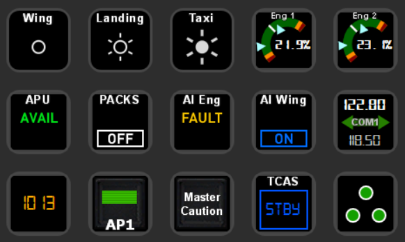
<br/><br/>
## Introduction
As the Title suggests, this is a Plugin for Elegato's StreamDeck for the FlightSimmers out there in need of just more Buttons! :wink:<br/>
It is build arround FSUIPC, so if something in the Sim can be triggered via Macros, Scripts, Luas, Lvars or Offsets - it can also be triggered via this Plugin from your StreamDeck! It is for the FlightSimmer already familiar with FSUIPC looking for an interesting Device to bind their Commands.<br/>
The Plugin is designed to be highly flexible and customizable, so it won't give any nice Guidance on what Offsets, Controls, Macros, ... are, how they are used with FSUIPC and it won't give you a nice List of Controls to select from. It even does not have anything pre-configured on the "COM Radio" Action - so you can make it work which fits best four your Aircraft(s).<br/><br/>
The Communication is Bi-Directional - it does not only send Commands into the Sim, it can also read & display a Controls State and can basically display any Value you want (as Text or Graphical Representation). It uses the full Potential the StreamDeck has to offer for FlightSimmers: it is also a *Display* Device, not *just* Buttons!<br/>
The Plugin can also switch between StreamDeck Profiles when the Aircraft (Model) and FSUIPC Profile change.<br/>
Another "Feature" would be that you can "read" Values via [Lua-Scripts](README.md#lua-values).
<br/><br/>
## Plugin Requirements
Uhm ... I'd say Prepar3D, FSUIPC and StreamDeck (Software) installed would be a bloody good Start :laughing:<br/>
It is compiled for .NET Framework 4.8, so if you have a more or less regulary patched Windows&#x00AE; 10 (>= 1809) and have all of the above running you're probably ready for Takeoff!<br/>
The Plugin only reacts when "Prepar3D.exe" is loaded, so FSX would require a Change of the [Plugin Settings](README.md#plugin-settings). It may work with FSX and older Versions of P3D and FSUIPC.
<br/><br/>
## Plugin Installation
It is not (yet) distributed in the StreamDeck Store, so it is a manual Installation for now.<br/>
Just put the Contents of the Zip in your Plugin-Folder under<br/>
  > **%appdata%\Elgato\StreamDeck\Plugins**

Optional: If you need/want to read Values generated by Lua-Scripts, you have to add the [PilotsDeck.lua](https://github.com/Fragtality/PilotsDeck/blob/master/PilotsDeck/lua/PilotsDeck.lua) Script from the Plugin's *\lua* Subfolder to your FSUIPC Installation as an Autostart Script. More Instructions can be found in that File.
<br/><br/><br/>
## Overview of included Actions
As of now, there are 7-8 Actions:<br/>
*  **Display Value** - Read any Offset or Lvar Value and display it as Text. You can Scale, Round, Format and/or BCD-Decode the Value and you can customize the resulting Text to your liking.
*  **Display Value Button** - Same as before, but you can bind Macro(s), Control(s), Lvar(s) an Offset or a Lua-Script to it so that the Button does actually do something.
*  **Simple Button** - As simple as it gets - a straight-forward Button like any of your Joystick-Buttons. BUT: it can be added to Multi-Actions in StreamDeck, so you can build Action-Sequences!
* 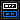 **Dynamic Button** - My Reason to start this Journey - a Button which reflects the actual State of a Control in the Sim! It does not matter from which Input Device you alter a Control: this Button will show the correct "Live"-State. (As long as this State can be correctly read from the Sim / Aircraft)
*  **COM Radio** - It is more or less a "Display Value Button" with two Values instead of one. Read the Radios from anywhere you want (BCD encoded or Integer) and swap the Frequencies by any Way you want.
*  **Display Gauge** - If you want a graphical Representation of a Value, let's say for your Engines N1 Value, Trim, Control Surface Deflection, Fuel Level ... this Action is for you! It can either be a Bar or an Arc. With Text or without.
*  **Display Gauge Dual** - New! Now with two Indicators instead of one! So you can have your Left/Right, Engine 1/Engine 2 or whatever in one Display.
*  **Profile Switcher** - This is more an Interface than an Action to configure the Profile Switching, it is only needed for Configuration and Profile Installation.
<br/><br/>
## Action Configuration
Now we're getting to the "Fun" part! :flushed:<br/>
The Actions behave like any other Actions on the StreamDeck. All the Action's Settings are stored in the StreamDeck Profiles (and therefore are saved when you Backup/Export Profiles). They can be moved arround, swapped, copy-pasted and put in Folders. In case of the "Simple Button" it can be put in Multi-Actions like normal. Only replacing one Type with another could lead to unexpected Results and is "not recommended".<br/>
All Configuration is done via the Property Inspector. Some Input-Fields combine multiple Fiels/Inputs in one string, so let's start with the common Syntax:<br/>
### Common Syntax & Fields & Behavior
Plain Numeric Values are separated by "**;**". E.g. an Size or Range Definition like "0; 10"<br/>
Addresses, Format and Profiles are separated by "**:**".<br/>
Address Fields and some other Fields are using Syntax Checking on the Input. So if an Exclamation Mark is shown in the Input Field, it could be wrong. The Property Inspector matches not all Cases and in any Case the Input will be saved. The "real" Syntax Checking is done when a Button is pressed and then will only allow valid Syntax. Mind the Difference between "Syntax" and "Semantics": The Plugin can check if the Input is correct to specifiy a Macro e.g. via FSUIPC, but it can't check if that Macrofile or Macro exists :wink:<br/>
If a Button Press could not be executed for whatever Reason (P3D closed, not ready, Syntax incorecct, Action not configured ...), the Plugin will show the StreamDeck Alert-Symbol (yellow Triangle with an Exclamation Mark).<br/>
If the Plugin is waiting for FSUIPC to connect, P3D to become ready (again) or while loading, all Actions will show a "..." Background.<br/>
#### Address Fields
* **Offset**
  \[ (0x)Hex-Address:Size(:Type:Signedness) ] (Read / Command)
  - *Hex-Address*: As seen in FSUIPC's Offsets Status Document (first column). A 4-digit Hex-Number. It can be prefixed with 0x and can be written in upper- or lower-case (the PI will only check mark upper-case, but lower-case does work).
  - *Size*: The Size of this Offset in Bytes (same Document, second column). A 1-digit Number.
  - *Type*: Specify if the Offset is Integer "**i**", Float/Double "**f**" or String "**s**". Defaults to ":i" for Integers if not specified.
  - *Signedness*: Specify if the Offset is Signed "**s**" or Unsigned "**u**". Defaults to ":u" for Unsigned if not specified.<br/><br/>
*Examples*:
  - *2118:8:f* for "Turbine Engine 2 corrected N1" (8 byte double/float64)
  - *034E:2* for "COM1 frequency in BCD" (2 byte integer)
  - *3544:4:i:s* for "standby alitmeter in feet" (4 byte signed integer)
  - *0x0ec6:2:i* for "Pressure QNH"
* **Lvar**
  \[ (L:)Name | (L:)Name((:L):Name)* ] (Read / Command)
  - *Name*: The Lvar's Name with or without the preceding "L:". For Switches you can bind multiple Lvars to it, every Lvar is separated by ":". Multiple Lvars only make sense if they react same for a same value (e.g. both Pack Switches, both reacting as "On" for "10")<br/>
  Example: *"VC_OVHD_AC_Pack_1_Button:VC_OVHD_AC_Pack_2_Button"*
* **Control**
  \[ Control(:Parameter)* ] (Command)
  - The known "FS Controls". First the *Control*-Number and then 0 or more *Parameter* for that Control. (e.g. Landing Light Switches, move them up two times and/or move multiple at one)<br/>
  Example: *"66587:72497:72507"* (Send Control 66587 with Parameter 72497 and then Control 66587 with Parameter 72507)
* **Macro**
  \[ File\:Macro(:Macro)* ] (Command)
  - *File*: The FSUIPC Macro File Name without Extension
  - *Macro*: The Macro's Name within that File. You can specify multiple Macros within one File (e.g. both Packs-Controls on one Button)<br/>
  Example: *"FSLA3XX_MAIN:ACPACK1:ACPACK2"* (Run Macro ACPACK1 from Macro-File FSLA3XX_MAIN and then ACPACK2 from the same File)
* **Script**
  \[ Lua|LuaToggle|LuaSet|LuaClear:File(:flag) ] (Command)
  - *File*: The Filename of a Lua-Script (known to FSUIPC). Without Extension and it has to be preceded with one of the Lua Commands. To run a Script use "*Lua:*" and don't specifiy a *:flag*. To use the Lua Controls Set, Clear or Toggle the *:flag* has to be specified, as the correct Control. Set, Clear, Toggle work as described in FSUIPC's Documentation.<br/>
  *Examples*:
  - *"Lua:Baro_Toggle"* (run Lua-Script "Baro_Toggle.lua")
  - *LuaToggle:FSL_CMD:21* (toggle Flag 21 for Lua-Script "FSL_CMD.lua")<br/>
#### DecodeBCD / Scale / Format
* **DecodeBCD**: If the Value is a BCD, the Plugin can decode it for you! 
* **Scale**: Multiply the Value by that Number to scale it, if it is too big or small. Defaults to 1.<br/>One Example would be "Pressure QNH as millibars" - it is delivered as multiple of 16 (e.g. 1013 = 16208). So we would scale it by "0.0625" (1/16) to have a human-readable Value.
* **Format**: Round the Value and/or add Text to it \[ Digits:Text %s Text ]
  - *Digits*: The Value is rounded to that fixed Number of Digits after the decimal Point (can be zero for an Integer). If not specified, the Value is not rounded at all.
  - *Text*: The Value is embedded at the "*%s*" in the Text you specify here. E.g. to add Units to the Value like "%s kg" or "%s %". Or put something in front of it. Every "%s" will be replaced by the Value.
* **Order**: DecodeBCD -> Scale -> Round -> Format. If the Value is to be matched (On/Off/Special State e.g.) it is done after Round and before Format.
* **Examples**
  - *1*     One Digit after the Decimal Point, the current Value of 20.522534 will be displayed as 20.5 for Example. Match for zero would be "0.0".
  - *2:1%s* Two Digits and add an "1" before the Text - useful for the BCD encoded Frequencies!
  - *%s ft* Add "ft" after the Value<br/>
#### Images
All Images are stored in the \Images Subdirectory. You can change and remove the existing ones and you can add your own Images. Newly added Images are automatically listed when you open any of the Actions Property Inspector, you don't have to restart the StreamDeck Software. If you change an existing Image, you have have to switch Profiles or restart the Software - all used Images are cached, so all Actions using the changed Image must disappear before the Image is loaded again from Disk.
* **Default Image / Background Normal**: The Image to be shown (or drawn to) when the Action is in their normal/working State or P3D is not loaded.
* **Error Image**: The Image to be shown when FSUIPC disconnects or the Value could not be read.
* **Special Value / State**: If the Value / Switch has an Special 2nd or 3rd State, you can indicate that by the Image specified. For Example if the Baro is on STD/1013, the PACK is on "Fault", the APU is "Avail", ...<br/>
#### Font Settings
For Actions which show Text, the used Font can be customized.<br/>
The default Behavior is to Inherit the Font Style from the Buttons Title Settings. Whatever you set there in Font, Size, Style is applied to the Text of that Button (all but Alignment and Show/Hide).<br/>
*BUT, there is a caveat in the StreamDeck API.* The Font Style (Regular, Bold, Italic) is transmitted as *localized* Text. I have put in the Strings for German and English. You can alter the [Plugin Settings](README.md#plugin-settings) to customize them or add your language. If you let me know which Strings are working for which Language, I can add that to the Plugin.<br/>
If you care at all to inherit the Font: Since the Plugin reads *all* installed Fonts on your System (in Contrast to StreamDeck), you can use nearly any fancy Font you like. The Font Style there is based on the (international) System API, so this StreamDeck caveat does not have an effect on the custom Font Settings.
<br/><br/>
### Display Value
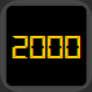<br/>
Most Settings should be explained by the common part.
* **Draw Box**: Will draw a Frame in the configured *Thickness* and *Color* arround the Value. The Frame's *Size & Position* is defined as *"X; Y; Width; Height"* (0, 0 is Top-Left).
* **Special Value Indication**: When you enable it, the Background will be changed to the specified Image as soon as the current Value from the Sim equals the one you specified here. It will reset to the Normal Background if it is unequal again. Mind Scale and Round - the Matching is done after both. To stay with the Pressure QNH Example - you would need to enter 1013, not 16208. <br/>
You can optionally hide the Text when the Values match. Maybe you want to display a nice "STD" Image?
You can also specify a *Different Color* when the Values match. This Color has priority over both inheritted or customized Font Settings. This Color is also used for the Frame, if *Draw Frame* is enabled.
* **Tweak Position**: This defines the Rectangle (the "Box") the Text is drawn on the current Background defined as *"X; Y; Width; Height"*. If *Draw Frame* is enabled, it is relative to the Frame's *Size & Position*. If it not enabled it is relative to the whole Button. The Text is always drawn horizontal/vertical centered within that Box. When *Draw Frame* is toggled this will reset to the respective Default.
<br/><br/>
### Simple Button / Display Value with Button
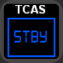<br/>
Since Diplay Value is explained above and a simple Button has nothing much to configure visually, we can concentrate on how a "Mapping" is done - how you can define what is send to the Sim.
* **Action Type**: Defines the Type of Action. There's nothing more to add, if you're familiar with FSUIPC and binding everything you can to your Joystick(s) it is exactly that what you would guess :wink:
* **Action Address**: This, in essence, is your Mapping. Here you specify which Offset/Lvar(s) to write to or which Macro(s)/Script to run or which Control(s) to send. The Syntax is refrenced [above](README.md#address-fields). For Types with multiple "Targets" (Macro, Control, Lvar), multiple Requests will be send to the Sim in fast Sequence.
* **On / Off State**: For Lvar and Offset you have to specify which Value stands for "On" and which for "Off". The Value to be written to the Lvar or Offset. The Button will toggle between these Values when pushed ("keyUp") and sends it to the Sim. It will always start in the "Off" State (sends "On" on next Push) and will reset to "Off" when you change the Settings.<br/>Remember that this Button doesn't read the current State, it has it's own State tracking. If you switch something "Off" by other means while this Button is "On", this Button will still write the "Off" Value on next push. <br/>If it is a Toggle-style Switch which you want to control (there is no On/Off State), write the same Value to both Fields (swap Frequencies e.g.).
* **Long Press**: When enabled, the Button can execute a completely different Command when pressed for longer than 600ms (with the default [Plugin Settings](README.md#plugin-settings). This second Command Settings' work exactly like described before. Note that the internal Mechanic is based on "keyUp": regardless of how long you press the Button, it will only execute when released!
<br/><br/>
### Dynamic Button
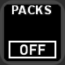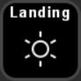<br/>
Action Type and Address work exactly like described above.<br/>
* **Address** (Control Status Value): Here you specify where the current State (Value) of a Switch in the Sim can be read. Since there are only two Ways to read something from the Sim via FSUIPC, it is either an Offset or a (single) Lvar.<br/>The Syntax works as described [before](README.md#address-fields). The "third" Way, reading a Lua Value is described [below](README.md#lua-values).
* **On / Off State**: When the Value matches On or Off, the respective Image is displayed.<br/>
For Offset and Lvar Actions: Since the Button knows the real current State of a Switch in the Sim, it will send the correct toggled Value to the Sim when pushed. If current Value is neither On nor Off, the Off Value will be send.<br/>The Assumption is that Action Address and Address are the same Offset or Lvar, but if you have the Use-Case that they have to be different, you can configure it that way! Just mind that the same On/Off Values will be used for both reading and writing.
* **Special State**: For Switches which have something "in between" or other than the On/Off States, this Special State can be displayed with that Setting. When you enable the Special State the specified Image is shown when the Value matches to the current Value. If that State is not a specific Value but any other Value than On/Off, check *Any Value*. An Example would be Gear Position: it retracted (~off), extended (~on) or in transit (any value).
<br/><br/>
### COM Radio
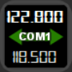<br/>
Most fields work the same as described before, you define the Addresses where the Active (top) and Standby (bottom) Frequency can be read and define an Action how they are swapped in the Sim.<br/>On the fields that differ or are new:
* **Swap Background**: When your defined Swap Action was (successfully) send to the Sim, the Button will show that Image for 3.2s (=16 Ticks).
* **Value Format**: You can define a *Different Format* for the Standby Value. So if you read the int32 Value from 05C4 for the Active Frequency and the BCD encoded int16 Value from 034E for the Standby Frequency, you can do that and have both look like a Frequency.
* **Font Settings**: Both Frequencies will always use the same Font, regardless how it is defined. The Font Style is ignored and is not configurable: the Active (top) Frequency is always bold, the Standby (bottom) Frequency is always regular. The Font Color for the Standby Frequency will be darkened if the Settings are inherited. With custom Settings you can choose different Colors for both.
* **Tweak Position**: There are two instead of one ... if you wish so, you can swap what is on top. :wink:
<br/><br/>
### Display Gauge
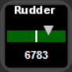<br/>
This Action can display a Value on a Bar or an Arc. The graphics are rendered on refresh.
* **Normal Background**: The graphics are rendered on that Background. 
* **Value Format**: Yo have to define a *Minimum* and *Maximum* Value for that Action to work. The Value after Decoding and Scaling is used for the Indicator.
* **Gauge Settings**
  - *Gauge Size*: The Size of the Bar or Arc. For a Bar it is "Width; Height", for an Arc it is "Radius; Thickness".
  - *Orientation* (Bar): Define if this Bar is horizontal or vertical and if the Values are increasing right/left or up/down. An Arc does not need (and ignores) that - it is a Circle, it has all directions. :smile:
  - *Start Angle* (Arc): The Angle at wich the Arc starts. 0° is at right center.
  - *Sweep Angle* (Arc): This Angle defines how "big" or "long" the Arc is from the *Start Angle*. For positive angles the Indicator moves clock-wise, for negative counterclock-wise.
  - *Offset* (Arc): You can diagonally move the Arc (and Text) from the top-left corner by that Value.
 * **Indicator Settings** Define the Color and Size of the Triangle that indicates the current Value in the Sim. You can *Flip* it to draw it on the "other side".
 * **Center Line** Draw a Line at the Center (50%) in the specified *Color* and *Size*
 * **Warning Range**: If there should be "dangerous" or "critical" area on the Bar/Arc, you can define it here.
 	- *Critical / Warning Range* In this *Range*, lying between *Minimum* and *Maximum*, the Area will be drawn in the specified *Color*. The Ranges can be at the start, end, center, anywhere you want.
	- *Symmetric Range*: If these colored areas should be at both Ends for Example, you can enable that here. The Ranges will then be "mirrored".
 * **Text Settings**: If the Indicator is in one the Ranges the Text can be drawn in the respective Range Color. Everything else here works the same.
<br/><br/>
### Display Gauge (Dual)
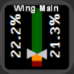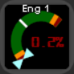<br/>
Shows two Values on the same Bar or Arc. So they share the same Minimum, Maximum and Format (and Font-Settings).<br/>
The most notabel Difference: with a Bar, both Values can be displayed as Text. With an Arc, only the first Value is displayed. The Arc therefore allows to swap (*Flip*) the Indicators.
<br/><br/>
### Profile Switcher
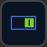<br/>
With this Action the Profile Switching is configured. If you want to use that (disabled by default), drag this Action somewhere on your StreamDeck. Upon first use, as soon as you select this Action and the Property Inspector appears, you will be asked if you want to install preconfigured Profiles (sometimes this Dialog pops up two times - you only have to acknowledge one, cancel the other one). This is *required* for the Switching to work! The StreamDeck API only allows to switch Profiles which came preconfigured with a Plugin and internally keeps Track of that (meaning, the StreamDeck *knows* if a Profile came frome a User or from a Plugin). You only have to install the Profiles if you want to use the Switching capabilities.<br/>
For that Reason the Plugin conveniently includes 4 StreamDeck Profiles (Default, X-Ray, Yankee, Zulu) that you can map to any FSUIPC Profiles. You don't have to use them, that is also customizable, but that requires a change in the Plugin Settings (they have to be "published" to StreamDeck upon Plugin Start and have to be installed by the Plugin)<br/>
The Plugin will switch to a Profile as soon FSUIPC is ready (somewhere while P3D loads). It attempts to switch back to the previous used Profile, but that only works if you don't use Folders (did not switch between them within the Profile) - again for API Reasons.<br/>
* **Enabled** When this is checked, this Feature is activated. You don not have to keep this Action anywhere on your StreamDeck after Configuration (it is a Global Setting).
* **Profiles Installed** You can reset the Installed flag (uncheck), if you wish. The next Time the Property Inspector (for this Action) is openend, the Profiles will be installed again. Profiles that already exist will *not* be overwritten - StreamDeck will add a "xyz copy" Profile.
* **Use Default** For unknown FSUIPC Profiles (or Aircrafts which do not have a FSUIPC Profile), the Plugin will switch to the Profile configured by *Name* if this Option is checked. If unchecked, only mapped FSUIPC Profiles will be switched. Default is obviously the bundled Default Profile :wink:
* **Profile Mappings** Here you can map your FSUIPC Profiles to the different StreamDeck Profiles. Use the FSUIPC Profile's Name exactly as it is configured in FSUIPC. Multiple FSUIPC Profiles can be mapped to the same StreamDeck Profile, their Names are separated by "**:**".
#### Customization
If you want to use your own Names or need more Profiles, you can customize that. But because of the described Limitation of the StreamDeck API, you have to fiddle with the Plugin's [Manifest](README.md#manifestjson) File directly (so the Plugin can install it).<br/>
* First create a new empty Profile in your StreamDeck and export it (or an existing one, does not need to be empty). Name it any way you want, non-alpha-numeric Characters are also allowed, but rename the File afterwards if these Characters are more "special" then Space, Minus or Underscore (it has no Influence on the displayed Name).
* Copy the .streamDeckProfile File in the Plugin's Directory, preferably in the \Profiles Subdirectory.
* Alter the Manifest File. Add your StreamDeck Profile(s) *File*-Name (without Extension) to the List in the same way as the included ones. You can, of course, get completely rid of the included StreamDeck Profiles if you wish and just use your own. Remember the Default Profile is configurable, so you can even replace/remove that!
* Restart the StreamDeck Application, use the Profile Switcher Action to reset the Installed State of the Profiles. Now the Profiles which are configured in the Manifest will be installed. The old ones will not (and can not) be removed automatically (if they were installed before), you have to delete them manually.
* You can use the added Profiles now like the included ones. If everything went well, they should be listed in StreamDeck and in the Profile Switcher Action to map FSUIPC Profiles to it. That's the best I can offer, I'm glad it works at all - as per StreamDeck SDK it shouldn't work because the preconfigured Profiles are writeable :laughing:
<br/><br/>
## Lua Values
Somewhere along the way, I wanted to add a Feature to read the current State of a Switch in the Sim with a Lua-Script. Maybe the State can't be read via one Lvar/Offset (FSL APU Avail...) and needs some "logic" from a Script to determine the State. Or it is just easier to read via Lua ("Copilot lua script" for FSL). Wouldn't it be cool if the Plugin could run Lua-Scripts to read their return Values and display/use these Values? :thinking:<br/>
You can!! Strictly speaking it is just one Script, it returns nothing, is not run by the Plugin and there is really no third way to read a Value from the Sim - but it still works. :laughing: Here is how:<br/>
The [Lua-Script](https://github.com/Fragtality/PilotsDeck/blob/master/PilotsDeck/lua/PilotsDeck.lua) which is provided in the \lua Subfolder is called by FSUIPC every 250ms as soon as it is started (given that you installed/configured it like described in that File). In that File (only) you can add your own Code to do that Control / State checking logic and generate a Value. Then you have to write these Values to the "General Use" Range 66C0-66FF (64 bytes) via one of the ipc.writeXX Functions provided by FSUIPC. Where you put them (in that Range) and in which Type (int/float/string/...) is up to you. You have to keep track of these and allocate these Addresses all by yourself! And then you read these Addresses via any Plugin Action like any other Offset. Yeah ... it is more a "mechanic" than a "Feature", but let's ignore that :shushing_face:<br/>
A small (hopefully helpful) Quick Reference is in the provided Script. Let's view my Script as an Example:<br/>
```lua
function Pilotsdeck_Poll ()
	readLDG()
	readTCAS()
	readPACK()
end

event.timer(250, "Pilotsdeck_Poll")

function readLDG()
	local FSL = require "FSL2Lua"
	FSL:setPilot(1)
	ipc.writeSTR(0x66C0, FSL.OVHD_EXTLT_Land_L_Switch:getPosn(), 4)
end

function readTCAS()
	local FSL = require "FSL2Lua"
	FSL:setPilot(1)
	ipc.writeSTR(0x66C5, FSL.PED_ATCXPDR_MODE_Switch:getPosn(), 4)
end

function readPACK()
	local pack1 = ipc.readLvar("VC_OVHD_AC_Pack_1_Button")
	local pack2 = ipc.readLvar("VC_OVHD_AC_Pack_2_Button")
	ipc.writeUB(0x66CA, pack1+pack2)
end
```
Within the Plugin I then use
- "66C5:4:s" to read the TCAS State and display & toggle it with a "Display Value with Button" Action (toggling via Lua-Script).
- "66C0:4:s" to read the Position/State of the Left Landing Light in a "Dynamic Button" and display the appropiate Images for the three States On, Off and Retracted (via Special State). One Button which sends "Up" for both Landing Lights, one to send "Down" for both Landing Lights via FSControls.
- "66CA:1:i" to read the Pack State and display them On/Off or "Fault" (if they are not both in the same State) with a "Dynamic Button" to also toggle the Packs via two Macro Calls.
<br/><br/>
## Plugin Settings
There are two Files where Settings can be altered (both can be found in the Plugin's directory):<br/>
The first is the [PilotsDeck.exe.config](README.md#pilotsdeckexeconfig) File which is the "main" Configuration File for the General Application/Plugin Settings.<br/>
The second is the [manifest.json](README.md#manifestjson) which is specific for StreamDeck (it defines it as Plugin so to speak). This only needs to be touched for a different Application to monitor and to customize (or add) StreamDeck Profiles to switch to.<br/>
Generally take care when editing them, the XML/JSON Syntax must be the correct for the Application/Plugin to start at all. Backups FTW! :laughing:<br/>
### PilotsDeck.exe.config
These are the available Settings and their Default:
* **applicationName**="Prepar3D.exe"	- The Executable to "listen to". The Plugin is informed by StreamDeck as soon as this Executable runs and only then tries to establish a FSUIPC Connection. Must also be changed in the [Manifest](README.md#manifestjson)!
* **pollInterval**="200"		- The Intveral / Tick-Time at which the Offsets and Lvars will be refreshed / read from the Sim.
* **waitTicks**="150"			- The amount of Ticks to wait between Connection retries. Fractions of that Value are used for other things (Start-Delay between Plugin/StreamDeck, Time-Measuring)
* **longPressTicks**="3"		- The amount of Ticks a Button had to be pressed/down to be recognized as ["Long Press"](README.md#simple-button--display-value-with-button) when released.
* **appStartDelay**="30"		- When P3D is started, it will throttle the Process Calls to FSUIPC to every 10s (based on Ticks) in the first X seconds after FSUIPC successfully processed. Depending on how fast/slow P3D and the selected Aircraft are loading this could be too long/short. This only applies to when the Plugin (StreamDeck Software) was already running, if the Plugin is started when P3D was already running, it will directly connect and process.
* **stringReplace**="%s"		- If for whatever Reason you don't like the C-Style, you can change the String-to-be-replaced for the Format Field. Don't use the colon (:). The PI and Value Checking are hardcoded to %s, though.
* **redrawAlways**"="false" 		-  With "true" you can force the Plugin to redraw the Buttons always, even if the Sim or FSUIPC are not running.<br/><br/>
For the Font-Inheritance Workaround (mentioned caveat in the StreamDeck API). "XX" is the two-letter Code for the (general) Language. For instance, en_US and en_GB both map to "en". You have to define all 3 Styles for a language.
* **fontDefault_XX**="Regular"
* **fontBold_XX**="Bold"
* **fontItalic_XX**="Italic"<br/><br/>
### manifest.json
There are only two Use-Cases to fiddle in that file, so these are the interesting Parts:
* **ApplicationsToMonitor**: Change this (and *applicationName* in the above File) to alter the Executable the Plugin reacts upon.
* **Profiles**: Like described under [Profile Switcher](README.md#customization) - here you add or change the StreamDeck Profiles. If the .streamDeckProfile File is in the \Profiles Subdirectory, you must prefix the Name with "*Profiles/*". Mind the JSON-Syntax: the last Entry must not have a "**,**" at the End, but all others have to be separated by that.
<br/><br/>
## License
Published under [MIT License](https://github.com/Fragtality/PilotsDeck/blob/master/LICENSE).<br/>
Uses "StreamDeckToolkit" from FritzAndFriends, published under [MIT License](https://github.com/FritzAndFriends/StreamDeckToolkit/blob/dev/LICENSE)<br/>
Uses "FSUIPC Client DLL for .NET" from Paul Henty \([License](http://fsuipc.paulhenty.com/index.html#licence))<br/>
Prepar3D is a Trademark or Registered Trademark of Lockheed Martin Corporation.<br/>
StreamDeck is a Trademark or Registered Trademark of Elgato Systems and/or Corsair Gaming, Inc.<br/>
Windows is a Trademark or Registered Trademark of Microsoft Corporation.<br/>
