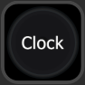
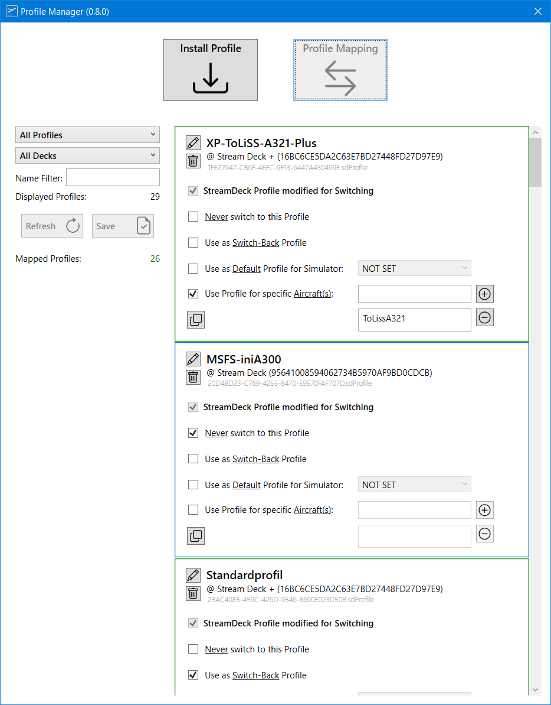

# PilotsDeck
Directly check & control your FlightSim from the StreamDeck!
<br/><br/>

# 1 - Introduction
PilotsDeck is a Plugin for Elegato's StreamDeck with the Ability to **trigger Cockpit-Controls** in different Ways and especially reading & **displaying a Control's State** on the StreamDeck as Text, Image, Bar/Arc or a Combination thereof. It is lean & mean, flexible, completely Open-Source and Free-to-Use.<br/><br/>

StreamDeck-wise it behaves like any other StreamDeck Plugin: it **runs alongside other Plugins** and you can Drag, Drop, Copy, Paste the Actions like any other Action in the StreamDeck Software between your Folders, Pages or even different StreamDecks. The Action Configuration is done through the standard "Property Inspector" of the StreamDeck UI (for the "classic" Actions) or its own "Action Designer" UI (for the new Composite Action). But regardless of the UI: the Configuration is stored in the StreamDeck Profile - You can create, export and share Profiles with the Plugin's Actions. On Top of the StreamDeck builtin Copy & Paste, it has also its own Mechanic allowing to **share single Actions** via Text with someone else.<br/><br/>
Installation is done through its own **Installer** which will check all Requirements and installs them for you if necessary. With the included **Profile Manager App** you can easily install **Profile Packages** (containing the Profiles, Images and Scripts) and can map your existing StreamDeck Profiles for specific Airplanes or Simulators so that the Plugin **automatically switches** the Profile(s) on the StreamDeck(s). You can write Scripts to directly read Values from a Function, or trigger a Function as Command - all in its own **internal Lua Engine** (Credits to: Neolithos for NeoLua!).<br/>
The Plugin supports different StreamDeck Models: **Mini**, **Standard**/15-Key, **XL**, **Mobile** and **Plus**. Other Models might work, but an indented Support for Non-Display Models is not planned. The Plugin runs only on **Windows**. There are no Plans for Linux or macOS Support (the first is not supported by StreamDeck at all, both do not run or support all Sims and some essential .NET Libraries are only available on Windows).<br/><br/>

Simulator-wise it supports all major Platforms on Windows - **MS Flight Simulator**, **X-Plane** and **Prepar3D**. Depending on the Sim, it either uses **SimConnect**, **FSUIPC** or **UDP** Connection (remote capable). Either way it will connect automatically as soon as a Simulator is running. All Variables and Commands these Connections allow are usable with the Plugin. You can directly switch from one Sim to another without reconfiguring anything.<br/>
For Prepar3D (and theoretically FSX) FSUIPC is a Requirement, for MSFS it is Optional and for X-Plane not used at all. Either Way: you do **not need a registered** (bought) Copy of FSUIPC to make the Plugin in Work! (Though some old Profiles may require a registered Copy).<br/><br/>
It is designed for **advanced Sim-Users** which "know how to do Stuff": it does not give you any Lists to select Stuff from. If you know how to read Control-States for your Plane (e.g. which Variables to use) and how to trigger these Controls (e.g. which Command to use), you can quickly define Actions for that on the StreamDeck. Since it does not limit your Selection by a predefined List, you can do everything the Connection/Simulator currently allows 😉<br/>
If you don't: be eager to read & learn! 😅 I'll try to give some Background in the Readme, but you have to take it from there!<br/><br/>

**Note**: PilotsDeck is 100% free and Open-Source. The Software and the Developer do **not have any Affiliation to Flight Panels**. You basically spend Money instead of Time to let a Power-User create the Profile(s) for you. That is totally fine - *IF* you knew you had the Option. Choose the Approach that suits you best! 😃<br/><br/>

User-Contributed and my Profiles for specific Planes are shared/linked under [Integrations](Integrations/). Since there aren't that many: If your Plane is not among these, they can at least serve as Example on what you could do:<br/>
<br/>
<br/>
<br/>
Other Examples can be found under [here](#51---examples).<br/>
<br/><br/><br/>

## 1.1 - Supported Simulator Versions

| Simulator | Supported | Tested | Connection |
| :-------------|:-------------:|:-----:|:-----|
| **Flight Simulator 2024** | **yes** | **yes** | SimConnect & MobiFlight WASM (Secondary: FSUIPC7) |
| **Flight Simulator 2020** | **yes** | **yes** | SimConnect & MobiFlight WASM (Secondary: FSUIPC7) |
| Flight Simulator X | yes | no | FSUIPC4 |
| Flight Simulator 2004 | yes | no | FSUIPC 3 |
| **Prepar3D v5** | **yes** | **yes** | FSUIPC 6 |
| Prepar3D v4 | yes | no | FSUIPC 5/6 |
| Prepar3D v1-3 | yes | no | FSUIPC 4 |
| **X-Plane 12** | **yes** | **yes** | UDP (local/remote) |
| X-Plane 11 | yes | yes | UDP (local/remote) |
| X-Plane <=10 | yes | no | UDP (local/remote) |

Supported is understood as "technical and basically supported by the Connection Method". Support in Terms of ensured Compatibility, Fixing Issues and giving Support exists only for the latest Version of the three Major Simulators: MSFS2020, X-Plane 12, P3D v5. I'm happy if it works for older Versions, but I won't make any Effort for them. It is time to go back to the Future! 😅<br/>
And yes: the latest Version for Prepar3D is still considered v5, since v6 was just DOA with nearly every Addon-Dev announcing to not support it.
<br/><br/><br/>

## 1.2 - Supported Sim-Commands & -Variables
Here a quick Overview of what you can send to the Simulator ("**Command**") or from what you can read Values from the Simulator ("**Variable**"). One of the Things which make the Plugin flexible: Variables can also be used as Commands. For Example to move a Cockpit-Control by writing a different Value to a Variable.<br/><br/>
How Commands and Variables are configured and the different Options how they can be executed is described under [2.1 - Defining Commands & Variables](#21---defining-commands--variables).<br/>

| ID | Description | Command | Variable | Simulators               | 
| :---: | :------------ | :---: | :---: | :-------------------- | 
| [**MACRO**](#macro) | Execute any Macro known to FSUIPC | ✔️ | ✖️ | MSFS, P3D, FSX |
| [**SCRIPT**](#script) | Run any Lua-Code known to FSUIPC | ✔️ | ✖️ | MSFS, P3D, FSX |
| [**CONTROL**](#control) | Send any SimEvent defined by its numerical ID | ✔️ | ✖️ | MSFS, P3D, FSX, FS9 |
| [**LVAR**](#lvar) | Read from / Write to any L-Var ("Local Variable") | ✔️ | ✔️ | MSFS, P3D, FSX |
| [**OFFSET**](#offset) | Read from / Write to any FSUIPC Offset | ✔️ | ✔️ | MSFS, P3D, FSX, FS9 |
| [**VJOY**](#vjoy) | Toggle/Clear/Set a Button of a virtual Joystick from *FSUIPC* | ✔️ | ✖️ | MSFS, P3D, FSX |
| [**VJOYDRV**](#vjoydrv) | Toggle/Clear/Set a Button of a virtual Joystick from the known *vJoy Device Driver* (if installed) | ✔️ | ✖️ | ALL |
| [**AVAR**](#avar) | Read from / Write to any Simulation Variable (also known as A-Var) | ✔️ | ✔️ | MSFS |
| [**KVAR**](#kvar) | Send / Write to any Event-ID (also known as K-Var / SimConnect Event) | ✔️ | ✔️\*\*\* | MSFS |
| [**HVAR**](#hvar) | Trigger any HTML Event in the Simulator (also known as H-Var) | ✔️ | ✖️ | MSFS |
| [**BVAR**](#bvar) | Trigger InputEvents (also known as B-Var) - but only those that MSFS enumerates via SimConnect | ✔️ | (✔️)\* | MSFS |
| [**CALCULATOR**](#calculator) | Run any Calculator/Gauge Code in the Simulator | ✔️ | ✔️\*\* | MSFS |
| [**XPCMD**](#xpcmd) | Send any Command known to X-Plane (as command_once) | ✔️ | ✖️ | XP |
| [**XPWREF**](#xpwref) | Read from / Write to any X-Plane DataRef | ✔️ | ✔️ | XP |
| [**LUAFUNC**](#luafunc) | Run a Lua Function in the Plugin's own Lua Engine | ✔️ | ✔️ | ALL |
| [**INTERNAL**](#internal) | Read from / Write to an internal Variable (available everywhere within the Plugin) | ✔️ | ✔️ | ALL |


\* = Per Default, B-Vars treated as Command-only Type - only some B-Var have an actual Value to read.<br/>
\*\* = While you can read the Result from a RPN Expression, you can't write to it (like with other Variable Types).<br/>
\*\*\* = Will only be updated when the Event is received.<br/>
:grey_exclamation: Please mind that the Command Types Script, Macro, Lvar (on P3D/FSX) and vJoy can only work with a **registered** Version of FSUIPC!<br/>
:grey_exclamation: Both **vJoy** Command Types are independent of each other and are two different Things! "VJOY" can only be assigned within FSUIPC (and not in the Simulator). The "VJOYDRV" can be assigned by anything which understands a Joystick Button (Simulator, FSUIPC, Addons, ...).
<br/><br/><br/>

## 1.3 - Available StreamDeck Actions
All Actions work on the **Keypads** (the normal/square StreamDeck Buttons). The Dial/Touchpad (aka **Encoder**) on the SD+ is supported by most Actions.<br/><br/>

|  | Action Name | Keypad / Encoder | Description |
| :---: | :-------------- | :---------: | :----------- |
|  | [**Display Value**](#display-value)\* | Keypad / Encoder | Display a Sim Variable as Number or Text (display "ON" instead of "1"). You can scale/round/format the Value as needed and customize the Font-Settings. |
|  | [**Simple Button**](#simple-button) | Keypad | Can only send Commands and always shows the same (configurable) Image. Supported in StreamDeck Multi-Actions! |
|  | [**Dynamic Button**](#dynamic-button) | Keypad / Encoder | This Action dynamically changes the displayed Image based on a Variable (in Addition to sending Commands). Different Values trigger different Images. |
|  | [**Korry Button**](#korry-button) | Keypad / Encoder | Intended for Korry-Switches in the Cockpit: the Action displays two "Sub-Images" independently of each other. They are shown/hidden based on their own Variable, but will not change the Image based on the Value. |
|  | [**COM Radio**](#com-radio) | Keypad / Encoder | Intended for Com Frequencies: the Action shows two different Variables which can be independently scaled/rounded/formatted but share the same Font-Settings. |
|  | [**Display Gauge**](#display-gauge) | Keypad / Encoder | This Actions renders the Value dynamically on a Bar or Arc. Size, Color, Position and Font-Settings can be tweaked. It can optionally send Commands. |
|  | [**Display Gauge (Dual)**](#display-gauge-dual) | Keypad | As before, but it renders two Values dynamically on the same Bar or Arc. |
|  | [**Composite Action**](#24---composite-action) | Keypad / Encoder | Not a fixed Template as the other Actions, more a Canvas to draw on: you can add and freely configure different "Elements" (like Text, a Value, an Image) which can be dynamically altered via "Manipulators" on certain "Conditions". Configured in its own dedicated "Action Designer" UI.  |
|  | [**Profile Switcher**](#31---profile-switching) | Keypad | This not a "real" Action like the others, it only serves to enable/disable Profile Switching. |

\* = As an experienced User you might miss the "Display Value with Switch" Action - it was renamed to "Display Value" in Version 0.8.0. The Former "Display Value" Action (without Switch) is still there and will keep working, it is just hidden from the Selection now. You can't create them anymore, but still run them!<br/><br/>

See [2 - Action Configuration](#2---action-configuration) how to configure these Actions.<br/>
How to add Custom Images is described under [3.3 - Custom Images](#33---custom-images).<br/>

<br/><br/><br/>

## 1.4 - Install, Update, Remove
Just [Download](https://github.com/Fragtality/PilotsDeck/releases/latest) & Run the **Installer** Binary! It will check and install all Requirements and installs/updates the Plugin (or remove it).<br/>
On the second Installer Page there are some Options to customize the Process - in most Cases it is recommended to leave them at the preselected Default!<br/>
You do *not* need to remove the old Version for an Update - using 'Remove' in the Installer will also **remove all custom** Images and Scripts!<br/>
<br/><br/>
It is highly likely that you need to **Unblock/Exclude** the Installer & Plugin from BitDefender and other AV-/Security-Software. It's the number one Reason for "the Plugin is not working"-Issues because either the Binary is blocked from running or is blocked when connecting to the StreamDeck Software.<br/>
**DO NOT** run the Installer, Plugin or StreamDeck Software "as Admin". It is not recommended to MSFS or FSUIPC7 "as Admin" - it might work, it might fail.<br/>
If it still does not work right or at all, please check [4.2 - Troubleshooting](#42---troubleshooting).<br/><br/>
The Requirements for the Plugin:
- Windows **10** or **11** (updated)
- [**StreamDeck Software v6.5**](https://www.elgato.com/downloads) and above - The StreamDeck Software will be installed/updated by the Installer, if necessary.
- [**.NET 8**](https://dotnet.microsoft.com/en-us/download/dotnet/8.0) - The x64 Desktop Runtime will be installed/updated by the Installer, if necessary. Reboot recommended when the Runtime was installed for the first Time.
- If used for MSFS/P3D/FSX: The **latest** Release of the [**FSUIPC**](http://fsuipc.com/) Major Version specific to your Simulator (e.g. FSUIPC 6 for Prepar3D v4/5) - will be installed/updated by the Installer, if necessary.
- If used for MSFS: The **latest** Release of the WASM-Module from [**MobiFlight**](https://github.com/MobiFlight/MobiFlight-WASM-Module/releases/latest) - will be installed/updated by the Installer, if necessary.
- Optional: If you want to use **VJOYDRV** Commands you need the [BrunnerInnovations Fork](https://github.com/BrunnerInnovation/vJoy/releases/latest) of the vJoy Driver - the Installer will check the State, and offers to optionally install/update it for you.<br/>**NOTE**: If you install the vJoy Driver for the first Time, don't forget that you need to enable at least one Joystick (configured to have 128 Buttons) in the vJoyConf Application to use it!

<br/>
The Plugin will be installed to:

`%appdata%\Elgato\StreamDeck\Plugins\com.extension.pilotsdeck.sdPlugin`

It is automatically started with the StreamDeck Software. It will spawn its own Icon in the System-Tray / Notification Area. Use this Icon to see if a Plugin Update is available, to access the [Developer UI](#32---developer-ui) or open the **Profile Manager** to configure [Profile Switching](#34---profile-switching).<br/>
<br/><br/>

**Note:** Since FSUIPC is only a "secondary" Connector for MSFS, you do not need to have it installed anymore (for MSFS). If you not plan to install/run FSUIPC7, uncheck the respective Option in the Installer!<br/>
But be aware that some older Profiles might still use Commands and Variables from FSUIPC and might not fully work then.

<br/><br/><br/>


## 1.5 - Installing Profile Packages (.ppp Files)
Starting with Version 0.8.0, the Plugin greatly improves Distribution and Installation of Profiles:<br/>

1. Use the **Profile Manager App** found in the Plugin Directory to install Profile Packages: Open it via Plugin Icon in the System-Tray / Notification Area and drop the Package File to be installed on the big Arrow (or navigate to Package File's Location).<br/><br/><br/>
2. The Package File will be read and the Description (from the Author) will be displayed - **check the Notes** for additional Steps.<br/><br/>
<br/><br/>
3. If you already have Profiles with the same Name (as shown in the StreamDeck UI), the App will **remove the old** Profiles (and update existing Profile Mappings to the new ones). If want to keep the old Profiles, **uncheck** 'Remove old Profiles'.<br/>
If you want to keep the extracted Package Contents, check *Keep extracted Files ...*. The Contents will be kept in Profiles Sub-Folder of the Plugin (named after the Package Name).<br/><br/>
4. Click Install. Note that the StreamDeck Software will be automatically started and stopped as needed.<br/><br/>
5. The App will extract and copy the Images and Scripts to the Plugin Directory for you.<br/>The Profiles need to be installed through the StreamDeck UI: **Click on the Link** displayed in the Profile Manager App, wait for the StreamDeck UI to come up and the select the correct StreamDeck to install the clicked Profile to. Repeat for each Profile. **NOTE**: All Profiles in the Package must be either installed or ignored before the Installation continues!<br/>
You need to click every Link for the Installation to finish successfully. If you do not want or need one of the Profiles, just Cancel the Installation in the StreamDeck UI!<br/>
<br/><br/>
6. If selected, the App will now remove the old Profiles (if your updating existing Profiles), remove the "Copy" from the Profile Name (of the new ones) and update the Profile Mappings (if there are existing Mappings).<br/>**NOTE**: The Update-Mechanic will only work, if you **keep the Profile Name**.<br/><br/><br/>
7. The Package Author can include additional Files you might to install/use the Profiles. If so, you will find a Folder on your Desktop (named after the Package's Name) with these additional Files.

<br/>

See [3.6 - Profile Packages](#36---profile-packages) on how to create a Profile Packages to share your own Profiles!

<br/><br/><br/><br/>

---


# 2 - Action Configuration
Since the Plugin is very flexible, there is a "little" Learning Curve 😳 So I tried to break it down into 4 Parts:
- First of starting with the various Commands and Variables that can be defined in [2.1 - Defining Commands & Variables](#21---defining-commands--variables). Triggering Actions in the Sim and reading Values from it is the Foundation to get any Use out of the Plugin!<br/>I try to give some basic Examples, Tips and Background as a basic starting Point.
- The second Part [2.2 - Common Options](#22---common-options) describes the Common Options & Behavior which all or most Actions share, *except* for the Composite Action.
- In the third Part [2.3 - Action specific Options](#23---action-specific-options) you'll find a Description of each Action (*except* the Composite Action) on how they work and how they can be customized with their specific Options.
- In the forth Part [2.4 - Composite Action](#24---composite-action) you'll find the Documentation for the Composite Action.

<br/>

Some Command/Variable Types have a Reference to look them up - you can quickly open those References in the "QRH" Section of the [Developer UI](#32---developer-ui) (accessible via the Tray-Icon of the Plugin).

<br/>

## 2.1 - Defining Commands & Variables
One of PilotsDeck's Core-Concepts is: everything has/is an Address. So whether it is a Variable to read (e.g. L-Var/DataRef/Offset) or a Command to send (e.g. Control, Script, Calculator-Code): it is identified by the Address. A Command is defined by its Type and Address in the UI. A Variable for reading only by the Address.<br/><br/>

Every Type needs a specific [Address Syntax](#211---address-syntax) to be used in the **Command Address** Field. Some Commands/Variables require extra Parameter and some Commands can also be **sequenced**. That means the Plugin will send multiple Commands with just one Button-Press!<br/><br/>

The Property Inspector UI/Action Designer UI has a Syntax-Check build in for every Type except for Calculator: When the Syntax is correct, you see a little Check-Mark in the Input Field or a red/green Border around the Input Field. Everything you enter will also checked more thoroughly by the Plugin before it executes a Command (if possible/trackable).<br/>
If a Command could not be executed by any Reason (invalid Syntax, Sim not connected) the Keypad will show a yellow Alert Sign briefly on the Display. On an Encoder the Touch-Display will shortly flash in red in that Case. (The standard StreamDeck Mechanic how Actions can show an Error/Warning)
<br/><br/>
Commands available on all Actions *except* the Composite Action:<br/>

- Actions on Keypads have a **Main Command** and an optional **Second Command** when pressed longer (>= 500ms).
- Actions on Encoders have the **Dial Left Command**, **Dial Right Command** and the **Touch Command** in Addition to Main and Second - these two will be used when you press the Encoder.
- All Actions can have an optional **Guard Command** to be executed before the Main and Second Command.
- The different Commands can each use a different Type, they don't need to be the same - the Main Command could be SCRIPT, the Left/Right Command could be CALCULATOR and the Touch Command LVAR for Example (but note that they share some Settings).

<br/>
Commands available on the Composite Action:<br/>

- Every (Composite) Action always supports every StreamDeck Event (**KEY_DOWN, KEY_UP, DIAL_DOWN, DIAL_UP, DIAL_LEFT, DIAL_RIGHT, TOUCH_TAP**), regardless on which StreamDeck it is currently on.
- You can **add every Command** the Plugin offers to **every Event** the StreamDeck sends. (But: adding a Command to DIAL_UP on a Keypad will do nothing, for example)
- For **both _UP** Events, you can configure Commands to be only executed after an **individual Down-Time** - like the Second Command from the other Actions. *BUT*: you can have multiple of those with different Times!
- Every Command can have one or more **Conditions**: The Command will only be run when all (or at least one) Condition is true. You can use **any Variable** the Plugin & Sim supports for these Conditions.
- You can add **multiple Commands** per Event, they will be run in Sequence then with a configurable Delay per Event. (But only if their configured Conditions are met)

<br/><br/>

### 2.1.1 - Address Syntax

<br/>

#### MACRO
| Command | MSFS, P3D, FSX | `File:Macro(:Macro)*` |
| --- | --- | --- |
- *File*: The Filename without Extension of the FSUIPC Macro-File.
- *Macro*: One or more Macros from that File to be executed in sequence.

*Examples*:
- `QW787_MAIN:QW_ENG1_START` - Run Macro *QW_ENG1_START* from Macro-File *QW787_MAIN.MCRO*.
- `FSLA3XX_MAIN:ACPACK1:ACPACK2` - Run Macro *ACPACK1* from Macro-File *FSLA3XX_MAIN.MCRO* and then *ACPACK2* from the same File.

<br/>

*Background*:<br/>
Macro Files are a rather "rudimentary and legacy" Way to Script Actions in FSUIPC. In my Profiles I only use them in Prepar3D for "Mouse-Macros" which are able to Click Controls that can only be triggered with the Mouse (note: Mouse-Macros are not supported on MSFS). So if you don't know and have Macros, your Time is better invested to look at Lua (or maybe even RPN) :wink:<br/><br/>

If you want to learn more about Macros, look at the "*FSUIPC7 for Advanced Users*" Document in your *My Documents\FSUIPC7* Folder (or \FSUIPC6 for P3D)!
<br/><br/><br/>


#### SCRIPT
| Command | MSFS, P3D, FSX | `(Lua\|LuaToggle\|LuaSet\|LuaClear\|LuaValue):File(:Flag)*` |
| --- | --- | --- |

- *Lua...*: The different Lua Controls defined by FSUIPC, you need to define exactly one.
- *File*: The Filename without Extension of the Lua-File known (!) to FSUIPC.
- *Flag*: Zero or more optional numeric Parameters to pass to the Lua-Script in sequence (for Toggle, Set, Clear or Value).

*Examples*:
- `Lua:Baro_Toggle` - Run Lua-Script *Baro_Toggle.lua*.
- `LuaToggle:FNX320_AUTO:12` - Toggle Flag *12* for Script *FNX320_AUTO.lua*.
- `LuaValue:Pilotsdeck_FSL:271:1` - Send Value *271* to Script *Pilotsdeck_FSL.lua* and then send Value *1* to the same Script.

<br/>

*Background*:<br/>
The ability to run Lua Files is the greatest Benefit of the registered (bought) FSUIPC Version - at least for me! Lua-Code is easier to write, understand and are more flexible than Marcos and allow to read or send anything that FSUIPC can read or send from/to the Simulator. They allow to run more advanced Logic on Joystick-Buttons (i.e. let the Button do two different Things depending on being on the Ground or in the Air). The Plugin allows you to run such Scripts via the StreamDeck.<br/><br/>

If you want to learn more about Lua-Scripts, look at the "*FSUIPC Lua Plug-Ins*" and "*FSUIPC Lua Library*" Documents in your *My Documents\FSUIPC7* Folder (or \FSUIPC6 for P3D)! Look at the *event.flag* and *event.param* Functions to understand how to use the LuaToggle and LuaValue Lua-Controls.<br/><br/>

**NOTE:** Do not confuse with the Scripts for the internal Lua Engine - this Command is only to trigger Scripts in FSUIPC that are written for FSUIPC!<br/><br/>

*Note for X-Plane Users*: You can achieve the same (and sometimes more) with the FlyWithLua Plugin for X-Plane! The Lua-Scripts there can define "Custom Commands" and "Custom DataRefs" which then can be used from the Plugin (or the Sim) like any other X-Plane Command or DataRef.
<br/><br/><br/>


#### CONTROL
| Command | MSFS, P3D, FSX, FS9 | `Control=Parameter(:Parameter)*(:Control=Parameter(:Parameter)*)*` |
| --- | --- | --- |
- *Control*: The numerical ID of the Control (aka Event-ID). Multiple Controls can be separated with a `:` Sign.
- *Parameter*: Zero or more optional Parameters for that Control. The first Parameter needs a preceding `=` and following Parameter are separated with `:` again.

*Examples*:
- `66168:65567` - Send Control *66168* and then send Control *65567*.
- `66587=72476:72478` - Send Control *66587* with Parameter *72476* and then Control *66587* with Parameter *72478*.
- `67195=3:67191=3:4` - Send Control *67195* with Parameter *3* and then Send Control *67191* with Parameter *3* and after that with Parameter *4*.

<br/>

*Background*:<br/>
In Essence, these Control-Codes are the numerical ID of the standard SimEvents documented in the MSFS/P3D/FSX SDK. Some Planes might react to every Event, some only to a Part/Fraction, some can't be interfaced with any of those Events. Some might even use an existing Event and use the Parameter for "custom Events" (e.g. PMDG and FSLabs with their "ROTOR_BRAKE" Events).<br/>
Note that these are the same as "Simconnect Events", "K-Vars" or "Key-Events" - For MSFS, you can achieve the same with using KVAR (or CALCULATOR) and the textual ID of that Event! It's two different Sides of the same Coin :wink:<br/><br/>

You can find a **full List** in the "*Controls List...*" Text-File in your *My Documents\FSUIPC7* Folder (or \FSUIPC6 for P3D) - Check the "QRH" Section of the Developer UI for a direct Link (accessible via the Tray-Icon of the Plugin)!
<br/><br/><br/>


#### LVAR
| Command & Variable | MSFS, P3D, FSX | `(L:)Name` |
| --- | --- | --- |
- *Name*: The Name of the L-Var with or without preceding `L:`. Since L-Vars in MSFS can have very "unusual" Characters in their Name, it is recommended get into the habit to always add the L: Prefix!

*Examples*:
- `L:I_OH_FUEL_CENTER_1_U` - Read from the L-Var *I_OH_FUEL_CENTER_1_U*.

When used as **Command**, you need to specify the **On Value** and the **Off Value**. The Plugin will toggle between these two Values and writes them to the Variable.<br/>
In addition to writing plain Values, the Plugin can also do simple Operations like increasing/decreasing the Value or toggling the Value in a defined Sequence. Look under [Command Options](#212---command-options) for Details.<br/><br/>

**NOTE for MSFS**: All L-Vars will be request with 'Number' as their Unit. Depending on how the Developer writes the Variable, this can lead to strange Results (e.g. getting the Value 0.174533... for an Heading of 10). If you come across such Variables, use an [AVAR](#avar) Variable with the required Unit!<br/><br/>

*Background*:<br/>
Local Variables (sometimes "Local Gauge Variables") are created and updated by the Plane. There are no standard L-Vars which could be used on every Plane. There is also no communality if and which L-Vars a specific Plane has. For some Planes it is the official Way to Read and Trigger Cockpit-Controls (e.g. Fenix, QualityWings). For some it is only for Read (e.g. PMDG). For some they exist, but are not really supported or usable sometimes (e.g. FSLabs).<br/>
But they are not only used by Planes. Some Addons like GSX also create and update L-Vars which can be used to interface with them!<br/><br/>

You can list all currently registered L-Vars in the **FSUIPC7 UI** (Add-ons -> WASM -> List Lvars).<br/>
Another great Source for L-Vars and (other Stuff) is [HubHop](https://hubhop.mobiflight.com/) by MobiFlight - Check the "QRH" Section of the Developer UI for a direct Link (accessible via the Tray-Icon of the Plugin)!
<br/><br/><br/>


#### OFFSET
| Command & Variable | MSFS, P3D, FSX, FS9 | `(0x)Address:Size(:Type:Signedness\|BitNum)` |
| --- | --- | --- |
- *Address*: The Address of the FSUIPC Offset as 4-Digit Hexadecimal Number, as documented in FSUIPC. The Hex Prefix `0x` is Optional.
- *Size*: The Size of this Offset in Bytes. A 1-digit (Decimal) Number.
- *Type*: Specify if the Offset is an Integer `i`, Float/Double `f`, Bit `b`, String `s` or Byte Array `a`. Defaults to `:i` if not specified.
- *Signedness*: Specify if the Offset is Signed `s` or Unsigned `u`. Defaults to `:u` if not specified (only relevant for Integers).
- *BitNum*: Only for Offset-Type Bit, the Number/Index of the Bit to read from or write to.

*Examples*:
- `2118:8:f` - Read a *8* Byte long *float* Number from Address *2118* ("Turbine Engine 2 corrected N1").
- `3544:4:i:s` - Read a *4* Byte long *signed* *integer* Number from Address *3544* ("standby altimeter in feet").
- `0x0ec6:2:i` - Read a *2* Byte long *unsigned* *integer* Number from Address *0EC6* ("Pressure QNH").
- `0x5408:10:s` - Read a *10* Byte long *String* from Address *5408*.
- `0x0D0C:2:b:1` - Read Bit *1* from the *2* Byte long Bitmask at Address *0D0C* (Nav Lights).
- `0x5800:1024:a` - Read a *1024* byte array from Address *5800* (Reads the right CDU screen contents on PMDG aircraft)

Before you use an Offset as **Command**, make sure that it is writeable (some are read-only)! When used as Command, you need to specify the **On Value** and the **Off Value**. The Plugin will toggle between these two Values and writes them to the Variable. Use only 1 or 0 for Bit-Offsets. For byte array offsets, you can either specify the new value as a hex string prefixed with `0x` (e.g. `0xdeadbeef`) or a JSON-like array of hex strings (prefixed with `0x`) or decimal numbers (e.g. `[26,0x3f]`).<br/>
In addition to writing plain Values, the Plugin can also do simple Operations like increasing/decreasing the Value or toggling the Value in a defined Sequence. Look under [Command Options](#212---command-options) for Details.<br/><br/>

Note on Byte Arrays: Their main Purpose is to be used in Lua Scripts - they are not intended (and not tested!) to be used in Actions as Commands or Variables. Check the [Global Scripts](#352---global-scripts) Section to see an Example on how Byte Arrays can be used in Lua.<br/><br/>

*Background*:<br/>
These Offsets are the way how FSUIPC makes Simulator Variables (also known as A-Vars) accessible to outside Applications (like my Plugin or some Flight Trackers for Example). FSUIPC sticks with that Concept for historical and compatibility Reasons. But not all Offsets are Simulator Variables: the Benefit of that System is that Applications can exchange Data through FSUIPC Offsets. For Example PMDG or Project Magenta use assigned Offset Ranges to share their Data.<br/>
Since most Offsets represent Simulator Variables, you can achieve the same Thing with the *AVAR* Type in MSFS. Not all Simulator Variables are exported by FSUIPC (like "FUELSYSTEM PUMP SWITCH" for Example) - in that Cases you need to read this Variable via *AVAR*.<br/><br/>

You can find the **full List** of available/official Offsets in the "*FSUIPC Offsets Status*" Document in your *My Documents\FSUIPC7* Folder (or \FSUIPC6 for P3D) - Check the "QRH" Section of the Developer UI for a direct Link (accessible via the Tray-Icon of the Plugin)!<br/>
<br/><br/><br/>


#### VJOY
| Command | MSFS, P3D, FSX | `Joystick:Button(:t)` |
| --- | --- | --- |
- *Joystick*: The Number of the virtual Joystick to use, as documented in FSUIPC (Joystick 64 - 72).
- *Button*: The Number of the Button on that Joystick (Button 0 - 31).
- *Toggle*: The specified Button is handled as toggleable Button: The Plugin toggles the State of that Button between pressed and unpressed (it will remain in that State). Without this Option, the Keypad works like a normal Joystick-Button (it stays pressed as long as you press the Keypad).

*Examples*:
- `64:4` - The Keypad on the StreamDeck is recognized as Joystick *64*, Button *4* in FSUIPC.
- `72:2:t` - The Keypad on the StreamDeck will toggle Joystick *72*, Button *2* between pressed and unpressed in FSUIPC.

The additional **Long Press** Command will not be available when you use a non-toggling vJoy for the normal/short Press!<br/>
The VJOY Command can also be used on the **Encoders** and the Touch-Display. On these Interactions a non-toggle vJoy will be shortly pressed. A toggling vJoy will be toggled on every Interaction.<br/><br/>

*Background*:<br/>
The virtual Joystick Facility of FSUIPC has nothing to do with the System Driver and can be used independently. So the Use-Cases are very narrow, but it can be a useful Feature. When you want to stick of doing your Mappings and Assignment mainly in the FSUIPC UI, you could use these vJoys to map the StreamDeck Keypads/Encoders.
<br/><br/><br/>


#### VJOYDRV
| Command | ALL | `Joystick:Button(:t)` |
| --- | --- | --- |
- *Joystick*: The Number of the virtual Joystick to use, as you configured in vJoyConf (Joystick 1 - 16).
- *Button*: The Number of the Button on that Joystick (Button 1 - 128).
- *Toggle*: The specified Button is handled as toggleable Button: The Plugin toggles the State of that Button between pressed and unpressed (it will remain in that State). Without this Option, the Keypad works like a normal Joystick-Button (it stays pressed as long as you press the Keypad).

*Examples*:
- `1:2` - The Keypad on the StreamDeck will set/clear Button *2* on the virtual Joystick *1*.
- `2:3:t` - The Keypad on the StreamDeck will toggle Button *3* on the virtual Joystick *2* between pressed and unpressed.

Non-Toggling vJoy Buttons will behave like any normal Joystick Button - they are down/set as long as the StreamDeck Key/Dial is down (and go up/cleared when the Key/Dial goes up again). NOTE: On the **Composite Action**, you have to map the intended (non-toggling) vJoy Address to both the KEY_UP and KEY_DOWN (or DIAL_UP/DIAL_DOWN) Events!<br/>
The additional **Long Press** Command will not be available when you use a non-toggling vJoy for the normal/short Press!<br/>
The VJOYDRV Command can also be used on the **Encoders** and the Touch-Display. On these Interactions a non-toggle vJoy will be shortly pressed. A toggling vJoy will be toggled on every Interaction.<br/><br/>

*Background*:<br/>
Using virtual Joysticks is really a great Feature and Solution for specific Use-Cases! For Example when you want to **press and hold** Cockpit-Controls from the StreamDeck (e.g. Fire-Test Buttons). Or when the Simulator has Commands which can only be triggered with a Joystick-Mapping (e.g. Custom Cameras in MSFS). It is especially useful in X-Plane to circumvent the API-Limitation that X-Plane Commands can only be send as "command_once".
<br/><br/><br/>


#### AVAR
| Command & Variable | MSFS | `(Prefix:Name(:index), Unit)` |
| --- | --- | --- |

- *Prefix*: The Prefix for the Variable: `A:` for Simulation Variables, `E:` for Enviroment Variables, `L:` for Local Variables (L-Vars)
- *Name*: The Name of the Variable as published. The whole Expression must be enclosed by Parenthesis `( )`.
- *:index*: (Optional) The Index to access, if the A-Var is a Map/Enum/Mask.
- *Unit*: The Unit of the A-Var as published separated by a `,` from the Name.

*Examples*
- `(A:FUEL RIGHT QUANTITY, Gallons)` - Reading the A-Var *FUEL RIGHT QUANTITY* using *Gallons* as Unit.
- `(A:FUELSYSTEM PUMP SWITCH:2, Bool)` - Reading Index *2* of the A-Var *FUELSYSTEM PUMP SWITCH* as *Bool* Value.
- `(A:LIGHT POTENTIOMETER:13, percent over 100)` - Reading Index *13* of the A-Var *LIGHT POTENTIOMETER* as *Percent over 100* Value (0.0 - 1.0).
- `(L:FCU_HEADING, Degree)` - Reading the L-Var *FCU_HEADING* using *Degree* as Unit.
- `(E:ZULU TIME, number)` - Reading the Enviroment Variable *ZULU TIME*.

Before you use an A-Var as **Command**, make sure that it is writeable (some are read-only)! When used as Command, you need to specify the **On Value** and the **Off Value**. The Plugin will toggle between these two Values and writes them to the Variable. Use only 1 or 0 for Booleans.<br/>
In addition to writing plain Values, the Plugin can also do simple Operations like increasing/decreasing the Value or toggling the Value in a defined Sequence. Look under [Command Options](#212---command-options) for Details.<br/><br/>

*Background*:<br/>
A-Var (or SimVars) are the standard Simulator Variables defined by Flight Simulator (2020 and Predecessors). There are no "custom" A-Vars. Default Planes normally only use A-Vars but complex and externally simulated Planes use/update only a Fraction of them. MSFS still sticks to the legacy System of many different and weird Units which have to be passed for Access to a Variable.<br/>
Since the Plugin can access all A-Vars, you can use Variables which are not exported as FSUIPC Offset without the Need of defining a myOffsets File for FSUIPC. Or even to completely circumvent FSUIPC Offsets at all if you prefer calling Things by their Name :wink:<br/><br/>
A **full List** of all A-Vars with their according Unit (and if writable) can be found in the SDK under [Simulation Variables](https://docs.flightsimulator.com/html/Programming_Tools/SimVars/Simulation_Variables.htm) - Check the "QRH" Section of the Developer UI for a direct Link (accessible via the Tray-Icon of the Plugin)!
<br/><br/><br/>


#### KVAR
| Command or Variable | MSFS | `(K:)Name(:Parameter){0,5}) \| (K:)Name:Parameter(:(K:)Name:Parameter)*` or `K:Name` |
| --- | --- | --- |

Single K-Var with multiple Values:
- *Name*: The Name of the K-Var to be set with or without preceding `K:`.
- *Parameter*: Zero to Five Parameters to be set on this K-Var (positive integer Value)

Sequence of multiple K-Vars:
- *Name*: The Name of the K-Var with or without preceding `K:`. You can send multiple Event in a Sequence if you separate them with a `:` Sign.
- *Parameter*: The first Index/Parameter (required) to set (positive integer Value). Each K-Var in the Sequence needs exact one Parameter! (Just take 0 or 1 if you don't have a specific Value)

Using a K-Var as **Variable**:
- The Name *must* be preceded with the `K:` Prefix!
- The initial Value will be 0 and will only change if the Event is actually received
- The Value will only reflect the first Index of a K-Var

*Examples*
- `K:TOGGLE_ALTERNATOR1` - Send the Event *TOGGLE_ALTERNATOR1*.
- `AP_SPD_VAR_INC:1:AP_SPD_VAR_INC:1` - Send the Event *AP_SPD_VAR_INC* two Times.
- `K:FUELSYSTEM_PUMP_TOGGLE:3` - Send the Event *FUELSYSTEM_PUMP_TOGGLE* with Value *3*.
- `K:LIGHT_POTENTIOMETER_SET:84:50` - Send the Event *LIGHT_POTENTIOMETER_SET* with Values 0 => *84* 1 => *50*.

<br/>

*Background*:<br/>
Think of K-Vars are the standard SimConnect Events defined by the Simulator. Some Planes might react to every Event, some only to a Part/Fraction, some can't be interfaced with any of those Events. Some might even use an existing Event and use the Parameter for "custom Events" (e.g. PMDG and FSLabs with their "ROTOR_BRAKE" Events).<br/>Although they are called "Variable" and you can set a Value on some, they can't be read - typically the Sim Event (K-Var) updates the according Sim Variable (A-Var)!<br/><br/>
A **full List** can be found in the Flight Simulator SDK under [Event IDs](https://docs.flightsimulator.com/html/Programming_Tools/Event_IDs/Event_IDs.htm) - Check the "QRH" Section of the Developer UI for a direct Link (accessible via the Tray-Icon of the Plugin)!<br/>
Another great Source for K-Vars and (other Stuff) is [HubHop](https://hubhop.mobiflight.com/) by MobiFlight - Check the "QRH" Section of the Developer UI for a direct Link (accessible via the Tray-Icon of the Plugin)!
<br/><br/><br/>


#### HVAR
| Command | MSFS | `Name(:Parameter)(:Name(:Parameter))*` |
| --- | --- | --- |
- *Name*: The Name of the H-Var with or without preceding `H:`. You can activate multiple H-Vars in a Sequence if you separate them with a `:` Sign.
- *Parameter*: An optional Parameter (numeric Value) to send (not all H-Var support/have that)

*Examples*
- `A32NX_EFIS_L_CHRONO_PUSHED` - Activate the H-Var named *A32NX_EFIS_L_CHRONO_PUSHED*.
- `A320_Neo_CDU_1_BTN_F:A320_Neo_CDU_1_BTN_L` - Activate H-Var *A320_Neo_CDU_1_BTN_F* first and then activate H-Var *A320_Neo_CDU_1_BTN_L*.
- `H:A2A_AVIONICS_SWITCH:1` - Activate H-Var *A2A_AVIONICS_SWITCH* with Value *1*.

<br/>

*Background*:<br/>
H-Vars are a new Simulation Variable Type that came with MSFS and work roughly similar like K-Vars - they trigger an Event but can't be read. Note that you don't need to configure and use the Hvar-Files from FSUIPC for the Plugin. You can use any known and existing H-Var from the Plugin directly.<br/><br/>
A great Source for H-Vars and (other Stuff) is [HubHop](https://hubhop.mobiflight.com/) by MobiFlight - Check the "QRH" Section of the Developer UI for a direct Link (accessible via the Tray-Icon of the Plugin)!
<br/><br/><br/>


#### BVAR
| Command or Variable | MSFS | `Name(:Parameter)(:Name(:Parameter))*` or `B:Name` |
| --- | --- | --- |

Command:
- *Name*: The Name of the B-Var with or without preceding `B:`. You can activate multiple B-Vars in a Sequence if you separate them with a `:` Sign.
- *Parameter*: An optional Parameter (numeric Value) to send (not all B-Var support/have that)

Variable:
- *Name*: The Name of the B-Var with preceding `B:`!

*Examples*
- `B:AUTOPILOT_Heading_Sync` - Send the InputEvent named *AUTOPILOT_Heading_Sync*.
- `B:AUTOPILOT_Heading:-1` - Send the InputEvent name *AUTOPILOT_Heading* with Value *-1*.
- `AUTOPILOT_Heading:-1:AUTOPILOT_Heading:-1` - Send the Input Event name *AUTOPILOT_Heading* with Value *-1* two Times.
- `B:AIRLINER_Knob_Seatbelts` - Read the InputEvent Value of *AIRLINER_Knob_Seatbelts*.

<br/>

*Background*:<br/>
B-Vars (or InputEvents) are an new Addition from MSFS to the "Variable-Zoo", but they come with a Twist: Some of those work like any other Variable Type (e.g. L-Var, A-Var) - you can read and update their Value.<br/>Some (most?) of those work like any other Command Type (e.g. K-Var, H-Var) - you can't read their Value, but you can send/activate them with an optional Parameter.<br/>On top of that, MSFS only makes certain InputEvents (the "_Set" Events) available to outside Applications via SimConnect (although you can see more B-Vars in MSFS' Developer Mode).<br/><br/>

Because B-Vars / InputEvents have this "Split Personality", the Plugin defaults to run them as Command-only Type: it will not request the Value, but you can use it as Command with the according Options. If a B-Var is actually readable, you can tell the Plugin to treat a specific Address as Variable-Type - and read and update its Value like with other Types.<br/><br/>

The Plugin exports all available B-Vars (with their correct Name to use!) as soon as the Simulator Session starts in the File "InputEvents.txt" in the Plugin Directory - Check the "QRH" Section of the Developer UI for a direct Link (accessible via the Tray-Icon of the Plugin)!<br/>
A great Source for B-Vars and (other Stuff) is [HubHop](https://hubhop.mobiflight.com/) by MobiFlight - Check the "QRH" Section of the Developer UI for a direct Link (accessible via the Tray-Icon of the Plugin)!
<br/><br/><br/>


#### CALCULATOR
| Command or Variable | MSFS | `RPN-Code \| $Name:Step(:Limit) \| $K:Name(:Parameter1(:Parameter2))` or `C:RPN-Code` |
| --- | --- | --- |
- *RPN-Code*: The Code in normal RPN Syntax you want to run with the execute_calculator_code Function.

For simple Tasks like increasing/decreasing a **L-Var** you can use the `$Name:Step(:Limit(:Reset))` Template (the Plugin will build the right RPN-Code for that):
- *Name*: The Name of the L-Var with or without preceding `L:`.
- *Step*: The positive/negative Number by which the Variable is increased/decreased. A Plus-Sign for a positive Number is optional.
- *Limit*: The Variable will not be increased/decreased beyond that optional Limit.
- *Reset*: When the Variable reaches the specified *Limit*, the Variable will be set to the Value of *Reset*

For simple Tasks like triggering a **K-Var** (Event) you can use the `$K:Name(:Parameter1(:Parameter2))` Template (the Plugin will build the right RPN-Code for that):
- *Name*: The Name of the K-Var to trigger, you have to prefix it with `K:`.
- *Parameter1*: An optional numeric Parameter to send (the first / inner).
- *Parameter2*: An optional numeric Parameter to send (the second / outer).

If you want to read the **Result** of the RPN-Code as a **Variable**, prefix your Code with `C:` in any of the Variable Address Fields! Note that you can't write to those special Type of Variable.

*Examples*
- `(A:LIGHT POTENTIOMETER:13, percent over 100) 0.0 > if{ (A:LIGHT POTENTIOMETER:13, percent over 100) 0.1 - 100 * (>K:LIGHT_POTENTIOMETER_13_SET) }` - Example of RPN Code (Decreasing Cabin Lights in the Fenix Airbus).
- `$E_FCU_SPEED:+1` - Increase L-Var *E_FCU_SPEED* by *1*.
- `$A_ASP_VHF_1_VOLUME:-0.05:0` - Decrease L-Var *A_ASP_VHF_1_VOLUME* by *0.05* until it is *0*.
- `$A_ASP_VHF_1_VOLUME:0.05:1:0.5` - Increase L-Var *A_ASP_VHF_1_VOLUME* by *0.05* as long it is smaller then *1*. When it reaches *1*, the Variable will be reset to *0.5*.
- `$K:FUELSYSTEM_PUMP_TOGGLE:2` - Trigger the Standard Event *FUELSYSTEM_PUMP_TOGGLE* with Parameter *2*.
- `$K:FUELSYSTEM_PUMP_TOGGLE:2:3` - Trigger the Standard Event *FUELSYSTEM_PUMP_TOGGLE* with Parameter *2* and *3*. Resulting RPN Code: `3 2 (>K:FUELSYSTEM_PUMP_TOGGLE)`
- `$K:A32NX.FCU_SPD_DEC` - Trigger the Custom Event *A32NX.FCU_SPD_DEC*.
- `C:(A:FUELSYSTEM PUMP SWITCH:1, Enum) 1 == (A:FUELSYSTEM LINE FUEL PRESSURE:2, KPa) 0 == and if{ 1 } els{ 0 }` - RPN Code to read the correct State of the (MSFS) 787 left Center Pump Pressure.

Templates have to start with the Dollar-Sign!<br/>
Note that there is no Syntax-Checking at all for Calculator Code (except for the Templates). Only use direct RPN-Code if you are used to it.<br/><br/>

*Background*:<br/>
Calculator-Code or sometimes Gauge-Code are an internal Mechanic of the Simulator - very roughly spoken it is how the modeled Aircraft Panels work inside for Ages.<br/>
The Template for increasing/decreasing L-Vars is especially useful on the Right/Left Turn of the **Encoders**: The Plugin will incorporate the number of Ticks received by the StreamDeck Software in the Code it generates (instead of repeating it). That means that it is the "smoothest" Option to manipulate a L-Var with an Encoder!<br/><br/>
Although RPN Syntax is very hard to understand (I still struggle 😵), it can be quite powerful. If you really want to go down the Rabbit Hole of using direct RPN-Code, start in the Flight Simulator SDK under [Reversed Polish Notation](https://docs.flightsimulator.com/html/Additional_Information/Reverse_Polish_Notation.htm).
<br/><br/><br/>


#### XPCMD
| Command | XP | `Path(:Path)*` |
| --- | --- | --- |
- *Path*: The Path to the Command as published. You can send multiple Commands in a Sequence if you separate them with a `:` Sign.

*Examples*
- `toliss_airbus/aircondcommands/Pack1Toggle` - Single Command
- `AirbusFBW/PopUpPFD1:AirbusFBW/PopUpND1` - Two Commands in Sequence

<br/>

*Background*:<br/>
Every Command in X-Plane - whether it is from the Simulator, Plane or other Addons - has a unique Path.<br/>
In Comparison to other Simulators, X-Plane Commands can be requested to be active (e.g. a Button is clicked/pressed) and not active (e.g. a Button is released) in independent Requests - so there is no specific Need for separate Click & Release Commands as in other Sims. Commands can also be send as "command_once" where the "Click & Release" is done instantly in one Request.<br/><br/>

Per Default the Plugin will trigger X-Plane Commands as "command_once" which is fine for most Buttons, Switches and Knobs. But in Cases of Buttons that need to be hold (kept pressed) for some Time and then released (e.g. CVR Test, TO CONF, Fire Tests) the Configuration depends on your X-Plane Version:
- For X-Plane Versions *earlier* than 12.1.4: You can only trigger Commands as "command_once". If you need to configure a holdable Switch, you have to use a *vJoy* (Driver) Command (with the corresponding vJoy Button mapped in X-Plane).
- For X-Plane Versions *at or greater* than 12.1.4 (and WebAPI enabled in the Plugin Config): You can enable the *Hold Switch* Option and disable the *Command Once* Option of the Plugin to create an holdable Button/Switch (use the same Command Ref in both Addresses). On the Composite Action you need to add the Command Ref to both the UP and DOWN StreamDeck Events with the *Command Once* Option disabled.

Note on Sequences for Hold Switches: All Commands will be set active - make sure to use the same Sequence for both Addresses!
<br/><br/>

You can lookup the Command References in the UI or on the Internet like on [siminnovations.com](https://www.siminnovations.com/xplane/command/) - Check the "QRH" Section of the Developer UI for a direct Link (accessible via the Tray-Icon of the Plugin)!<br/>
Or you can use the DataRefTool Plugin to explore all Commands (including Custom) currently known to the Simulator.
<br/><br/><br/>


#### XPWREF
| Command & Variable | XP | `Path([index]\|:sNUM)` |
| --- | --- | --- |
- *Path*: The Path to the DataRef as published.
- *\[index\]*: (Optional) The Index to access, if the DataRef is an Array.
- *:sNUM*: If the DataRef is a String, you need to add `:s` to the Path followed by the Number of Characters to read.

*Examples*
- `ckpt/lamp/74` - Reading a Value from a normal DataRef.
- `AirbusFBW/FuelOHPArray[2]` - Reading a Value (on Index *2*) from the Array under this Path.
- `sim/aircraft/view/acf_relative_path:s32` - Reading a *String* of Length *32* from that Path.

Before you use a DataRef as **Command**, make sure that it is writeable (some are read-only)! When used as Command, you need to specify the **On Value** and the **Off Value**. The Plugin will toggle between these two Values and writes them to the Variable.<br/>
In addition to writing plain Values, the Plugin can also do simple Operations like increasing/decreasing the Value or toggling the Value in a defined Sequence. Look under [Command Options](#212---command-options) for Details.<br/><br/>

*Background*:<br/>
Every Simulator Variable (called DataRef) in X-Plane - whether it is from the Simulator, Plane or other Addons - has a unique Path. DataRefs are everything and Everything is defined by DataRefs 😅<br/><br/>
You can lookup the default Sim DataRefs in the X-Plane SDK under [Datarefs](https://developer.x-plane.com/datarefs/) - Check the "QRH" Section of the Developer UI for a direct Link (accessible via the Tray-Icon of the Plugin)!<br/>
Or you can use the DataRefTool Plugin to explore all DataRefs (including Custom) currently known to the Simulator.
<br/><br/><br/>


#### LUAFUNC
| Command & Variable | ALL | `lua:File:Function(Parameter, ...) \| lua:File(:Parameter)` |
| --- | --- | --- |
- *File*: The File Name with or without File-Type (.lua). The `lua:` Prefix is *always* necessary! The File Name is case-insensitive.
- *Function*: The (required) Function's Name to call in *File*. The Function Name is case-sensitive!
- *Parameter*: An optional list of Parameters to pass to *Function* (if the Function supports that).

NOTE: For Image Scripts the Syntax is different! As the Function-Name is fixed, you don't need to pass a Function-Name. The Parameter is optional (depends on the Script if it is used).

*Examples*
- `lua:fnx-a320:INIT_AIRCRAFT` - Run the Function *INIT_AIRCRAFT* in File *fnx-a320.lua*.
- `lua:gsx:MENU_SELECT(1)` - Run the Function *MENU_SELECT* with Parameter *1* in File *GSX.lua*.

When you use a Lua Function as Variable Address, the Plugin will use the Value returned by the called Function (and handles it as every other Variable Type).<br/>
If you use a Lua Function for a Command Address, the Plugin ignores the return Value (if the Function should return anything at all).<br/><br/>
-TODO- See the Section BLA how to use the Plugin's own Lua Engine.
<br/><br/><br/>


#### INTERNAL
| Command & Variable | ALL | `X:Name` |
| --- | --- | --- |
- *Name*: The Name of the Variable, always needs to be prefixed with `X:`.

*Examples*
- `X:GSX_MENU_LINE1` - Read the internal Variable *GSX_MENU_LINE1*.

Like the Name suggests, these Variables are internal to the Plugin and can only be read or written to within the Plugin.<br/>
They are useful in specific Use-Cases when you need to share a Value only within the Plugin - i.e. to track a certain State or something.
<br/><br/><br/><br/>


### 2.1.2 - Command Option
<br/>

**On Value** / **Off Value**:<br/>
These Fields are required for all Command & Variable Types. The Plugin will toggle between these two Values: when the current Value matches the Off Value, it will write the On Value. In every other Case the Off Value will be written.<br/><br/>
But the Plugin can also do simple **Value Manipulations** on the Variable to increase/decrease the Value or write a Sequence of Values. These Value Manipulations always start with a `$` Sign and need to be entered in the **On Value** Field (the **Off Value** Field is not used then).<br/>
The Syntax for increasing/decreasing is `$Step(:Limit(:Reset))`
- `$1` - A simple Increment by *1*.
- `$1:4` - Increment by *1* up to a Value of *4*.
- `$1:4:2` - Increment by *1* up to a Value of *4*. When *4* is reached, the Variable will be set to *2*.

The Values in a Sequence are defined as `,` separated List. The Plugin will compare the current Value with the List - if the Value is matched, it will write the next Value from the List to the Variable. If there is no match, it will use the last Value in the List. One Value can optionally be defined as Default with a `=` in Front of it. A Sequence must contain at least two Values with an optional Default Value or exactly one Value defined as Default. All Values in the List must be unique with the Exception of the last one.<br/>
An optional `<` at the End lets the Value "bounce off" - if the current Value is already the last one in the List, the previous Value is written.<br/>
*Examples*
- `$0,1,2<` - When the Control is in Position *0*, it will be moved to Position *1*. Then from *1* to *2*. When at *2*, it will go back to *1*. (e.g. for toggling Taxi Lights OFF>ON<>T.O.)
- `$=4` - The Control is always moved to Position *4*, regardless of the current Position. (e.g. for setting ND Mode to PLAN from any Position)
- `$2,=3<` - The Control will toggle between Position *2* and *3*. If the Control is in any other Position it will default to *3*. (e.g. for toggling ND Mode between NAV<>ARC and go to ARC from any other Position)
- `$0,1,2,3,1` - Moves the Control from Position *0* to *3*. When in Position *3* it starts over at Position *1*.

<br/><br/>

**Toggle Switch**:<br/>
This Option is available for all Commands but not for Variables. It allows you to control/toggle a Switch with a second Command defined by the **Alternate Command Address** - for Example for Push/Pull or Left/Right. Both Commands need to be of the same Type. Which Command is used will be deciced by the Plugin based on the current Value of the Variable you define in the **Monitor Address** Field.<br/>
When the current Value matches the configured **Off Value**, the Plugin will use the alternate Command. In every other case the normal Command will be used. You can specify a Comparison like `>5` which will be interpreted as "*if* the current Value is > 5, *then* use the alternate Command". The **On Value** Field is not used with this Option.<br/>
Note that this Option is only available for the Main Command - (short) Pressing the Keypad or Encoder.<br/>
*Examples* when to use: Push/Pull Knobs like for Barometers or the Autopilot are a great Use-Case for that Option.
<br/><br/><br/>


**Hold Switch**:<br/>
This Option is available for all Commands and Variables except both vJoys, because the Keypad or Encoder behaves like a (non-toggle) vJoy then! The Difference to a vJoy is: you can directly define which Command or Value is send in the StreamDeck UI. If it makes Sense for a specific Cockpit-Control: the Control needs to stay in Position (does not reset the Position itself) and needs to have two distinct Commands or Values for pressed and unpressed (click<>release, down<>up)!<br/>
If you use it with a Command(-only) Type, you need to define an **Alternate Command Address**. The normal Command will be sent on KeyDown and the alternate Command on KeyUp.<br/>
If you use it with a Command & Variable Type, you need to define the **On Value** and the **Off Value**. Then On Value will be written on KeyDown and the Off Value on KeyUp. You can't use a Value Manipulation with that Option.<br/>
Note that when Hold Switch is enabled, the Action can't have another Command for **Long Press**. It is also only available for the main Interaction.<br/>
Also note that this Option is only available Main Command, but will be applied to the Guard Command if configured!<br/>
*Examples* when to use: Buttons you need to press & hold like Fire-Test or other Test Buttons are a great Use-Case for that Option.
<br/><br/><br/>


**Reset Switch**:<br/>
This Option is only available for Variable Types. When activated, the Plugin will write the **On Value** to the Variable and after 100ms it will write the **Off Value** to the Variable. You can't use a Value Manipulation with that Option.<br/>
Note that this Option affects all Commands on that Keypad/Encoder! So for Example if enabled on the Main Command, it will also applied to the Second Command or Touch Command (if these are also a Command & Variable Type).<br/>
*Examples* when to use: Buttons which do not reset their Position when being pressed (but should not stay pressed). Like the MCDU Keys of the Fenix Airbus for Example! Prefer a Reset Switch over an Hold Switch in such Cases (the Button just has to be pressed and unpressed shortly).
<br/><br/><br/>


**Use Delay**:<br/>
This Option is available for some Command(-only) Types - the ones which allow to chain Commands / execute multiple Commands in a Sequence. Some Planes/Cockpit-Controls don't recognize the Commands correctly when they come in too fast. In these Cases you can enable the Option so that the Execution of the next Command is delayed by 25ms. The Delay is only used if there is more than one Command/Parameter.<br/>
Note that this Option affects all Commands on that Keypad/Encoder! So for Example if enabled on the Main Command, it will also applied to the Second Command or Touch Command (if these are also belong to these Command Types).
<br/><br/><br/>

**Run as Command**:<br/>
Only available when B-Var is selected as Command Type. If this Option is unchecked, the B-Var is treated as Variable Type and will present the respective Options.
<br/><br/><br/><br/>


## 2.2 - Common Options
<br/>

### 2.2.1 - Common Input Style
Generally, most of the Configuration is defined in Text-Input-Fields. This is on Purpose so that Parts of the Configuration can quickly be changed and easily be copied between Actions.<br/><br/>
If a Field requires multiple numeric Values - like Sizes, Positions and Ranges - the Values must be separated by a semicolon. For Example: `0; 10` or `9; 14; 54; 20`<br/><br/>
Mostly all Fields which accept numeric Values understand Float-Values also with either Decimal-Character independent of your System Locale (so `0,5` and `0.5` is the same for the Plugin). All Float-Values rendered by the Plugin will use a Decimal-Point **`.`** though!<br/><br/>
If a Field/Syntax requires multiple Parameters, the Parameters are separated by colon **`:`**<br/><br/>
If a Field/Syntax requires a Mapping or Assignment it is defined by an equal-Sign **`=`** . Some allow even simple Value-Comparisons like **`<=`**, **`>=`**, **`<`** or **`>`**.
- A single Comparison like **`>=5`** will be interpreted as "*if* the current Value is >= 5, *then* use/trigger this Option". Equality is automatically tested if just a Number is present (do not add the Equal-Sign for that).
- A Comparison in a Mapping can only be with Equality (`<=` or `>=`) and a Comparison like **`5>=X`** will be interpreted as "*if* 5 is >= the current Value, *then* use/display X".

<br/>

### 2.2.2 - Common Options
**COPY** / **PASTE**:<br/>
When COPY is clicked, the Configuration of the selected Action is exported to your Clipboard as base64-encoded String.<br/>
When PASTE is clicked, the Configuration in your Clipboard is applied to the selected Action (regardless if it already configured or not). You can only Paste to an Action of the same Type.<br/>
The Benefits over the normal Copy & Paste you can do in the StreamDeck UI: you can transferr Settings between Keypads and Encoders and can share the resulting String with someone else to quickly share the Configuration of a single Action.
<br/><br/><br/>

**Decode BCD**:<br/>
If the Value is a binary coded decimal (BCD), the Plugin can decode it for you with that Checkbox!
<br/><br/><br/>

**Scalar**:<br/>
Multiply the Value by that Number to scale it, if it needs to be converted. Defaults to 1.<br/>One Example would be "Pressure QNH as millibars" - it is delivered as multiple of 16 (e.g. 1013 = 16208). So we would scale it by `0.0625` (1/16) to have the right Value.
<br/><br/><br/>

**Format**:<br/>
Add leading Zeros, Round the Value and/or add Text to it. Syntax: `Zeros.Fraction:Text %s Text`
  - *Zeros*: Leading Zeros will be added so that the Value has always the same number of integral Digits. Optional, but can only be specified together with *Fraction*.
  - *Fraction*: Define to how many fractional Digits the Value should be rounded (zero is allowed). If not specified, the Value is not rounded at all.
  - *Text*: The Value is inserted at the `%s` in the Text you specify here. E.g. to add Units to the Value with `%s kg` or a Percent-Sign with `%s %`. Or put something in Front of it. Every %s will be replaced by the Value. If Zeros/Digits are not specified, you don't need to add a colon.<br/>
  - *Examples*
    - `1`     One fractional Digit after the Decimal Point, a Value of 20.522534 will be displayed as `20.5`. Match for zero would be 0.0.
    - `2:1%s` Two fractional Digits and add an "1" before the Text - useful for the BCD encoded Frequencies!
    - `%s ft` Add "ft" after the Value, 300 will show as `300 ft`
    - `3.3`   The Value will have 3 Digits before and after the Decimal Point, a Value of 20.522534 will be displayed as `020.523`.

The Order in which these Options are applied: DecodeBCD -> Scale -> Round -> Format. If the Value is to be matched or mapped, it is done after Round and before Format.
<br/><br/><br/>

**Font Settings**:<br/>
Actions which render Text will default to inherit the Font Settings configured in the Title Settings. When the **Inherit Font** Checkbox is disabled, you can specify the **Font**, **Size**, **Color** and **Style** separately! Note that the Plugin can use **all Fonts** installed on your System, so it offers way more Choices than the default Title Settings allow.
<br/><br/><br/>

**Background**:<br/>
All Actions have a **Background Image** they draw their Contents on to. Some Actions have additional Images that can be selected. See [3.2 - Custom Images](#32---custom-images)) on how to use your own Images.<br/>
In all Cases, the Images are selecteable from a Dropdown Box which will show little Preview of the currently selected Image in Front of it.
<br/><br/><br/>

**Image Mapping**:<br/>
Enable that Option to provide an **Image Map** to determine the active Image. The Mapping is similar to the Text-Mapping in the Display Value Actions. You write the Number and assign it with `=` to the Image's Filename (without Extension, but with the Folder Name if it is in a Subfolder). Comparisons can also be used (only with Equality). Each Mapping is then separated by a `:` and you can have as many you want.<br/>
The Address/Variable used for the Comparison differs from Action to Action. Note that you can also use Lua Function (from a specialized Image Script) to return the Image to be used.<br/>
Example:
- `0=IRS_off:1=IRS_nav:2=IRS_att` - Assigning each different Value/Position of the IRS Switch (0, 1, 2) to its specific Image.

If there a multiple Sizes of the Images entered, the Plugin will select the correct itself like with other selected Images. You don't need to add the `@2x` Suffix on the XL for Example!
<br/><br/><br/>

**Tweak Position**:<br/>
Some Actions allow you to manipulate the Position & Size of some Objects (Text, Images). It is expressed as **Draw Rectangle** defined by these 4 Parameter: `Pos-X; Pos-Y; Width; Height` - with a Position of X=0 and Y=0 being the Top-Left Corner. These are not absolute Numbers in Pixel, it is the Position and Size on a 72x72 Grid which then is scaled/adapted to the reals Size used for Rendering. So you can copy an Action between a SD and XL and the Position will stay the same.
<br/><br/><br/>

**Switch Guarded**:<br/>
This Option enables an additional Command to be run when the Keypad/Dial is pressed. You need to specify an **Guard Address** which is checked for the **Guard Value** if the Guard is active. When the Guard is active, the **Guard Command** will be executed (otherwise the normal Main Command).<br/>
You can specify a Comparison for the Guard Value.<br/><br/>

While the Guard is active a dedicated **Guard Image** is drawn *on Top* of the current Content - so if the Image has transparent Parts, the underlying Content can be seen.<br/>
You can also use an Image Map or Image Script to have different Images showing up. The Value used for the Comparison differs from Action to Action:
- Display Value => The current Value of the *Variable* / Address
- Simple Button => The current Value of the *Guard Address*
- Dynamic Button => The current Value of the *Variable* / Address
- Korry Button => The current Value of the *Top Address*, or if empty/disabled: the current Value of the *Bottom Address*
- COM Radio => The current Value of the *Guard Address*
- Display Gauge => The current Value of the *Variable* / Address

<br/><br/><br/>


## 2.3 - Action specific Options
<br/>


### Display Value
This Action draws the current Value of the configured *Variable* on the Keypad or Encoder.<br/>
Even though it is "only" Text-based, it can cover a wide Set of Cockpit-Controls and -Displays! What makes it so flexible is the Fact that numeric Values can be mapped to Text (e.g. the different Positions of a ND Mode Switch) and that you can use any Font installed on your System (e.g. a nice Quartz- or LCD-Display-Font). It is great for controling/showing Multi-State-Switches without the Need of having an Image for each State!<br/><br/>
**Mappings**: In this Field you can map numeric Values to Text. You can have any number of Mappings and each Mapping is separated with a `:` Sign. A numeric Value is mapped to its Text with a `=` Sign. Comparisons are also allowed, but only with Equality: a Comparison like `5>=FOO` will be interpreted as "*if* 5 is >= the current Value, *then* display the Text FOO". Example:<br/>
- `0=LS:1=VOR:2=NAV:3=ARC:4=PLAN` - Mapping the Positions of the ND Mode Switch to their Name (Fenix).

<br/>

**Special State**: If a Control or Value displayed does have special State which should have different visual Appearance, you can configure it here:
- *Hide Value*: The Value is hidden in this State.
- *Different Color*: Draw the Number/Text with a different Color than configured in the *Font Settings*.
- *Value*: When the Value matches the current Value of the *Variable*, the Special State Options will be used. Remember the Order of Scale/Round/Format! Instead of just a plain Value you can also use a Comparison here: the Expression `>2` will be interpreted as "*if* the current Value is > 5, *then* use the Special State.
- *Background*: Draw the selected Image onto the Background Image when in this Special State.
- *Image Mapping*: Use an Image Map / Image Script to select the Image. The Value of the configured *Variable* will be used for the Comparison.

<br/>

**Draw Frame**: You can disable the Frame drawn around the Value by default with that. You can customize the *Thickness*, *Color* and its *Size & Position*. If you use a *Different Color* in the Special State, that Color is also applied to the Frame.<br/>
Note that toggling this Options changes the Values and Behaviour of the *Draw Rectangle*: When the Frame is enabled, the Rectangle is relative to the Center of the Frame.
<br/><br/><br/><br/>


### Simple Button
Everything you can configure here is already described: You set a **Command** to be executed (with an optional **Guard**) and the **Background** Image to show at all Times. This Action is great for Keyboards found on (M)CDUs, Transponders or some COM Radios. Or Chrono-, Test- and View-Buttons. A straight and honest Button, not much to describe here 😅
<br/><br/><br/><br/>


### Dynamic Button
The Basic Idea of this Action is simple: it swaps between two Images (On/Off), depending on the configured *Variable* being in it the *On State* or *Off State*. This Action is great for Multi-State-Switches where a visual Representation is more suited or preferred - like Light-Switches for example.<br/><br/>

**On Image / On Value**: Select the Image to be shown when the current Value matches the On Value (required). You can use a Comparison here.<br/><br/>

**Off Image / Off Value**: Select the Image to be shown when the current Value matches the Off Value (required). You can use a Comparison here.<br/><br/>

**Special State**: You can define an optional third State which shows its own *Special Image*. You either use a plain Value or a Comparison used for matching. Alternatively you can enable *Any Value* which will use this State for any Value which is not On or Off.<br/><br/>

The Order the Value matching is done is: On Value -> Off Value -> Special Value. So watch out when using Comparisons.<br/>
Note that technically, all Images are *drawn on Top* of the Background - so you can play with Transparency in the On/Off/Special Image to mask certain Parts of the Background!
<br/><br/><br/><br/>


### Korry Button
This Action is intended for Use Cases where you have two different Variables and for each an independent Sub-Image should be either displayed or hidden on the Background Image. For that this Action is best suited for Korry Switches you find in the Overhead Panels and all around (modern) Cockpits (hence the Name). But it can adapted to other Use-Cases, for Example the Buttons on the Airbus ACP where you have green Light/Bar for selected and a Call Lamp that can flash independently.<br/>
It can also reduce the Need to create separate Images for the same Annunciation in different Positions: create and add the Annunciation as `\korry` Sub-Image and let it draw on the same Background but on different Positions on different Actions!<br/>
<br/>
**Top**: Configure the **Top Address** with the Variable that Half should use and the **Image** that will be shown. The **Show Value** defines on which Value the Image will be shown. If the Image should be shown whenever the Value is not Zero you can activate **Show while non-zero**. Alternatively you can use a Comparison in the Show Value!<br/>
The Position and Size of the Image can be tweaked with the **Top Rectangle**.
<br/><br/>

**Bottom**: It works exactly as its counterpart.
<br/><br/>

**Images**: You can disable/enable each of the Halves independently here.<br/>You also can enable Image Mapping for the whole Action, where each Half can have its own independent Map (matching against the Variable of the respective Half).
<br/><br/><br/><br/>


### COM Radio
This Action is specialized for displaying the active and standby COM Frequencies, but it could be used in other Use-Cases where you have two different Variables which should be displayed independently.<br/><br/>

**Frequency Variables**: The two Variables used are identified as *Active* (shown on the Top) and *Standby* (shown on the Bottom).<br/><br/>

**Value Format**: These common Options work as described, but you can have separate Options for Active & Standby Value with the **Different Format** Checkbox. If not checked, the same Options are applied to both Variables!<br/><br/>

**Font Settings**: Both Values will always use the same Font Settings. The **Style** can't be configured here: The Active Value is always drawn in Bold-Style and the Standby Value always in Regular-Style.<br/><br/> 

**Background**: In Addition to the *Background Image*, this Action has an Additional *Swap Image* which is shown after the Button was pressed. The Duration is configured in ms with *Swap Active*. You could disable that Feature by using the same Image for Default and Swap.<br/><br/> 

If you want to use it on an Encoder so that you can both alter the Inner and Outer Knob with one Dial: Create an Encoder-Stack! Then configure the COM Radio Action as you want to use it and then copy & paste it in the same Stack. Configure the Commands for either the Outer and Inner Knob on the Left/Right Command and the Swap on the Touch Command. You can use the Format-Option on the Standby for Identification which Action (Knob) is currently selected - for Example with a ">" in Front for the Outer Knob and a "<" behind the Frequency for the Inner.<br/>
You then can basically turn -> push -> turn -> tap to set and swap your Frequency on one Encoder!
<br/><br/><br/><br/>


### Display Gauge
Generally spoken, this Action can draw a visual Representation of a continuous Value within its minimum and maximum Value. For example the Position of a Flight Control, the Fuel in a Tank, Engine Parameters or even Volume-Knobs on the Airbus ACP. It is not meant to draw the exact Graphics like seen in the ECAM, EICAS or analog Gauges. It is there to give a quick Approximation which is easy to read on the tiny StreamDeck Displays!<br/><br/>

**Has Command**: By default this Action does have Input Fields to define Commands. But you can check **Has Command** to define the various Commands.<br/><br/>

**Value Format**: Here you can define the **Minimum** and **Maximum** Values of the configured *Variable*. It is the Value Range the Gauge will use. The **Scalar** can be used to scale/normalize the Value to another Range. The Minimum and Maximum must match the scaled Value!<br/><br/>

**Gauge Settings**: By Default this Action will render a Bar on the Display, with **Draw Arc** it can display an Arc instead.<br/>
- *Size*: For a Bar the it is defined as `Width; Height` and for an Arc it is defined as `Radius; Thickness`
- *Gauge Color*: The Color used to fill the Bar or Arc.
- *Color Change*: Use another Color when the *Value* matches the Variable defined in *Address Color*. A Comparison is allowed.
- *Orientation* (Bar): Define if the Bar is horizontal or vertical and if the Values are increasing right/left or up/down.
- *Start Angle* (Arc): The Angle at which the Arc starts. 0° is on the Right Side in the Center.
- *Sweep Angle* (Arc): This Angle defines how "big" or "long" the Arc starting from its *Start Angle*. For positive angles the Indicator moves clock-wise, for negative counterclock-wise.
- *Offset*: You can adjust the Position with this Field as "x; y" Offset from the top-left Corner (0, 0).

<br/>

**Indicator Settings**: The Indicator is drawn as Triangle at will represent the current Value on the Bar/Arc. You alter the **Size** to make it smaller or bigger and can change the **Color** it is using. With **Flip** you can alter on which Side it is drawn (outer<>inner, top<>bottom). The Color is not influenced by the *Color Change* Option.<br/><br/>

**Center Line**: You can draw a Line in the middle of the defined Value Range (50%) which can have its own **Color** and **Size**.<br/><br/>

**Warning Range**: If there is a "warning" and "critical" Area in the defined Value Range, they can be visualized with these Options. Both can have a separate *Color* and *Range* which can be anywhere in the defined Value Range (between Min and Max). With *Symm. Range* they can be drawn on both Ends.<br/>
You can 'trick' the Plugin to show only one Range when you set both to the same Color and Numbers.<br/><br/>

**Text Settings**: By Default this Action will also draw a Text-Representation of the current Value on the Display, but you can disable that. The Options you find here work exactly like in the Display Value Actions: you can *Format* it, have Value-to-Text *Mappings*, configure the *Font Settings* and change the Position with the *Draw Rectangle*. By Default the Option **Range Color** is checked: when the Warning Range Option is used and the Value is currently in one of the Ranges, the Text will use the Color configured there.

<br/><br/><br/>


### Display Gauge (Dual)
This Action can be used when you have two different Values which share the same Range. For Example the Fuel in the Left/Right Tank or the Position of the Left/Right Aileron. The Variables to read from are configured in **1st Address** and **2nd Address**.<br/>
All Options work the same here and are applied to both Values. *Flip* will swap the Position of both Values on the Bar/Arc. A Text-Representation will be drawn for both Values with a Bar but with an Arc only the first Value will also be displayed as Text.
<br/><br/><br/>


## 2.4 - Composite Action

This new Action (introduced with 0.8.0) is so powerful and flexible that it needs a dedicated Chapter 😅 <br/>
To get a rough a Idea of the Capabilities: A Fenix FCU Display can be done without any external Program/Script with individual Labels, Dashes, Dot, different Value Variables and Formatting all reacting correctly (also to the Light-Test) and dimmed by the Knob in the Cockpit - all in one single Action! Or an Action that can show a Knob on one Plane Variant and be a Korry Switch on another Variant.<br/><br/>
It can use the exact **same Resources** as the "classic" Actions (Commands, Variables, Images, Scripts), but follows a **totally different Approach** on how they are used and arranged. While the other Actions have fixed Layout of the Elements displayed and have a fixed Logic how Commands are triggered, the Composite Action let's you freely design **what Elements the Action consits off** and allows to **freely map** one (or more!) **Commands** to the Events received from the StreamDeck. Hence its Name: it is a Compound of its individual Elements.<br/><br/>

[**Display Elements**](#242---display-elements) <br/>
The Action can be composed of any of the following Elements (in any Amount):

| Element | Description |
| :---: | :--- |
| *Text* | Draw a "static" Text on the Canvas. |
| *Value* | The textual Representation of a Variable with more advanced Options to format the Value. |
| *Image* | Draw a "static" Image on the Canvas. |
| *Gauge* | Draw a Bar or Arc on the Canvas. Can grow/shrink dynamically in Size by a Variable.  |
| *Primitive* | Draw a basic geometric Form (Line, Rectangle, Ellipse) on the Canvas. |

<br/>

Each Element has its own specific Location, Size, Rotation, Orientation, Color and Font (if applicable) used to draw that Element on the Canvas.<br/>
The Elements may sound a bit "boring" at first, but it is the free Combination of them what makes the Composite Action so powerful. Together with the Manipulators you can attach:

<br/>

[**Element Manipulators**](#243---element-manipulators) <br/>
Manipulators **change** the Appearance of an **Element dynamically** or based on a **Set of Conditions**<br/>
You can add one or more different Manipulators to each of the Elements of the Action.

| Manipulator | Elements | Description |
| :---: | :---: | :--- |
| *Color* | ALL | Change the Color used to draw the Element when the Conditions are true. |
| *Visible* | ALL | Show or Hide the Element when the Conditions are true. |
| *Flash* | ALL | Let the the Element flash (alternate Visibility on defined Interval) when the Conditions are true. |
| *Size / Position* | ALL | Change the Size/Position continuously by a Variable or to fixed Size/Position when the Conditions are true. |
| *Rotation* | ALL | Change the Rotation continuously by a Variable or to fixed Rotation when the Conditions are true. |
| *Transparency* | ALL | Change the Transparency continuously by a Variable or to fixed Transparency when the Conditions are true. |
| *Format* | Value | Change the Format used on the Variable's Value when the Conditions are true. |
| *Indicator* | Gauge | Draw an Indicator using its own Variable on the Gauge it is attached to. |	

<br/>

[**Conditions**](#conditions) <br/>
Each Manipulator can have **one ore more Condition(s)** to determine if that **Manipulator is active** (if it will be used to manipulate the Element).<br/>
**Each** Condition uses its **own Variable, Comparison and (fixed) Value** to be evaluated.<br/>
Conditions can also be attached to **Commands** so they are only triggered when the Conditions are true.<br/>

<br/>

[**Commands**](#244---commands) <br/>
For every StreamDeck Event that can be received, you can add **one ore more Command(s)** that should be triggered then (when the attaced Conditions allow it to run).<br/>
They don't have Options like Hold or Toggle Switch - theses are just a logic Consequence of they Way Commands can be attached and defined with that Action.

<br/><br/>

### 2.4.1 - Action Designer UI
Creating a Composite Action starts as with every other Action: Drag the Action from Action List to a free Keypad/Encoder on the StreamDeck.<br/>
When you select a Composite Action on the StreamDeck, you will find a *Open in Designer* Button to open the dedicated Action Designer UI used to configure this Action. (The Copy/Paste Actions work exactly like as with the other Actions)<br/>
In Contrast to the StreamDecks Property Inspector, you can have multiple of these Windows open (but only as long as the Action is still visible on the StreamDeck). Every Change you do is directly applied to the Configuration of this Action (like with the other Actions).<br/><br/>

<br/>

The Top Buttons act on the currently selected Item in the respective Tree View (only one Item in both Trees can be selected). When you select an Item in one of the Tree Views, you can view or change its Parameters in central Settings View.<br/>
You can either Delete  the selected Item, Move it up or down, or Copy/Paste  between Parent Nodes (which also works between different Instances of the UI). Copy/Paste also allows you to do all Manipulators or Conditions at once - copy the parent/source Item (e.g. an Element to copy its Manipulators) and use the Paste Button directly besides the Child Label (e.g. "Manipulators:" or "Conditions:" on the target Item. Note that all Childs (Manipulators, Conditions) on the Target will be replaced!<br/>
NOTE that the Order of Elements/Manipulators is important: everything is drawn/executed in the Order seen in the UI - so an Image Element to draw the Background should be the first Thing in the List (on the Top)!<br/><br/>

The Dropdown/Button above the Settings View will change dynamically depending on the currently selected Item. On the "Elements" Header you can trigger the Selection for a new Element, on an Element it allows to add Manipulators, on Manipulators it allows to add Conditions.<br/><br/>

When you open a new/unconfigured Action, the UI allows you to apply one of several Templates resembling the other "classic Actions" to have a rough Layout predefined. That is purely optional, the default is "No Template" which will add nothing.<br/><br/><br/>

#### Common Settings

All Elements share a **common Set of Settings**:
<br/>
On Input-Fields, the Setting is stored when the Field loses Focus or when the Enter Key is pressed. On every other Field the Setting is stored on Click.
<br/><br/>

**Copy/Paste**:<br/>
Besides most Setting you'll find a Copy/Paste Button. It allows copy/paste Settings like Font, Color, Position or even whole Lists. Also not restricted to the current Action Designer Window!<br/>
When something was copied, only the Setting that can paste it will have the Button active. You need to paste it to copy something new again.
<br/><br/>

**Font**: (Text, Value)<br/>
Click on the Font-Name to open a Font Selection Dialog to configure what Font is used to draw Text. To quickly change the Size only, use the arrow Buttons  on the right Side.<br/>
Below the Font you'll find Button to change the horizontal (left, center, right) and vertical (top, center, bottom) Alignment of the Text drawn.<br/>
Note: Font-Styles like "SemiBold" don't work - stick to the "default" Styles (Regular, Bold, Italic, Bold+Italic).
<br/><br/>

**Color**:<br/>
Click on the Color to open a Color Selection Dialog to configure what Color is used to draw that Element or Manipulator. The Dialog automatically remembers selected Colors (persistently).<br/>
It is also available for Images, where it is used to fill the Background of the Image (so only makes Sense when the Image has Transparency).
<br/><br/>

**Position**:<br/>
The *absolute* Position on the Canvas. In Contrast to the classic Actions, there is now "default Raster" of 72x72. E.g. a Position of 10, 10 shows up differently on the SD and the XL (or on an Encoder).<br/>
Use the arrow Buttons to move the Element left/right/up/down 1 Pixel on the Canvas for fine-tuning. The Button on the Center  resets the Position!
The Plugin tries to scale all Position and Sizes when the complete Action is copied between StreamDecks with different Resolution - but that is only a rough Estimation. You absolutely need to fine-tune the Action.<br/>
For the Line Primitive, the Fields specify the Starting Location.
<br/><br/>

**Centering**:<br/>
Allows you to align the whole Element horizontally, vertically or both on the Canvas. You can still use the Position Fields, but they act as an Offset from that aligned Position.
<br/><br/>

**Size**:<br/>
The *absolute* Size (Width, Height) used to draw the Element. A Size of zero defaults either to the Canvas Size or Default Size (e.g. the native Size of the selected Image).<br/>
Use the arrow Buttons to change the Size of Element by 1 Pixel for fine-tuning. The Button on the Center  resets the Size to the default!
<br/><br/>

**Scaling**:<br/>
You can apply a Scaling to the Element, which is either the Relation between the current Canvas Size and the Default Raster (72x72) -or- the Relation between the current Canvas Size and the Size of the Element.<br/>
Scaling can either keep the Aspect Ratio or stretch the Element on the Canvas. E.g. an Image can be scaled to completely fill out the Canvas.
<br/><br/>

**Rotation**:<br/>
The Angle the Element is rotated when drawn. An Angle of Zero means "facing up".
<br/><br/>

**Transparency**:<br/>
The Transparency used to draw the Element in the Range from 0 to 1 where 1 means fully visible.
<br/><br/>


**Custom Name**:<br/>
A User-defined Name to better identify an Element, Manipulator or Command. The Name is used in the Item List.
<br/><br/><br/>

#### Conditions

Conditions always behave and look the same, regardless to what they are attached to:<br/>
<br/>
The current Value of the Variable is compared with the specified Comparison to the specified (fixed) Value.<br/><br/>

Comparisons for lesser/greater (with or without Equality) are only applied to numeric Values. Equality and Unequality will act on both numeric and string Values.<br/>
Additionally you can do Sub-String Searches with *contains* and *not contains*.<br/>
You can also use *has changed* so that the Condition is only true one time: when the Variable had changed since the last Refresh Cycle. The Value is ignored on this Comparison.

<br/><br/><br/>

### 2.4.2 - Display Elements

<br/>

#### TEXT

**Element Text**:<br/>
The static Text to draw on the Canvas.<br/>
It may sound boring first, but it can be very helpful to draw Labels that would normally require you to modify the Image used. E.g. you can use it to mark the Positions of a Knob, create a free customizable Title or for Labels on an Autopilot Panel.
<br/><br/><br/>


#### VALUE

**Variable Address**:<br/>
The Value of the Variable configured will be drawn on the Canvas. The Syntax is completely the same as with the other Actions, the Syntax Check is just a bit more nice in the Visuals 😉<br/>
The raw Value as it is read from the Sim is displayed below the Input-Field.<br/>
NOTE that all the following Settings are applied in the exact Order you seem them in the UI.
<br/><br/>

**Preferred Type**:<br/>
Some Variable Types can hold both a Number or String and the Plugin will to default to treat Numbers as Numbers - even when stored in a String! This Setting tells the Plugin how to treat the Value.<br/>
In some Situations (e.g. you generate a preformatted Number as a String in a Lua Script), you do not want that the Plugin tries to convert back the Value to a Number. In exactly these Situations you can force the Plugin to handle the Value as String and do not apply any (Number) Formatting on it (all from Decode BCD to Digits is not applied)!
<br/><br/>

**Decode BCD**:<br/>
Decode a Binary-Coded-Decimal.
<br/><br/>

**Absolute Value**:<br/>
Use the absolute Value for all consecutive Formatting.
<br/><br/>

**Scale**:<br/>
Apply a Scale / Factor to the Value.
<br/><br/>

**Offset**:<br/>
Add a fixed Number (positive or negative) to the Value. You can optionally check to apply that before Scaling is done!
<br/><br/>

**Round**:<br/>
Round the Number to the specified Number of fractional Digits. A Value of -1 means "do nothing".<br/>
Instead of Rounding you can also apply the Ceiling or Floor Function to the Value. When one of these Options is selected, the current Round Value is disabled (it doesn't play a Role)
<br/><br/>

**Digits**:<br/>
Here you can format the Value to a fixed Number of integral (*Leading*) and fractional (*Trailing*) Digits. A Value of -1 means "do nothing".<br/>
With *Insert + Sign ...* you can force the Sign on positive Values. If you just need the String to be the same Length regardless of a positive or negative Value, you can use *Insert Space...* instead.<br/>
By default the Formatting will "fill up" Zeros to match the Number of Digits specified - greater/longer Numbers will not be touched. If you want to cut-off Digits, you can use the *Cut off Digits* Checkbox to limit the Digits (the Values act now as a Maximum, not a Minimum).
<br/><br/>

**Sub-String**:<br/>
Cuts out a Part of the Value (as it is currently formatted). An Index of -1 means "do nothing"<br/>
The Index 0 is the first Character in the String, it is the Position where the Sub-String starts.<br/>
The second field denotes the Length read starting from the Index.
<br/><br/>

**Value Mappings**:<br/>
Map a Value (as it is formatted currently) to a fixed Text (Value = Text). In Contrast to the classic Actions, you can only use Equality here.<br/>
When you have entered a Value and Text, hit the Enter Key in Text Field or click on the + Button. To remove a Mapping, select it and click on - Button.<br/>
When a Mapping is selected it is displayed in the Input Fields where you can change it - click on the Pencil to update the Mapping.
<br/><br/>

**String Insertion**:<br/>
Allows you to insert the Value (as it is formatted/mapped currently) in a static Text. Use `%s` to specify where the Value is inserted.<br/>
<br/><br/><br/>


#### GAUGE

**Gauge Type**:<br/>
Choose between a Bar or Arc to draw on the Canvas in the specified Color (as with the classic Display Gauge Action).<br/>
For an Arc the Width determines the Size and the Height the Thickness of the Arc.
<br/><br/>

**Min / Max Value**:<br/>
The Minimum and Maximum Value specify the "Range" that is displayed on the Gauge. You scale the Value optionally.<br/>
Note that these Values are applied to every Indicator that is attached, or put differently: Every Indicator attached can only display Values of that Range.
<br/><br/>

**Angel Start / Sweep** (Arc):<br/>
Used to specify at what Angle the Arc starts and how "long" the Arc is.
<br/><br/>

**Color Ranges**:<br/>
You can specify multiple "Sub Ranges" with their own Min, Max and Color Value on Top of the Gauge to denote "Critical" or "Warning" Ranges.<br/>
Click on the + Button to add a Range and the - Button to remove the currently selected Range.<br/>
To change a Range: select it in the List, change the Parameters as needed and click the Pencil to update the Range.
<br/><br/>

**Gauge Markers**:<br/>
These Fields allow to define Markers/Ticks/Lines on the Gauge. Each can have its individual Position (Value), Thickness, Offset, Height and Color.<br/>
Click on the + Button to add a Marker and the - Button to remove the currently selected Marker.<br/>
To change a Marker: select it in the List, change the Parameters as needed and click the Pencil to update the Marker.<br/>
To add a whole Range of Markers (with common Settings) you need a specific Syntax in the Value Field: `$start:end:step` denoting the numeric Value where the Range starts/ends and the Stepping between Markers. The other Parameters (Thickness, Offset, Height, Color) will be applied to all Markers as entered. That Range of Markers will be shown and managed as on Entity - i.e. selecting it, allows you edit the whole Range.
<br/><br/>

**Grow Gauge**:<br/>
By default a Gauge the gauge is drawn static in the Size specified. When you enable that Checkbox, you can specify a Variable used to grow (and shrink) the Gauge - i.e. the Bar/Arc itself will get bigger or smaller.<br/>
The Variable used is scaled by the specified Number and must be within the specified Min / Max Value in order to work as intended.<br/>
The Color Ranges can still be statically drawn (regardless of how "big" the Gauge is currently) with the *Always draw colored Ranges* Checkbox. Else they will show up as the Gauge grows.<br/>
With *Reverse Direction* you can let the Gauge grow in the opposite Direction - i.e. a Bar grows from Right to Left instead.
<br/><br/><br/>


#### PRIMITIVE

**Primitive Type**:<br/>
Choose between a Line, Rectangle or Ellipse (just the outline or filled) to be drawn in the specified Color on the Canvas.<br/>
Note that for a Line, the Position and Size Field will be used as Start and End Point of the Line!
<br/><br/>

**Line Size**:<br/>
The Thickness use to draw the Line, Rectangle or Ellipse (outline). Use the arrow Buttons on the Side to increment/decrement the Line Size.
<br/><br/><br/>


### 2.4.3 - Element Manipulators

<br/>

A general Word on **Condition Handling**: You can have as many Conditions you need on a Manipulator, each using a different Variable/Comparison/Value.<br/>
BUT: You can't do any **individual Logic between** the Conditions. Either they must all be true (logical AND) -or- when the Checkbox *Trigger Manipulator when any Condition is true ...* is checked, at least one needs to be true (logical OR).<br/>
Note that per Default, an empty List of Conditions is considered as "false" - meaning the Manipulator will never be triggered (some Manipulators allow to be Condition-less).

<br/>

#### COLOR

Use this Manipulator to change the Color of an Element.<br/>
The Color selected in the Manipulator will be used to draw the Element it is attached to - when the Conditions are true. If they are false, the Element continues to use its configured Color.

<br/><br/><br/>


#### VISIBLE

Use this Manipulator to show or hide an Element.<br/>
The default Behavior of this Manipulator is to show the Element it is attached to - when the Conditions are true. If they are false, the Element is hidden (not drawn).<br/>
When you check *Reset Visible State after*, the Element is hidden again after the specified Time (in ms) - even when the Conditions are still true. The Element will only ever be shown for the specified amount of Time, when the Conditions change from false to true.

<br/><br/><br/>

#### FLASH

Use this Manipulator to let an Element flash.<br/>
When the Conditions are true, the Element will alternate the Visibility (hidden, shown) on the Configured *Flash Interval* (in ms).<br/>
The flashing will stop when the Conditions are false. If the used Conditions can only indicate the Start-Condition, you can alternatively stop the flashing when the Action received a StreamDeck Command/Interaction (Key/Dial Up, Rotate, Tap) by checking *Stop on Interaction*.<br/>
Per default, the Element will be hidden when the Conditions are not met and will return to the hidden State when flashing has stopped (either by Condition or Interaction). If the Element should be visible per default, check *Default State Visible*.

<br/><br/><br/>

#### SIZE / POSITION

Use this Manipulator to modify the Size and/or Position of an Element. You can change single Parameters (e.g. only the Position on the X-Axis or only the Height) or all at once.<br/>
In the default Behavior, the Manipulator will change the selected Parameters with the specified Value on the Element it is attached to - when the Conditions are true. If they are false, the Element continues to use its configured Size/Position.<br/><br/>

Alternatively the selected Parameters can be change dynamically based on the Value of a Variable - to enable that Behavior check *Change Size/Position dynamically by Value* and configure the *Monitor Address*. The minimum/maximum Position or Size that will be set is always within the current Canvas Size.<br/>
Specify the correct *Minimum Value* and *Maximum Value* to map the Variable's Value Range accordingly. When the current Value is at the Minimum Value, the Element Size or Position will be set to (almost) Zero. At the Maximum Value the Height/Width/Bottom-Right-Corner of the Canvas will be set.<br/>
You don't need Conditions with that Behavior, they can be empty. If you have Conditions configured, the Element will only be changed when the Conditions are true.<br/>
Values outside of the Min/Max Range will be ignored and will be considered at Min/Max.

<br/><br/><br/>


#### ROTATION

Use this Manipulator to modify the Rotation of an Element.<br/>
In the default Behavior, the Manipulator will set the specified Rotation on the Element it is attached to - when the Conditions are true. If they are false, the Element continues to use its configured Rotation.<br/><br/>

Alternatively the Rotation can be continuously changed based on the Value of a Variable - to enable that Behavior check *Continuously rotate Element by Value* and configure the *Monitor Address*.<br/>
Specify the correct *Minimum Value* and *Maximum Value* to map the Variable's Value Range accordingly. When the current Value is at the Minimum Value, the Element will be at *Angle Start*. When the current Value is at the Maximum Value, the Element will be at the Start + *Angle Sweep*.<br/>
You don't need Conditions with that Behavior, they can be empty. If you have Conditions configured, the Element will only be changed when the Conditions are true.<br/>
Values outside of the Min/Max Range will be ignored and will be considered at Min/Max.
<br/><br/><br/>


#### TRANSPARENCY

Use this Manipulator to modify the Transparency of an Element.<br/>
In the default Behavior, the Manipulator will set the specified Transparency on the Element it is attached to - when the Conditions are true. If they are false, the Element continues to use its configured Transparency.<br/><br/>

Alternatively the Transparency can be dynamically changed based on the Value of a Variable - to enable that Behavior check *Change Transparency dynamically by Value* and configure the *Monitor Address*.<br/>
Specify the correct *Minimum Value* and *Maximum Value* to map the Variable's Value Range accordingly. When the current Value is at the Minimum Value, the Element will be at 0 (not visible). When the current Value is at the Maximum Value, the Element will be 1 (full visible).<br/>
You don't need Conditions with that Behavior, they can be empty. If you have Conditions configured, the Element will only be changed when the Conditions are true.<br/>
Values outside of the Min/Max Range will be ignored and will be considered at Min/Max.

<br/><br/><br/>


#### FORMAT

Use this Manipulator to modify the Formatting of a Value Element.<br/>
When the Conditions are true, the specified Formatting Settings are applied to the Value Element it is attached to (all Settings are replaced). If they are false, the Element continues to use its configured Format Settings.<br/>
Every Setting behaves exactly the same as in the [Value Element](#value).

<br/><br/><br/>


#### INDICATOR

Use this Manipulator to add an Indicator to a Gauge Element<br/>
You do not need to configure Conditions on this Manipulator. But if you do, the Indicator is only drawn when the Conditions are true.<br/><br/>

The value of the Variable specified by **Indicator Address** is drawn on the Gauge Element the Manipulator is attached to. The Range of its Movement is predefined by the Minimum / Maximum Value of the Gauge Element. You can apply an individual *Indicator Scale* on the Value to get it into this Min/Max Range.<br/><br/>

When **Reverse Direction** is checked, the Indicator will move the opposite Direction - e.g. from right to left.<br/><br/>

The Type/Style of the Indicator is set by **Indicator Type**, you can select between: Triangle, Circle, Dot, Line or even an Image! When an Image is used, ensure its default Orientation is either up or down (so it will correctly point on to the Gauge).<br/>
Depending on the Type selected, you change the **Line Size** used and/or the **Color** used to draw the Indicator.<br/>
For Types with Orientation (Triangle, Image) you can check **Flip Indicator** to mirror the Indicator and change its Orientation.<br/>
For all Types you can configure the **Size** and **Offset** used to draw the Indicator. The Offset changes how far away from the Center of Bar/Arc it is drawn. Together with Flip you can an modify an Indicator to be drawn on the Inside of the Arc, for Example.
<br/><br/><br/>


### 2.4.4 - Commands

Commands are **assigned to StreamDeck Events**: KEY_DOWN/_UP, DIAL_DOWN/_UP, DIAL_LEFT/RIGHT, TOUCH_TAP). When you select one of these Events in the List View, you click on the **Command + Button** to add a new Command to the selected Event.<br/>
Each Composite Action will always have these StreamDeck Events, regardless of the Hardware. Assigning Commands to Events that can't be received (like DIAL_LEFT on a Keypad), does not hurt, but will also don't do anything meaningful 😉<br/><br/>

A Command **can have Conditions** attached to it - if Conditions are attached, the Command is only triggered/send to the Simulator when the Conditions are true. Configuring a Condition works and looks the same as with the Manipulators. Select a Command in the List View and click the **Condition + Button** to add a new Condition.<br/><br/>

You can configure **multiple Commands** per StreamDeck Event to send a Chain of Commands to the Simulator. They will be sent in the Order seen in the UI (the top Command is send first). Note that on Encoders, that this Chain of Commands is execute on *every* Tick.<br/>
Per default, the Plugin will delay the Execution of the next Command in the Chain by 15ms. You can change that Delay by selecting the StreamDeck Event itself and set the **Inter-Command Delay** Field. A Value of 0 disables this Delay.<br/>
Be aware that Commands can't depend on each other, for Example when the first Commands updates a Variable, do not expect a following Command to have that changed Value already available (the Execution of Commands is decoupled from refreshing Variables & Actions).<br/><br/>

Defining Commands share some communality with the classic Actions. The available Command Types and their [Syntax](#211---address-syntax) is exactly the same. For Variable based Commands, you can use the same [Value Manipulations](#212---command-option) in the **On/Write Value** Field.<br/>
For Variable based Commands, the **Reset Switch** Option is also available and works the same as with the other Actions - but each single Command has its own individual Setting and Delay/Hold Time!<br/>
For Command-only Types that allow to be sequenced, the **Command Delay** Option is also available to delay Execution of the Commands contained in the Sequence. Each single Command has its own individual Setting and Delay Time!<br/><br/>

The **Long Press** Option is also available when the Command is placed on an **_UP Event**. Each Command can have its own individual Time for the Duration of the Press. There can even be multiple Commands with different Durations - the Plugin will select the highest valid Duration. For Example, when you have 3 Commands at 1000, 2000 and 3000ms and the press the Button for 2500ms, the second Command is send. In Essence, every Command is a timed Command - since the Long Press Duration default to 0ms, every Command will have the highest valid Duration.<br/><br/>

Other Options like *Hold Switch* or *Toggle Switch* do not exist on the Composite Action. The first one is accomplished by assigning two different Commands on the _DOWN and _UP Events and the second one is accomplished by assigning a Condition to two different Commands. With the "small" Difference that the Conditions can be far more advanced now 😉<br/><br/>

Note that for **VJOY** / **VJOYDRV** Commands you need to **manually assign** a Command for the same Joystick & Button to **both the _DOWN and _UP** Event (for non-toggled)!


<br/><br/><br/><br/>

---

# 3 - Advanced Topics

<br/>

## 3.1 - Display Behavior

The Plugin has 3 different **States** that affect how the Actions are displayed:
- When no Simulator running it is in the **Idle** State: all Actions will have a static Image which resembles/previews their current Configuration. You don't need to have a Simulator running to do basic Configurations and directly see the visual Result!
- When a Simulator is running but not in an active Session (loaded into a Flight) it is in the **Waiting** State: all Actions will show a hardcoded *Wait Image*  - just wait until your Flight is ready 😉 (You can still configure Actions)
- When a Simulator Session is running normally it is in the **Ready** State: all Actions will be drawn according to their Configuration and current Value. When the State changes to Ready, the Plugin will **switch** to matching **Profiles**.

<br/>

**Text Coloration** <br/>
The Plugin will ignore the currently configured Text Color if the String to draw contains a **special start Sequence** with the Color embedded in Html/Hex Format like `"[[#BFBFBF"`<br/>
Can be useful for Applications/Scripts to directly control the Color of their Output. Or in other Words: I wanted it for my GSX Script, so it is there 😂

<br/><br/><br/>

## 3.2 - Developer UI

The Developer UI is a separate Window that can be opened via the Tray-Icon of the Plugin. It currently offers two Views:<br/><br/>

**Monitor View**<br/>
The Monitor View some essential Information and Statistics of the Plugin as well current Messages from the main Log File (anything greater/equal to LogLevel Information).<br/>
Clicking on the Resource Counts will spawn a List with the respective Resource Names (e.g. the List of loaded Image Files).<br/>
<br/><br/>

**QRH View**<br/>
The QRH View is basically a Compilation of Links to quickly navigate to useful References or Plugin Folders.<br/>
For Example: you can directly open the InputEvents File in your Text-Editor, go directly to the Script Folder in your Explorer, or directly open the MSFS SDK in your Browser.<br/>


<br/><br/><br/>

## 3.3 - Custom Images

The Plugin **includes a basic Set** of Images with a more "iconograpic" Look for better Readability instead of realistic Looks. But if you want a **different visual Style**, you can easily add & select own Images or Images from great **IconPacks** like from Guenseli or others! Just copy/save it to the **Images Folder** of the Plugin - Check the "QRH" Section of the Developer UI for a direct Link (accessible via the Tray-Icon of the Plugin):

`%appdata%\Elgato\StreamDeck\Plugins\com.extension.pilotsdeck.sdPlugin\Images`

<br/>
You can organize different Image Packs in **Sub-Folders** to help navigating the Images easier ("Sub-Sub-Folders" are ignored) or keep them better separated.<br/><br/>

You don't have to restart the Plugin, every new Image will be selectable/usable when you open the next Property Inspector. When an Image is updated, it needs to be "uncached" (=no Action is using it and Plugin in Idle State) before it is read again. You can also restart the Plugin via its Tray-Icon to force reloading.<br/>
The included Images can also be changed or even deleted - but these Changes will be overwritten when the Plugin is updated.<br/><br/>
To be usable the Image needs to be in **PNG** Format and must be **"square"** - having the same Height and Width. It will be automatically scaled to fit (but not stretched on an Encoder). For **Encoders** the Image should be "rectangular" - having a higher Width than Height.<br/><br/>

But for optimal Visual Results it is recommended to provide an Image in specific and multiple **Sizes**. The Plugin will then automatically select the Image-Size which is optimal for the StreamDeck an Action is on (respectively the optimal for the Draw Rectangle Size). These are:
- The "Standard" Size of 72x72 Pixel, for Example called `myImage.png` - it will be used for the Mini, SD and Mobile.
- The "HQ" Size of 144x144 Pixel with a `@2x` Suffix: `myImage@2x.png` - it will be used for XL, Plus Keypads.
- The "Plus" Size of 200x100Pixel with a `@3x` Suffix: `myImage@3x.png` - it will be used for the Plus Encoders (Touch-Display). Make the Background transparent if possible/applicable.
- The Image will be selectable as `myImage` - the other Size-Variants are not visible in the UI.
- So if you add a "HQ" or "Plus" Image, you need to also add a File without Suffix!

It is only really needed if you have multiple StreamDeck Types in use. For Example, if you have only have a XL and all your Icons are already 144px: **just copy over the Images**!

You can also add new Images for the "Sub-Images" selectable in the **Korry Button** Action. These are stored in the `\korry` Sub-Folder of the above mentioned Path. These use the following Sizes (also PNG Format, preferably with transparent Background):
- The "Standard" Size is 54x20 Pixel with no Suffix.
- The "HQ" Size is 108x40 Pixel with a `@2x` Suffix.

<br/>

Note that the Images itself are not stored in the StreamDeck Profile: if you want to share a Profile with someone, you need to provide the Images you used in that Profile. ❕ **IF** you have the Permission to share these Images - check and ask if you are allowed to do so! The Images which came with the Plugin don't need to be shared, just make sure to be at the same Plugin-Version.<br/><br/>
If you want to **share your Profile and Images together**, check out how to create [Profile Packages](#35---profile-packages) to make Distribution and Installation easier!
<br/><br/><br/><br/>


## 3.4 - Profile Switching

The Plugin is able to **switch** the current **active Profile automatically** on each on your StreamDeck depending on the **current Aircraft or Simulator**. For Example, you can fly an A320 with all your Buttons and Dials "speaking Airbus", load up a Boeing Aircraft after that and have all your Buttons and Dials "speak Boeing" now in a blink of an Eye 😅<br/><br/>
To **enable Profiles** for Switching and to **map Profiles** to specific Aircraft, you need to open the **Profile Manager** App (introduced with 0.8.0) from the Plugin Icon in the System-Tray / Notification Area and click on *Profile Mapping*:<br/>
<br/><br/>

**1.**   It is **recommended to stop** the StreamDeck Software (the App will ask) if you plan to make Changes!

<br/>

**2.**   To **enable a Profile** for Switching, click on the Checkbox *StreamDeck Profile modified for Switching*. The Profile Files will be **modified on Disk**, so that the Plugin can switch to it (StreamDeck API Mumbo-Jumbo).

<br/>

**3.**
  - If you want to configure the Profile as **Default Profile**, select the **Simulator** it should be used for.<br/>Default Profiles will be loaded if no matching Aircraft Profile was found.
  - If you configure the Profile for a **specific Aircraft**, enter the **Search-String** to match and click on the Plus-Button.<br/>Aircraft Profiles will be loaded if any of the Search-Strings is contained in the current Aircraft-String received from the Simulator (the matching is case-insensitive).
  - If you want the Plugin to **switch back** to a certain Profile after the **Simulator has closed** (any Sim), select the Checkbox *Use as Switch-Back Profile*

<br/>

**4.**   If you have multiple Profiles that should use the same Settings, you can use the **Copy/Paste Button** to transfer the Settings **to another (enabled) Profile**

<br/>

**5.**   If you are finished with mapping Profiles, be sure to click the **Save** Button.

<br/>

**6.**  **Done** - Your Profiles will be switched automatically from now!<br/>Use the Profile Switcher Action on the StreamDeck to enable / disable Profile Switching globally.

<br/><br/>

Some Tips & Hints:
- The Refresh Button will destroy all unsaved Changes when clicked.
- The Delete (Trash-Bin) Button will remove the Profiles Files from your StreamDeck and Disk.
- If you have many Profiles installed, you can Filter the displayed Profiles with the Dropdown based on mapping State or StreamDeck Type.
- You can use the Developer UI (Monitor) or the Profile Switcher Action on the StreamDeck to see the current Aircraft String when your Sim Session is running (typically the Path to Aircraft File or Livery Path).
- Also check the Aircraft String received when the Plugin was started while the Sim Session is running - some Simulators (MSFS *cough*) return a shortened Path when the Value is requested instead of received.
- When updating Profiles from Package Files, your Mappings are transferred to the newly installed Profiles - but only if the Names (as shown in the StreamDeck UI) are the same!

<br/><br/><br/>


## 3.5 - Lua Scripts
Starting with Version 0.8.0 of the Plugin, it has its very **own Lua Engine** to run Scripts **internally** - you do not need a registered Copy of FSUIPC or need to install FlyWithLua anymore to run advanced Logic for some Commands or Displays!<br/>
Scripts can read & write **any Variable** Type and can run **any Command** Type the Plugin supports. The **Functions** of these Scripts can then be used as **Variable or Command** in **any Action** the Plugin has.<br/><br/>

All Scripts need to be placed in the **Scripts Folder** - Check the "QRH" Section of the Developer UI for a direct Link (accessible via the Tray-Icon of the Plugin):

`%appdata%\Elgato\StreamDeck\Plugins\com.extension.pilotsdeck.sdPlugin\Scripts`

Like any other Plugin-Resource, the Scripts are loaded on-demand and will be unloaded when no Action is using them anymore. You can **add** Scripts while the Plugin **is running** and already loaded Scripts are **automatically reloaded** when modified (based on the last modified Time of the File).<br/>
They can also be distributed via **Profile Packages to share** your Profiles as working Unit (or to just share a Script for the Plugin and make Installation easier).<br/><br/>

The general Logic for the Scripts is: the Plugin will **only run Functions** within the Script. The whole Script is only executed **globally one-Time**: when it is (re)loaded.<br/>
The **State** of the Script is **persistent** as long as it is loaded. For Example, when you want to remember a State (i.e. a Button was pushed), you can store that Information in a (Lua) Variable inside the Script and access that stored Information when a Function (any within the Script) is run again (regardless if used as Command or Variable).<br/><br/>

The Plugin supports 3 different Types of Scripts. Depending of the Script Type the available Lua Globals from the Plugin are different and the Conditions when the Script is loaded/unloaded changes:
- **Standard** Scripts are only loaded when an Action uses a Function of the Script as Command or Variable. The Script is only active when the Plugin runs a Function as part of a Command or to read the current Value on the Refresh Cycle.
- **Global** Scripts (placed in the Sub-Folder `\global`) are started when the Sim Session becomes ready (and are stopped when the Session ends). They run constantly on an individual Interval (or on specific Simulator Events). The starting Conditions can be specified to only start a Script for a specific Aircraft and/or Simulator.
- **Image** Scripts (placed in the Sub-Folder `\image`) are only loaded when an Action uses that Script for Image Mapping (as an Alternative to hand-typed & text-based Maps). The Plugin will run a predefined Function when it need to fetch an Image (on every Refresh Cycle, when the Action has Changes). They can't be used as a Command or Variable (but of course can also read any Variable the Plugin supports)

<br/>

Some rough Guidelines:
- For most Commands and Variables you want to create a Standard Script.
- When used for Commands: it is no Problem to use Sleep or create a "long running" Task (i.e. Setting up your Plane and modifying multiple Cockpit Switch in one Function). The execution won't block anything.
- When used for Variables: keep it short & fast! The Functions will run on every Process Cycle to get the current Value. 
- If you need to check any State (and eventually act upon it) in the Background, you might want to create a Global Script instead.
- Like standard Scripts, global Scripts can also be used as a Command or Variable! But be aware: if a standard and global Script have the same File Name, the Plugin will always prefer the standard Script!
- All Log Messages and Script Errors are logged to a separate `lua.log` File in the log Directory of the Plugin.
- The Error Reporting by the Lua Engine used isn't that great to be honest (it has other Benefits) - it will just tell you that you have an Exception without telling you where that actually happened in the Script.<br/>
Use Log Messages to troubleshoot and minimize Changes while developing a Script.

<br/><br/>

## 3.5.1 - Standard Scripts
The following **Lua Globals** are available for Standard Scripts:

| SimVar | `SimVar("Address")` |
| --- | --- |

Every Variable used for reading in the Script has to be registered first.<br/>
Use the known Plugin Syntax to define Variable Addresses - it is recommended to add optional Prefixes.<br/>
Typically placed at the Beginning of the File (globally).<br/>
*Example:*<br/>
`SimVar("L:AP_VNAV_ARMED")`
<br/><br/><br/>


| SimRead | `SimRead("Address")` |
| --- | --- |

Read a Variable from the Sim.<br/>
The Plugin tries to return Value in it "native" Form - a Number will be returned as Number and a String as String.<br/>
Use the known Plugin Syntax to define Variable Addresses - it is recommended to add optional Prefixes.<br/>
*Example:*<br/>
```lua
if SimRead("L:AP_VNAV_ARMED") == 1 then
	--do something
end
```
<br/><br/><br/>


| SimReadString | `SimReadString("Address")` |
| --- | --- |

Force to read a Variable as String - even when it a Number!<br/>
So a Value of `1` is returned as `"1"`.<br/>
Use the known Plugin Syntax to define Variable Addresses - it is recommended to add optional Prefixes.<br/>
*Example:*<br/>
```lua
if SimReadString("L:AP_VNAV_ARMED") == "1" then
	--do something
end
```
<br/><br/><br/>


| SimWrite | `SimWrite("Address", Value)` |
| --- | --- |

Write a Value to a Variable (and only to Variables).<br/>
When you only use a Variable for writing, you do not need to register it with SimVar.<br/>
Use the known Plugin Syntax to define Variable Addresses - it is recommended to add optional Prefixes.<br/>
*Example:*<br/>
`SimWrite("L:AP_VNAV_ARMED", 1)`
<br/><br/><br/>


| SimCommand | `SimCommand("Address")` |
| --- | --- |

Send a Command to the Sim.<br/>
Use the known Plugin Syntax to pass Parameters for Commands - it is required to add optional Prefixes.<br/>
*Example:*<br/>
`SimCommand("K:APU_GENERATOR_SWITCH_TOGGLE:1")`
<br/><br/><br/>


| JoystickCommand | `JoystickCommand("Address", "Operation")` |
| --- | --- |

Trigger a vJoy Command.<br/>
Use the known vJoy Syntax for the Address (e.g. '1:1'). It is recommended to prefix the Address with 'vjoy:'.<br/>
Use either `up`, `down` or `toggle` for Operation to control how the vJoy Buttonn will be set.<br/>
*Example:*<br/>
`JoystickCommand("vjoy:1:1", "down")`
`JoystickCommand("vjoy:1:1", "up")`
<br/><br/><br/>


| SimCalculator | `SimCalculator("RPN CODE")` |
| --- | --- |

Run Calculator Code in the Sim.<br/>
Does not return a Value - use SimRead on a "C:" Variable instead.<br/>
*Example:*<br/>
`SimCalculator("(A:LIGHT POTENTIOMETER:60, percent over 100) 100 * (>L:LIGHTING_POTENTIOMETER_60)")`
<br/><br/><br/>


| Log | `Log("Message")` |
| --- | --- |

Log a Message to the current Log File.<br/>
*Example:*<br/>
`Log("Loaded Fenix A321")`
<br/><br/><br/>


| UseLog | `UseLog("File")` |
| --- | --- |

Use a dedicated Log File for this Script instead of the general lua.log.<br/>
Place it with your SimVar Statements on the Beginning of the File.<br/>
*Example:*<br/>
`UseLog("gsx.log")`
<br/><br/><br/>


| Sleep | `Sleep(ms)` |
| --- | --- |

Let the Script sleep for the defined amount of milliseconds.<br/>
*Example:*<br/>
`Sleep(150)`
<br/><br/><br/>


| GetAircraft | `GetAircraft` |
| --- | --- |

Holds the current Aircraft String the Plugin knows (as received by the Sim).<br/>
*Example:*<br/>
`string.find(GetAircraft, "FNX_321", 0, true)`
<br/><br/><br/>


| SharpFormat | `SharpFormat("format", parameters ...)` |
| --- | --- |

Use the string.Format Function of C# as an Alternative to Lua builtin string.format.<br/>
(uses the "Invariant Culture" for Formatting).<br/>
*Example:*<br/>
`SharpFormat("{0:0.}", SimRead("INI_Altitude_Dial"))`
<br/><br/><br/>


| SharpFormatLocale | `SharpFormatLocale("format", parameters ...)` |
| --- | --- |

Use the string.Format Function of C# as an Alternative to Lua builtin string.format.<br/>
(uses the the "Current UI Culture" for Formatting).<br/>
*Example:*<br/>
`SharpFormatLocale("{0:0.}", SimRead("INI_Altitude_Dial"))`
<br/><br/><br/>

**Migration from FSUIPC** <br/>
Most FSUIPC Scripts can be easily migrated:
- ipc.readLvar => SimRead (Place a SimVar Statement for the Variable)
- ipc.writeLvar => SimWrite
- ipc.control => SimCommand
- ipc.execCalcCode => SimCalculator
- ipc.log => Log
- ipc.sleep => Sleep
- event.flag and event.param can probably just deleted => you can now just directly address a Function and pass Values to it!
- Offset => Use SimRead with Offset Syntax from the Plugin or switch to an A-Var
- Control => Use SimCommand with Control Syntax from the Plugin or switch to a K-Var

<br/><br/>
**Example Script**
```lua
SimVar("L:FS2CREW_RAASPRO_MASTER_SWITCH")
SimVar("C:(E:ZULU TIME, number)")

--Variable Example: generate a String containing the current (Sim) UTC Time
function ZULU_CLOCK()
    local clock = SimRead("C:(E:ZULU TIME, number)")

	if clock >= 0 then
        local hours = math.floor(clock / 3600.0)
        local minutes = math.floor((clock - (hours * 3600)) / 60)
        local seconds = math.floor(clock - (hours * 3600) - (minutes * 60))

        return string.format("%02u", hours) .. ":" .. string.format("%02u", minutes) .. ":" .. string.format("%02u", seconds)
    else
        return ""
    end
end

--Command Example: toggle some Cockpit Switches to get the Plane initialized
function INIT_AC()
	SimWrite("L:XMLVAR_Battery_Switch_State", 1)
	Sleep(750)

	SimCommand("K:TOGGLE_NAV_LIGHTS")
	Sleep(50)
	SimCommand("K:TOGGLE_LOGO_LIGHTS")
	Sleep(50)

	SimWrite("L:XMLVAR_Baro_Selector_HPA_1", 1)

	SimCommand("K:TOGGLE_EXTERNAL_POWER:1")
	Sleep(50)
	SimCommand("K:TOGGLE_EXTERNAL_POWER:2")
	Sleep(50)
	SimCommand("K:TOGGLE_EXTERNAL_POWER:3")

	if SimRead("L:FS2CREW_RAASPRO_MASTER_SWITCH") ~= 1 then
		SimWrite("L:FS2CREW_RAASPRO_MASTER_SWITCH", 1)
	end
end
```
<br/><br/><br/>

## 3.5.2 - Global Scripts
Global Scripts have **additional Lua Globals** available to them:

| RunInterval | `RunInterval(time, "function")` |
| --- | --- |

The specified *function* is called on the defined Interval (in ms). If no Function Name is specified, the Plugin will default to "OnTick".<br/>
It is required to have a RunInterval Call in your Script - if you do not need it, the Script probably doesn't need to be global 😉<br/>
There can only be one Call to RunInterval per Script and it need to be placed at the Beginning of the Script (globally) - typically with your SimVar Statements.<br/>
*Example:*<br/>
`RunInterval(500, "MAIN_LOOP")`
<br/><br/><br/>


| RunAircraft | `RunAircraft("match")` |
| --- | --- |

The Script will be only started at Session Start when the passed Text is contained in the current Aircraft String (matching is case-insensitive).<br/>
It is not required to have that Call if you want to start a Script for every Aircraft.<br/>
There can only be one Call to RunAircraft per Script and it need to be placed at the Beginning of the Script (globally) - typically with your RunInterval Statement.<br/>
*Example:*<br/>
`RunAircraft("fnx_3")`
<br/><br/><br/>


| RunSim | `RunSim("sim")` |
| --- | --- |

The Script will be only started at Session Start when current Sim matches. Allowed Values: "FSX", "P3D", "MSFS", "XP"<br/>
It is not required to have that Call if you want to start a Script on every Simulator.<br/>
There can only be one Call to RunSim per Script and it need to be placed at the Beginning of the Script (globally) - typically with your RunInterval Statement.<br/>
*Example:*<br/>
`RunSim("MSFS")`
<br/><br/><br/>


| RunEvent | `RunEvent("event", "callback")` |
| --- | --- |

The specified *callback* Function is called as soon as the Plugin receives a Notification for the specified *event*.<br/>
This is currently only supported for MSFS (as the other Connectors do not offer an Event-based API). Check the Flight Simulator SDK for [Event IDs](https://docs.flightsimulator.com/html/Programming_Tools/Event_IDs/Event_IDs.htm)<br/>
There can multiple Calls to RunEvent per Script to track different Events (in different Functions). These need to be placed at the Beginning of the Script (globally) - typically with your RunInterval Statement.<br/>
*Example:*<br/>
`RunEvent("EXTERNAL_SYSTEM_TOGGLE", "SYSTEM_EVENT")`
<br/><br/><br/>

**Migration from FSUIPC** <br/>
Most FSUIPC Scripts can be easily migrated:
- event.timer => RunInterval
- event.control => RunEvent
- \[Auto.X\] Sections in the ini File => RunAircraft

<br/><br/>
**Example Script**
```lua
--This Script will sync the FD/LS Button between Captain and FO - dynamically configurable via Internal Variables.
--It will also track which Aircraft Variant is currently used so other Actions can use that Information to act and appear differently.
SimVar("L:I_FCU_EFIS1_FD")
SimVar("L:I_FCU_EFIS2_FD")
SimVar("L:I_FCU_EFIS1_LS")
SimVar("L:I_FCU_EFIS2_LS")
SimVar("X:PLD_FNX_SYNC_FD")
SimVar("X:PLD_FNX_SYNC_LS")
SimVar("X:PLD_FNX_IS_A321")
RunInterval(500, "CheckButtons")
RunAircraft("fnx_3")
RunSim("MSFS")

SimWrite("X:PLD_FNX_SYNC_FD", 1)
SimWrite("X:PLD_FNX_SYNC_LS", 1)

local FDswitched = true
local LSswitched = true
function CheckButtons()
	if SimRead("X:PLD_FNX_SYNC_FD") == 1 then
		SyncFD()
	end
	if SimRead("X:PLD_FNX_SYNC_LS") == 1 then
		SyncLS()
	end
	if string.find(string.lower(GetAircraft), string.lower("fnx_321"), 0, true) then
		if SimRead("X:PLD_FNX_IS_A321") == 0 then
			Log("Loaded Fenix A321")
			SimWrite("X:PLD_FNX_IS_A321", 1)
		end
	elseif SimRead("X:PLD_FNX_IS_A321") == 1 then
		Log("Loaded Fenix A319/320")
		SimWrite("X:PLD_FNX_IS_A321", 0)
	end
end

function SyncFD()
	local posCapt = SimRead("L:I_FCU_EFIS1_FD")
	local posFO = SimRead("L:I_FCU_EFIS2_FD")

	if posCapt ~= posFO and not FDswitched then
		SimWrite("L:S_FCU_EFIS2_FD", 1)
		Sleep(125)
		SimWrite("L:S_FCU_EFIS2_FD", 0)
		FDswitched = true
		Log("FD Button toggled")
	elseif FDswitched then
		FDswitched = false
	end
end

function SyncLS()
	local posCapt = SimRead("L:I_FCU_EFIS1_LS")
	local posFO = SimRead("L:I_FCU_EFIS2_LS")

	if posCapt ~= posFO and not LSswitched then
		SimWrite("L:S_FCU_EFIS2_LS", 1)
		Sleep(125)
		SimWrite("L:S_FCU_EFIS2_LS", 0)
		LSswitched = true
		Log("LS Button toggled")
	elseif LSswitched then
		LSswitched = false
	end
end
```
<br/><br/>
**Example Script for FSUIPC Byte Array**
Provided by the great ngreatorex - The Developer contributing Byte Arrays to PilotsDeck! :tada:
```lua
RunSim("MSFS")
RunAircraft("PMDG 777")
RunInterval(200, "UpdateVariables")

local CDU_COLUMNS = 24
local CDU_ROWS = 14
local AutoCruise = 0

SimVar("0x5800:1024:a")
function UpdateVariables()
    local bytes = SimRead("0x5800:1024:a")
    local rows = {}
    local byteIndex = 0

    for col=1,CDU_COLUMNS do
        for row=1,CDU_ROWS do
            if col == 1 then
                rows[row] = {}
            end
        
            rows[row][col] = { Symbol=string.char(bytes[byteIndex]), Color=bytes[byteIndex+1], Flags=bytes[byteIndex+2] }
            byteIndex = byteIndex + 3
        end
    end

    local title = ""
    for idx, cell in ipairs(rows[1]) do
        if cell.Symbol ~= string.char(0) and cell.Symbol ~= " " then
            title = title .. cell.Symbol
        end
    end

    if title == "AUTOCRUISE" then
        if bit32.extract(rows[9][2].Flags, 0) == 0 then
            AutoCruise = 2
        else
            AutoCruise = 1
        end
    else
        AutoCruise = 0
    end
end

function GetAutoCruise()
    return AutoCruise
end
```
<br/><br/><br/>

## 3.5.3 - Image Scripts
Image Scripts have a reduced Set of **Lua Globals** since their Purpose is very specific:

| MapImage | `MapImage("Image", index)` |
| --- | --- |

Every *Image* used in the Script has to be registered first and mapped to an self defined *index*. Your Script's GetMappedImage Function must return the respective Index to select an Image.<br/>
If the Image is in a Sub-Folder, you need to add that. The base Folder ("Images/") can be omitted. The Extension can be omitted too.<br/>
The MapImage Statements have to be placed at the Beginning of the File (globally).<br/>
*Example:*<br/>
`MapImage("Images/A320/FIRE_open.png", 0)`
<br/><br/><br/>

| SimVar | `SimVar("Address")` |
| --- | --- |

Every Variable used for reading in the Script has to be registered first.<br/>
Use the known Plugin Syntax to define Variable Addresses - it is recommended to add optional Prefixes.<br/>
Typically placed at the Beginning of the File (globally).<br/>
*Example:*<br/>
`SimVar("L:S_OH_FIRE_ENG1_BUTTON")`
<br/><br/><br/>


| SimRead | `SimRead("Address")` |
| --- | --- |

Read a Variable from the Sim.<br/>
The Plugin tries to return Value in it "native" Form - a Number will be returned as Number and a String as String.<br/>
Use the known Plugin Syntax to define Variable Addresses - it is recommended to add optional Prefixes.<br/>
*Example:*<br/>
`if SimRead(""L:S_OH_FIRE_ENG1_BUTTON"") == 1 then --do something end`
<br/><br/><br/>


| SimReadString | `SimReadString("Address")` |
| --- | --- |

Force to read a Variable as String - even when it a Number!<br/>
So a Value of `1` is returned as `"1"`.<br/>
Use the known Plugin Syntax to define Variable Addresses - it is recommended to add optional Prefixes.<br/>
*Example:*<br/>
`if SimReadString(""L:S_OH_FIRE_ENG1_BUTTON"") == "1" then --do something end`
<br/><br/><br/>


| Log | `Log("Message")` |
| --- | --- |

Log a Message to the current Log File.<br/>
*Example:*<br/>
`Log("Loaded Fenix A321")`
<br/><br/><br/>


| GetAircraft | `GetAircraft` |
| --- | --- |

Holds the current Aircraft String the Plugin knows (as received by the Sim).<br/>
*Example:*<br/>
`string.find(GetAircraft, "FNX_321", 0, true)`
<br/><br/><br/>

**Callback Function**
The Name of the Callback Function (to get mapped Image) is always: `GetMappedImage` and needs to have at least one Parameter for the current Value used for the Mapping.<br/>
The passed Value is what the Plugin would use for text-based Image Map. You do not need to use it (just accept it as Parameter)!<br/>
You can have additional Parameters to the Function to reuse the Script on different Cockpit-Switches.<br/>
The Function is expected to return a Number - the Index to one of the Image mapped with the MapImage Calls.<br/>

<br/><br/>
**Example Script**
```lua
--This Script return the fitting Image for the different States of Fenix A320 Fire Push Buttons
MapImage("Images/A320/FIRE_open.png", 0)
MapImage("Images/A320/FIRE_open_up_off.png", 1)
MapImage("Images/A320/FIRE_on_open_down.png", 2)
MapImage("Images/A320/FIRE_on_open_up.png", 3)
SimVar("L:S_OH_FIRE_ENG1_BUTTON")
SimVar("L:S_OH_FIRE_ENG2_BUTTON")
SimVar("L:S_OH_FIRE_APU_BUTTON")

function GetMappedImage(currentValue, funcParam)
	Log("Param "..funcParam)
	local btnState = SimRead("L:S_OH_FIRE_"..funcParam.."_BUTTON")
	Log("BtnState "..btnState.."	currentValue "..currentValue)
	if currentValue == 0 then --no fire indication
		if btnState == 0 then
			return 0
		else
			return 1
		end
	else
		if btnState == 0 then
			return 2
		else
			return 3
		end
	end
end
```

<br/><br/><br/><br/>

## 3.6 - Profile Packages
Profile Packages (.ppp - PilotsDeck Profile Package) allow Profile Authors to share their Work as coherent Unit and greatly simplify Installation for the Users! (introduced with 0.8.0)<br/>
The Package File contains (almost) everything needed by the User to use a Profile or a Set thereof: Images, Scripts and of course the StreamDeck Profiles. A Package File does not need to have all of the three - you can create also Packages to only distribute an Image Pack or a Script or just a Profile. An User only has to take Care to get the correct Fonts now. (Since most Fonts have Limitations on the Distribution, it didn't make much Sense to add them as Feature/Content)<br/><br/>

Requirements / Guidelines for creating Package Files:
- You have to **stick to the Folder Structure** - it is the same Structure as in the Plugin-Folder (plus the additional Profiles Sub-Folder). So just copy/select the Files as they are laid out in your Plugin Directory.
- You need to add a **package.json File** with a basic Description of the Package in the **Root Folder of Package**. Use the **"notes" Property** to inform the User about necessary additional Steps (e.g. Fonts) or other vital Information.
- **Profiles** added to the Package File need to be in the **.streamDeckProfile Format** you get when Exporting a Profile from the StreamDeck Software.
- Please **keep the Name** of the StreamDeck Profiles **the same** (as shown in the StreamDeck UI). Else the Profile Manage can't replace old Files and transfer Profile Mappings on Profile Updates.
- Please **make it clear** in the Profile or File Name for **which StreamDeck Type** a Profile is intended for - so that the User can choose the correct StreamDeck on Installation. There is no automatic Way because for whatever Reason, Elgato does not export that Information.
- You can include additional Files in the Package (e.g. FSUIPC Scripts, a Readme, Simulator Modules) in the **Extras** Folder. If put there, the Profile Manager will place the Files on the User's Desktop for easier retrieval (in a Folder named after the Package File's Name).

**NOTE**: The Profile Manager has a **'Create Package' View** to assist with the Creation and Update of Package Files.
<br/>

**Package Description**<br/>
The Package Description is saved in package.json File and should look like that:
```json
{
  "packageformat": 1,
  "title": "A fancy Profile for some Aircraft",
  "versionpackage": "0.1",
  "aircraft": "Airplane! (Version 1982 and greater)",
  "author": "Otto",
  "url": "https://www.google.com",  
  "notes": "A \"fancy\" Profile for an Airplane including:\r\nJust Switches, Lights & Knobs!\r\nFor Instructions on the blinking, beeping and flashing lights: consult Buck Murdock.", 
  "versionplugin": "0.8.0"
}
```

*packageformat* <br/>
For the Future, to keep track of Changes in the Fileformat - just leave it at 1 for the Moment!<br/>

*title* <br/>
A short meaningful Title, so the User knows what she/he is looking at.<br/>

*versionpackage* <br/>
A Version-Number assigned by the Author so that both the Author and the Users can keep track of updated Packages.<br/>
It is just displayed, there is no Version-Checking involved.<br/>

*aircraft* <br/>
A short Description for what Aircraft (and eventually Variants thereof) this Package is intended.<br/>
It is just displayed, there are no active Checks involved.<br/>

*author* <br/>
Your Name, the Name of the Author 😉 <br/>

*url* <br/>
An URL to the Readme and/or to the Download-Page - a Place Users can go to.<br/>

*notes* <br/>
Use this Property to inform the User about necessary additional Steps (e.g. Fonts) or other vital Information.<br/>
Be aware to escape Characters properly for the json Format! Quotation Marks must be escaped like `\"` . To have a Newline in the Output, use `\r\n` .<br/>

*versionplugin* <br/>
This is the minimum Plugin Version required to use the included Images/Scripts/Profiles.<br/>
The Version specified will be checked against the current Plugin Version the User has. If it is below this Minimum, the Package Installation will not be allowed<br/>


<br/>

**Folder Structure**<br/>
```
\
|--\Extras
|  |--Additional Files
|
|--\Images
|  |--image.png
|  |--\imagesubfolder
|     |--image.png
|
|--\Profiles
|  |--profile.streamDeckProfile
|
|--\Scripts
|  |--standardscript.lua
|  |--\global
|     |--globalscript.lua
|  |--\image
|     |--imagescript.lua
|
|package.json
```

<br/>

**File Format**<br/>
A Package File is just a normal Zip-Archive with another Extension (.ppp instead of .zip).<br/>
So when you'r finished with you Package Contents, just zip everything into an Archive and change the File Extension.<br/>
Make sure the Folder Structure is preserved (relative Paths) and that the package.json File is at the Root of the Archive. Do not use any fancy Options - just create a plain Zip File!<br/><br/>

### 3.6.1 - Create Package View

<br/>

1 - To load or create a Package, enter or browse (with the '...' Button) the Work-Folder for the Package and click 'Load'. When you create a new Package, use a new empty Folder - the Manager will create the required Folder-Structure when click the Button! Note that the Folder's Name will be used later as the Filename for the Package File.<br/><br/>

2 - Then fill out or update the Text-Fields, following the Recommendations above, for the Package Description File. Click 'Save Manifest' to create/update the package.json File for your Package.<br/><br/>

3 - Now you can add/update the actual Files that should go with your Package to the `_Package` Sub-Folder of the Work-Folder. The Manager automatically creates the expected Folder Structure (see above) in this Sub-Folder.<br/><br/>

4 - When having everything put together, click on the 'Create Package' Button to create the actual Package File. The Manager will put it into the `_Releases` Sub-Folder of the Work-Folder and use the Folder Name and Version as Filename. It creates both a .zip and .ppp File - the only Difference is the Extension (to allow Uploads on Platforms only allowing certain Extensions, like flightsim.to). The Manager will warn/ask you, if there is already a Package File with the same Name/Version.

<br/><br/><br/><br/>

## 3.7 - REST API
The Plugin has a very simple and not compliant REST API (so more REST-like API) to interface with the Plugin respectively the connected Simulator. Specifically:
- Get a List of all active (registered and subscribed) Variable Names the Plugin uses currently
- Get the Value of a Variable
- Set the Value of a Variable
- Send a Sim or vJoy Command
- Register/Deregister a Variable

NOTE: It is absolutely not designed to replace other "Middlewares" like FSUIPC or SPAD, so do not use the API excessively! It is more a Convenience to test Actions without a Sim or maybe feed some State/Information to the Plugin.<br/><br/>

Per Default the Plugin will listen on Port 42042, but that is customizable in the Plugin Configuration if there would be a Conflict in your Setup.<br/>
All Requests are done via the GET Method - this Way Clients can just simply call an URL instead of creating a POST Request with a Body (i.e. directly with the Browser).<br/>
The Result (if there is any) will be send as *plain/text* Content-Type.<br/><br/>

### 3.7.1 - REST Commands

**LIST Variables**
`http://localhost:42042/v1/list`

Result: List of all active (registered and subscribed) Variable Names - one Name per Line.

<br/><br/>

**GET Variable**
`http://localhost:42042/v1/get/<Variable Address>`

<Variable Address> => Use the (exact) same Syntax as elsewhere in the Plugin.

Result: The current Value of that Variable.

<br/><br/>


**SET Variable**
`http://localhost:42042/v1/set/<Variable Address>=<Value>`

<Variable Address> => Use the (exact) same Syntax as elsewhere in the Plugin.
<Value> => The Value to be set.

Result: None (only the HTTP Response Code 200 if successful).

<br/><br/>

**SEND Command**
`http://localhost:42042/v1/send/<Command Address>`

<Command Address> => Use the (exact) same Syntax as elsewhere in the Plugin.

Result: None (only the HTTP Response Code 200 if successful).

<br/><br/>

**SEND vJoy**
`http://localhost:42042/v1/vjoy/<vJoy Address>/<Operation>`

<vJoy Address> => Use the (exact) same Syntax as elsewhere in the Plugin.
<Operation> => Must be either `up`, `down` or `toggle`.

Result: None (only the HTTP Response Code 200 if successful).

<br/><br/>

**REGISTER Variable**
`http://localhost:42042/v1/register/<Variable Address>`

<Variable Address> => Use the (exact) same Syntax as elsewhere in the Plugin.

Result: None (only the HTTP Response Code 200 if successful).

<br/><br/>

**UNREGISTER Variable**
`http://localhost:42042/v1/unregister/<Variable Address>`

<Variable Address> => Use the (exact) same Syntax as elsewhere in the Plugin.

Result: None (only the HTTP Response Code 200 if successful, 404 if Variable is not known/registered).

<br/><br/><br/><br/>

## 3.8 - MSFS Remote Connection

You can run the Plugin and StreamDeck Software on a different PC and connect to your Simulator PC via the Network. Note that regardless of Configuration, FSUIPC7 will not be available as Secondary Connector for MSFS when using a remote Connection!<br/><br/>

To assist with Configuration, use the `SimConnectHelper` App located in the Plugin-Directory (`%appdata%\Elgato\StreamDeck\Plugins\com.extension.pilotsdeck.sdPlugin`).<br/><br/>

First, setup the "**Server**" - the PC running the Simulator:

1) Copy the SimConnectHelper App to that PC.
2) Run the App and select the Simulator Version/Variant you want to configure
3) Select Add/Update to configure for Remote-Connection
4) Select one of the available IP-Addresses to use (the correct one is something you have to know) and enter a Port to use (in Doubt use 6969)
5) The Simulator/Server is now prepared - Exit the App with 'q' or modify another Version/Variant

You can keep the App on your Simulator PC to modify or remove the Configuration later.<br/><br/>

Next, setup the "**Client**" - the PC running the StreamDeck Software and Plugin:
1) Stop the StreamDeck Software (so the Plugin is not running)
2) Open the SimConnectHelper App in the Plugin-Directory (!)
3) The App should display Options to setup the Plugin for Remote or Local Connection - choose "Setup Plugin for Remote Connection"
4) Enter the IP-Address to use (the one you selected on the Server) and the Port to use (the Port you have entered there)
5) The Plugin Config is now modified. You can choose "Display current Plugin Configuration" to view the Configuration.

You can run the App later to configure the Plugin back to a local Connection.<br/><br/>

Note: If you're familiar with remote SimConnect and modifying the SimConnect.xml File of the Simulator, you can directly start with configuring the Plugin. Use the Display Option to get the XML-Code that needs to be added to SimConnect.xml File.<br/><br/>

In case you wonder if you need to create a **SimConnect.cfg** File on the Client: NO, that is not needed. The Plugin will automatically create/update/delete that File in the Plugin Directory depending on its current Configuration - in other Words, it is automatically managed for you. 😉

<br/><br/><br/><br/>

---

# 4 - Plugin Config & Troubleshooting

<br/>

## 4.1 - Plugin Settings
Some of the Plugin Settings can be tweaked in the File `PluginConfig.json` in the Plugin Folder (where the Binary is). The File will be persisted through Updates - changed Settings will survive Updates.<br/>Normally you don't need to do anything here, it is best to keep the Settings and their Defaults unless instructed otherwise:<br/>
* "**IntervalDeckRefresh**": 50	        - The Interval in ms used to refresh all active (currently displayed) Actions registered to the Plugin. All Actions will be refreshed, but only redrawn if they had Changes since the last Cycle.
* "**IntervalSimProcess**": 50		- The Interval in ms used to poll Variable from the Sim (if a Variable Type needs to be polled) - this also included Lua Functions used as Variable.
* "**UseFsuipcForMSFS**": true         	- Determines if FSUIPC7 is used for MSFS as secondary Connector. If changed to false, the Plugin won't try to attempt to connect ot FSUIPC7.
* "**LongPressTime**": 500		- The Time in ms a Keypad/Dials had to be down to be considered as Long Press.
* "**CommandDelay**": 2 		- The Delay in ms between sequenced Commands.
* "**VariableResetDelay**": 100		- The Time in ms used by the *Reset Switch* Option to wait before the Variable is updated to the Off Value.
* "**TickDelay**": 15			- The Delay in ms between Encoder Ticks (before the Command is repeated again).
* "**VJoyMinimumPressed**": 75 		- The Time in ms a vJoy Button should be minimally pressed/down.
* "**FsuipcScriptFlagDelay**": 10	- The Delay in ms between sending the next Flag to FSUIPC Lua Script (when Command Delay was 0).
* "**InterActionDelay**": 15		- The default Delay in ms between multiple Commands queued by the Composite Action.
* "**MobiVarsPerFrame**": 0		- The amount of (changed) Variables the MF WASM Module will send per visual Sim Frame. A Value of Zero does not set that Module Parameter (so the Module uses the Default of 30).
* "**IntervalSimMonitor**": 5000	- The Interval in ms used to check for running Simulators (does include the Check for remote X-Plane Installations).
* "**XPlaneIP**": "127.0.0.1" 		- The IP (not Hostname) where X-Plane is running, anything other than "127.0.0.1" will be considered remote.
* "**XPlanePort**": 49000 		- The Port Number used to connect to X-Plane.
* "**XPlaneRemoteCheckTimeout**": 1500	- The Timeout in ms for the Check if a remote X-Plane Installation is ready. Must be below SimMonitor.
* "**XPlaneUseWebApi**": false	- Use the X-Plane WebAPI (available with 12.1.4 and above) to read/write DataRefs and send Commands. You must allow Access in the X-Plane Settings for the Plugin being able to connect!
* "**XPlaneWebApiHost**": 127.0.0.1:8086	- The Address used to connect to the WebAPI.
* "**ApiPortNumber**": 42042	- The Port Number used by the Plugin's REST API.
* "**MsfsRemoteConnection**": false	- Set to true to enable a SimConnect Connection over the Network.
* "**MsfsRemoteHost**": 127.0.0.1:6969	- The Remote Address and Port for SimConnect to connect to. The localhost (127.0.0.1) is only the default Value, a networked Connection to localhost is not supported by the Plugin.

<br/>

A Note on **networked** Installations for **X-Plane**: the Plugin has no Way to determine if the Simulator is in the loading State - the Plugin will directly jump to Idle to Session Ready when X-Plane has finished loading the Flight. Changing Aircrafts/Loading another Flight will cause the Plugin to consider the Simulator as stopped until it has finished loading.

<br/><br/><br/>

## 4.2 - Troubleshooting

### 4.2.1 - General Guidlines

**First**, check if you see the Plugin's Actions available in the StreamDeck GUI (on the right Side). If you don't see them, verify that the Plugin was installed in the correct Path. The Path to the Executable should be: `%appdata%\Elgato\StreamDeck\Plugins\com.extension.pilotsdeck.sdPlugin\PilotsDeck.exe`.<br/>
<br/>
**Second**, if you see the Actions but you can't configure any Action because the Dropdown Boxes for Command Types and Images are not filled: it is very likely that the Executable and/or its DLLs are blocked by some Security Mechanic. The Dropdowns not working is only the "first Symptom" - the Actions/Buttons on the StreamDeck will generally not work in any Sim!<br/>
One Reason could be the Windows Explorer / Zip Folder Mechanic for "Files downloaded from the Internet". Run that in Powershell \(change \<USERNAME\> accordingly\):
```powershell
dir -Path C:\Users\<USERNAME>\AppData\Roaming\Elgato\StreamDeck\Plugins\com.extension.pilotsdeck.sdPlugin -Recurse | Unblock-File
```
If that is not the Culprit, check **your AV Scanner** and try if it works if you add an Exception for the Plugin. With Avast this is not necessary (does only a thorough "Cyber Scan" upon first Launch, requiring to restart the StreamDeck Software), but other AV Scanners might behave differently and just silently block it!<br/>
And it is not only File-Scanning: Security-Tools / Firewalls blocking Network-Traffic could also be the Reason! The Connection between StreamDeck Software and its Plugins is done via local Sockets (also the Connection to X-Plane).<br/><br/>
If it still doesn't work, contact me on one of the Platforms or Forums! To help you I will need:
- The **Version** of the Plugin you have downloaded
- Your latest **StreamDeck Log File** (StreamDeck0.log in %appdata%\Elgato\StreamDeck\logs)
- The **Startup Log File** (startup.log int the \log Directory of the Plugin. If it does not exist, please tell me that)
- Your latest **PilotsDeck Log File** (PilotsDeckYYYYMMDD.log int the \log Directory of the Plugin. If it does not exist, please tell me that)
- Open the Command Line and share me the Output of `dotnet --list-runtimes`
- Try to run the Executable manually via PowerShell / Command Line and copy or make a **Screenshot** of the Output.

<br/><br/>

### 4.2.2 - Create a Verbose Log

In some Situations it might be neccessary to create a Verbose Log.<br/>
ONLY create such a Log when directed to do so! They get really big really fast, so they should only be done when needed and only as long as needed to cover the Issue in Question.<br/>
When directed to do so, please follow these Steps closely:

1) Prepare your Setup for the Situation in Question so that you can directly replicate your Issue - e.g. when there is an Issue with an Action on a certain Aircraft, load the Sim and Aircraft.
2) Close the StreamDeck Software (so that the Plugin is not running)
3) Delete all PilotsDeck Log File in `%appdata%\Elgato\StreamDeck\Plugins\com.extension.pilotsdeck.sdPlugin\log`
4) Modify the PluginConfig.json (`%appdata%\Elgato\StreamDeck\Plugins\com.extension.pilotsdeck.sdPlugin`): Change the Value for `LogLevel` to `0`
5) Start the StreamDeck Software again. When the Plugin is finished loading, directly replicate your Issue without any Delays
6) Once the Issue in Question is captured, close the StreamDeck Software again
7) Copy the PilotsDeck Log File elsewhere to preserve its State and to share it later
8) Revert the Change in the PluginConfig.json - set `LogLevel` back to `1`
9) Continue to use the StreamDeck Software/Plugin as normal and share the Log

<br/><br/>

### 4.2.3 - Known Errors

#### Does not Connect / "Out of Bound" Exception / MSFS 2024

- Reasons currently unknown, likely due to the Beta State of 2024. Try if removing the Mobiflight Event Module, re-running the Installer and then rebooting the PC helps.

<br/>
 
<br/><br/><br/>

---

# 5 - Examples & "Tutorial"
Sorry I've tricked you, there is no real Tutorial here 🤣 - but I can at least try to give some basic Guidance where to start with all that.<br/>
The Thing is: there are so many different Aircrafts out there which each handle Things differently, even in the same Simulator, that there can be one or few Tutorials which could explain everything. Don't ask for Tutorial-Videos, they will not exist (at least from me): I don't specifically hate such Videos, I just strongly Belief that Reading is the Key to get a fundamental Understanding of any Topic. On that Fundament, other Mediums like a Video can be great Addition.<br/><br/>
So *after Reading* this Document - where do you start? 😉<br/>
Before you can really start with anything in the Plugin, you must have some kind of SDK/API/whatever Reference from anywhere for the Aircraft you want to create StreamDeck Actions for. You need to know how you can read the Control-States and how you manipulate them! Some Aircraft a purely based on L-Vars, others only for read, other not at all. Some use Custom Events, some use Rotor-Brake-Codes. Some things just can't be read. If you are lucky, it is a Default Plane or a Plane which reacts to Standard-Commands and -Variables. For such "defaulty" Planes, you can use the various References for Standard Commands and Variables I have linked in [Defining Commands and Variables](#21---defining-commands--variables).<br/><br/>
You can use other Sources like MobiFlight's [HubHop](https://hubhop.mobiflight.com/) to lookup if someone else already found out what Variables / Events can be used on a specific Plane. You can also use the ModelBehaviour Debugger of the MSFS DevMode to search for Events & Variables. The great Sebastian (Mr. MobiFlight himself) did a [Guide on YouTube](https://www.youtube.com/watch?v=PKBjEl9E5A4) how to use that! ❤️<br/><br/>
Try to follow the KISS Principle. Don't start with Complex Controls or even Displays. Focus on the Cockpit-Controls with the greatest "discomfort" in a normal Simulator Session. Usually the ones where fiddling around with the Mouse is just annoying. Things like the Aircraft-Lights, because you have to quickly control these when entering/leaving a Runway for Example. Being able to quickly control & check such Controls without loosing Focus on Flying/Taxiing the Aircraft will give you the most Benefit and greatly improves the Simulation Experience.<br/>
Lights and Signs are a good starting Point (except on the FBW...) because the Variable to read can relatively easily be found. They only have 2 or 3 States and most of the Time you want to toggle them. That calls for a Dynamic Button! Enter the Command, enter the Variable, enter the Values for On/Off (and Special) and select the Light... Images. You have defined your first Light. Just copy and paste that Action for the next similar working Light and change the Command and Variable. Now you have your Light Panel on the StreamDeck!
<br/><br/>

-TODO- Update Examples

## 5.1 - Examples
<br/>
The essential Stuff from the A320 Overhead. Everything displayed here was done with the Korry Button Action. In Case of the Fenix everything is done with LVAR Variables and Commands. For the FBW it is mostly LVAR but also AVAR and CONTROL (they call them "MSFS Var" and "MSFS Event").<br/><br/>

<br/>
The essential Stuff from the A320 Main Panel. The Korrys are again done with the Korry Button Action. The Anti-Skid Switch is done with the Display Value with Switch Action (and Text-Mapping). The Display-Brightness and Brake-Pressure is done with the Display Gauge Action. The Clock is just a Display Value, Buttons for +/- are just Simple Buttons. The Clock-Display-Content is read from a Lua Function which calculates the Value and returns a formatted String.<br/><br/>

<br/>
A StreamDeck Folder with the most common Actions when in Flight. The Lights & Signs Switches are done with Dynamic Buttons, as well as the EFIS, FCU and ECAM Buttons. The EFIS ND Mode and Range are done with Display Value with Switch again (Text-Mappings!).<br/><br/>

<br/>
A StreamDeck Folder for the ACP. The Buttons are Korry Buttons, just with an non-empty Background. The Volume-Displays are Display Gauge Actions. Increasing & Decreasing with Simple Buttons.<br/><br/>

<br/>
A StreamDeck Page on the Plus for the FCU. The Encoders use the Composite Action for an accurate FCU Display and pushing the Dial automatically toggles between Managed/Selected. The Keypads are Dynamic Buttons with two different Images for On & Off.<br/><br/>

<br/>
A complete MCDU Keyboard, with Subpages for Numbers and Letters, on the XL. It is all Simple Buttons!
<br/><br/><br/>

## 6 - License & Acknowledgements
The Plugin is published under the [MIT License](https://github.com/Fragtality/PilotsDeck/blob/master/LICENSE).<br/><br/>
Using NeoLua Engine from [neolithos](https://github.com/neolithos/neolua)<br/>
Using Code from "StreamDeckToolkit" from FritzAndFriends, published under [MIT License](https://github.com/FritzAndFriends/StreamDeckToolkit/blob/dev/LICENSE)<br/>
Uses "FSUIPC Client DLL for .NET" from Paul Henty \([License](http://fsuipc.paulhenty.com/index.html#licence)) and "FSUIPC" from Pete and John Dowson.<br/>
Code for X-Plane Connection inspired by MaxFerretti's [XPlaneConnector](https://github.com/MaxFerretti/XPlaneConnector).<br/>
Code for SimConnect / WASM Connection inspired by [MobiFlight](https://github.com/MaxFerretti/XPlaneConnector).<br/>
Using Icons from [Bootstrap](https://icons.getbootstrap.com/)<br/>
Prepar3D is a Trademark or Registered Trademark of Lockheed Martin Corporation.<br/>
X-Plane is a Trademark or Registered Trademark of Laminar Research.<br/>
StreamDeck is a Trademark or Registered Trademark of Elgato Systems and/or Corsair Gaming, Inc.<br/>
Windows and Flight Simulator is a Trademark or Registered Trademark of Microsoft Corporation.<br/>
All Rights belong to their respective owners.<br/>
