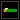
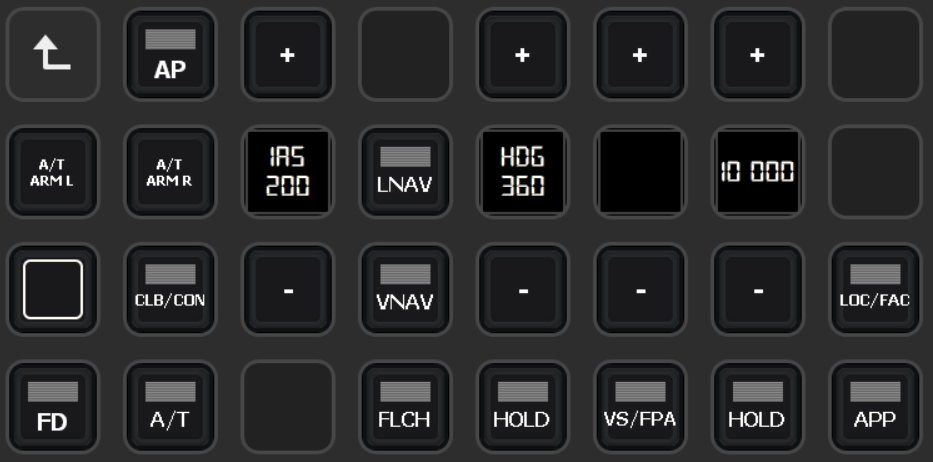
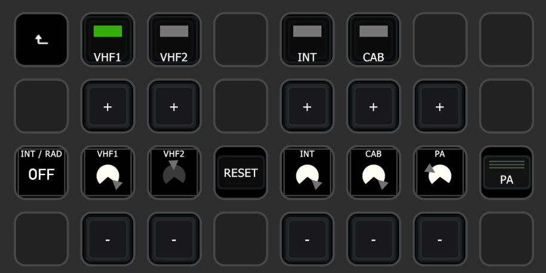

# Pilot's Deck
Directly control the FlightSim from your StreamDeck&#x00AE; via FSUIPC!
<br/>
<br/>
More Screenshots can be found under [Examples](README.md#Examples). Working ready-to-use / Example Profiles can be found under [Integrations](Integrations/).

<br/><br/>
## Introduction
As the Title suggests, this is a Plugin for Elegato's StreamDeck for the FlightSimmers out there in need of just more Buttons! :wink:<br/>
It is build arround FSUIPC, so if something in the Sim can be triggered via Macros, Scripts, Luas, Lvars, Hvars or Offsets - it can also be triggered via this Plugin from your StreamDeck! It is for the FlightSimmer already familiar with FSUIPC looking for an interesting Device to bind their Commands.<br/>
The Plugin is designed to be highly flexible and customizable, so it won't give any nice Guidance on what Offsets, Controls, Macros, ... are, how they are used with FSUIPC and it won't give you a nice List of Controls to select from. It even does not have anything pre-configured on the "COM Radio" Action - so you can make it work which fits best for your Aircraft(s)! Kinda like a "Framework" to build your own Thing :slightly_smiling_face:<br/><br/>
The Communication is Bi-Directional - it does not only send Commands into the Sim, it can also read & display a Controls State and can basically display any Value you want (as Text or Graphical Representation). It uses the full Potential the StreamDeck has to offer for FlightSimmers: it is also a *Display* Device, not *just* Buttons!<br/>
The included Images do not aim to create a "photorealistic" Look of Buttons and Switches like other Plugins do. But if you preferr that, you can configure your Actions that way with your own Images!<br/>
The Plugin can also switch between StreamDeck Profiles (on multiple Decks) when the Aircraft (Model) and FSUIPC Profile change.<br/>
Another "Feature" would be that you can "read" Values via [Lua-Scripts](README.md#lua-values).<br/><br/>
As there is no Sim-specific Library involved (only FSUIPC in form of the .NET Client), the Plugin should automatically connect to all FSUIPC Versions & Variants. Which Features / Action Types work depends on the Sim / the FSUIPC Variant (and if it is free or registered). It is developed on Prepar3D&#x00AE; and MSFS2020, so this Readme describes the Features which work there.
<br/><br/>
## Plugin Requirements
Uhm ... I'd say a FlightSim, \*UIPC and StreamDeck (Software) installed, updated and working would be a bloody good Start :laughing: <br/>
Starting with Version 0.7.3 the Plugin connects directly with **X-Plane** - you don't need to install XUIPC to use the Plugin!<br/>
It is compiled for the .NET Framework and tested on Windows 10. For the newer Releases of the Plugin (starting with 0.7.0) .NET 6 is required for which you'll probably need to download the according Runtimes (Download [here](https://dotnet.microsoft.com/en-us/download/dotnet/6.0)). You'll need ".NET Runtime 6.0.x" and ".NET Desktop Runtime 6.0.x" as x64. (Do not confuse it with arm64!)<br/>
Older Versions of the Plugin (until 0.6.x) only need .NET 4.8 which should be already installed on your System (as Part of Windows).
- To test if .NET 6.0 is installed (Plugin Version 0.7.0 or greater), run this in Powershell or Commandline:
 ```powershell
 dotnet --list-runtimes
 ``` 
 The Runtimes "Microsoft.NETCore.App 6.0.5" and "Microsoft.WindowsDesktop.App 6.0.5" should be listed (as an Example, the Version can be greater).
- To test if .NET 4.8 is installed (Plugin Version up to 0.6.x), run this in Powershell:
 ```powershell
 (Get-ItemProperty "HKLM:\SOFTWARE\Microsoft\NET Framework Setup\NDP\v4\Full").Release -ge 528040
 (Get-ItemProperty "HKLM:\SOFTWARE\Microsoft\NET Framework Setup\NDP\v4\Full").Version
 ```
The first Command should show "True", the second something with "4.8.x".<br/><br/>
The Connection to FSUIPC happens automaticallly when the StreamDeck Software (with the Plugin installed) runs. The Plugin's Manifest-File includes the Executables of all relevant Sims, so that it is informed by the StreamDeck Software when a Simulator starts (only then it tries to connect). The Executable-Names can be altered in the [Plugin Settings](README.md#plugin-settings).<br/>
Running the Plugin or the StreamDeck Software "as Admin" is NOT neccessary (and could probably even cause Problems)!<br/><br/>
The Sims and their FSUIPC Version/Variant are:
- FSUIPC3 - Microsoft Flight Simulator 2004
- FSUIPC4 - Microsoft FSX, FSX Steam Edition, Prepar3d 1.4 to 3.4
- FSUIPC5 - Prepar3D Version 4
- FSUIPC6 - **Prepar3D Version 4 and 5**
- FSUIPC7 - **Microsoft Flight Simulator 2020**
- XPUIPC/WebSocket - **X-Plane 12 & 11** (and probably older)<br/><br/>
If you let me know what works and which Features work in which Sim (other than P3D v5, MSFS2020, X-Plane 12/11), I'll add it to the Readme! :wink:<br/>
:grey_exclamation: Please mind that the Action Types Script, Macro, Lvar and vJoy can only work with a registered Version of FSUIPC! The Plugin can only do what your \*UIPC Installation supports, so a registered Version of FSUIPC is highly recommended (but not neccessary)!<br/>
:grey_exclamation: For MSFS2020 SU10 you will need at least Version 7.3.9 installed, with the "WASM/WAPI" Module also installed and activated (Version 0.9.0).
<br/><br/>
## Plugin Installation
It is not (yet) distributed in the StreamDeck Store, so it is a manual Installation for now.<br/>
Just put the Contents of the Zip in your Plugin-Folder under<br/>
  > **%appdata%\Elgato\StreamDeck\Plugins**

If it should not "work right" after Installation, check the [Troubleshooting-Section](README.md#troubleshooting).<br/><br/>

Optional: If you need/want to read Values generated by Lua-Scripts, you have to add the [PilotsDeck.lua](https://github.com/Fragtality/PilotsDeck/blob/master/PilotsDeck/lua/PilotsDeck.lua) Script from the Plugin's *\lua* Subfolder to your FSUIPC Installation as an Autostart Script. More Instructions can be found in that File. (If your Sim supports Lua)
### Upgrade
Just drop in / extract the new Version and you're good to go (if you modified/changed some Files like the json, config or Images you have to take care of it).<br/>
**BUT** if you switch from 0.6.x to 0.7.x follow the Steps below! After you have switched to 0.7.x it is "just drop in" again :slightly_smiling_face:<br/>
### Upgrade 0.6.x to 0.7.x
- First make a Backup of your current (PilotsDeck) Profiles with StreamDeck, close StreamDeck and make a Backup of your Plugin-Directory (%appdata%\Elgato\StreamDeck\Plugins\com.extension.pilotsdeck.sdPlugin).<br/>
- Delete the Plugin-Directory!
- Install/extract the new Version
- If you did not modify or added anything in your old Installation: cleared for takeoff :smile:
- If you changed or added Images, place them again in the \Images Sub-Directory of the Plugin.
- If you changed the manifest.json (e.g. for Profile-Switching of custom Profiles), change the new manifest.json accordingly. (Or take your old one and edit the Version, as long there are no new Actions)
- If you changed the PilotsDeck.exe.config File you have to modify Values now in the PilotsDeck.dll.config File. Please do NOT just copy in the Contents of the old .config File!
- If you added your own StreamDeck-Profiles in the \Profiles Directory, add them again (if you used the Profile-Switching Feature in that Way). They don't need to be reinstalled with the Profile-Switcher Action.
<br/><br/><br/>
## Overview of included Actions
As of now, there are 8-9 Actions:<br/>
*  **Display Value** - Read any Offset or Lvar Value and display it as Text. You can Scale, Round, Format and/or BCD-Decode the Value and you can customize the resulting Text to your liking. Numeric Values can also be mapped to Text!
*  **Display Value Button** - Same as before, but you can bind Macro(s), Control(s), Lvar(s) an Offset or a Lua-Script to it so that the Button does actually do something.
*  **Simple Button** - As simple as it gets - a straight-forward Button like any of your Joystick-Buttons. BUT: it can have have two different Mappings depending on a short or long Press AND it can be added to Multi-Actions in StreamDeck, so you can build Action-Sequences!
*  **Dynamic Button** - My Reason to start this Journey - a Button which reflects the actual State of a Control in the Sim! It does not matter from which Input Device you alter a Control: this Button will show the correct "Live"-State. (As long as this State can be correctly read from the Sim / Aircraft). Basically it switches the Background-Image of the Action depending on the current Value. Either 2-3 distinct States or 2 distinct States and "any" State.
*  **Korry Button** - This is a more specialized Variant of the Dynamic Button. It can read up to two Values (one for each Half) and draws two different/independent Images on the Background (does not swap the whole Image like the Dynamic Button).
*  **COM Radio** - It is more or less a "Display Value Button" with two Values to be read instead of one. Read the Radios from anywhere you want (BCD encoded or Integer) and swap the Frequencies by any Way you want. The Background Image is customizable.
*  **Display Gauge** - If you want a graphical Representation of a Value, let's say for your Engines N1 Value, Trim, Control Surface Deflection, Fuel Level ... this Action is for you! It can either be a Bar or an Arc. With Text or without.
*  **Display Gauge Dual** - New! Now with two Indicators instead of one! So you can have your Left/Right, Engine 1/Engine 2 or whatever in one Display.
*  **Profile Switcher** - This is more an Interface than an Action to configure the Profile Switching, it is only needed for Configuration and Profile Installation. Whey you press it's StreamDeck Button the Profile Switching is enabled/disabled.
<br/><br/>
## Action Configuration
Now we're getting to the "Fun" part! :flushed:<br/>
The Actions behave like any other Actions on the StreamDeck. All the Action's Settings are stored in the StreamDeck Profiles (and therefore are also saved when you Backup/Export Profiles). They can be moved arround, swapped, copy-pasted and put in Folders. In case of the "Simple Button" it can be put in Multi-Actions like any other Action. Only replacing one Type with another could lead to unexpected Results and is "not recommended".<br/>
All Configuration is done via the Property Inspector. Some Input-Fields combine multiple Fiels/Inputs in one string, so let's start with the common Syntax:<br/>
### Common Syntax, Fields and Behavior
Plain Numeric Values are separated by "**;**". E.g. an Size or Range Definition like "0; 10". All numeric Input-Fields support Float-Values and support both Decimal-Characters ("**,**" or "**.**") regardless of System Setting. The Output is forced to have a Decimal-Point regardless of System Setting (I'm not aware of any "localized" Cockpits :laughing:), but you can change that in the [Plugin Settings](README.md#plugin-settings).<br/>
Addresses, Format and Profiles are separated by "**:**".<br/>
Address Fields and some other Fields are using Syntax Checking on the Input. So if an Exclamation Mark is shown in the Input Field, it is likely wrong (or just missing). The Property Inspector matches not all Cases and in any Case the Input will be saved. The "real" Syntax Checking is done when a Button is pressed and then will only allow valid Syntax. Mind the Difference between "Syntax" and "Semantics": The Plugin can check if the Input is correct to specifiy e.g. a Macro via FSUIPC, but it can't check if that Macrofile or Macro exists :wink:<br/>
If a Button Press could not be executed for whatever Reason (Sim closed, not ready, Syntax incorecct, Action not configured ...), the Plugin will show the StreamDeck Alert-Symbol (yellow Triangle with an Exclamation Mark).<br/>
If the Plugin is waiting for FSUIPC to connect, Sim to become ready (again) or while loading, all Actions will show a "..." Background.<br/>
#### Address Fields (Action Types)
* **Offset**
  \[ (0x)Hex-Address:Size(:Type:Signedness|BitNum) ] (Read / Command)
  - *Hex-Address*: As seen in FSUIPC's Offsets Status Document (first column). A 4-digit Hex-Number. It can be prefixed with 0x and can be written in upper- or lower-case (the PI will only check mark upper-case, but lower-case does work).
  - *Size*: The Size of this Offset in Bytes (same Document, second column). A 1-digit Number.
  - *Type*: Specify if the Offset is an Integer "**i**", Float/Double "**f**", Bit "**b**" or String "**s**". Defaults to ":i" for Integers if not specified.
  - *Signedness*: Specify if the Offset is Signed "**s**" or Unsigned "**u**". Defaults to ":u" for Unsigned if not specified and only relevant for Integers.
  - *BitNum*: Only for Offset-Type Bit, the Number/Index of the Bit to read from or write to. Use 0 or 1 for the On/Off/Special Value Fields.<br/><br/>
Examples:
  - ```2118:8:f``` for "Turbine Engine 2 corrected N1" (8 byte double/float64)
  - ```034E:2``` for "COM1 frequency in BCD" (2 byte integer)
  - ```3544:4:i:s``` for "standby alitmeter in feet" (4 byte signed integer)
  - ```0x0ec6:2:i``` for "Pressure QNH"
  - ```0x0D0C:2:b:2``` to toggle Landing Lights
  <br/>
* **Lvar**
  \[ (L:)Name ] (Read / Command)
  - *Name*: The Lvar's Name with or without the preceding "L:". When used as Action/Command, the Values for On and Off can be configured in respective Fields.<br/><br/>
  Example:
  - ```VC_OVHD_AC_Pack_1_Button```
  <br/>
* **Control**
  \[ Control=Paramater(:Parameter)*(:Control=Paramater(:Parameter)*)* ] (Command)<br>
  \[ Control(:Control)* ]
  - The known "FS Controls" - FSUIPC provides a List of the available Standard/P3D Controls available. Also known as Events. First the *Control*-Number and then 0 or more *Parameter* for that Control. (e.g. Landing Light Switches, move them up two times and/or move multiple at once or move both at once). A Sequence of Controls only (no Parameters) is also possible.<br/><br/>
  Examples:
  - ```66587=72497:72507``` (Send Control 66587 with Parameter 72497 and then Control 66587 with Parameter 72507)
  - ```66168:65567``` (Send Control 66168 and then send Control 65567)
  <br/>
* **Macro**
  \[ File\:Macro(:Macro)* ] (Command)
  - *File*: The FSUIPC Macro File Name without Extension
  - *Macro*: The Macro's Name within that File. You can specify multiple Macros within one File (e.g. both Packs-Controls on one Button)<br/><br/>
  Example:
  - ```FSLA3XX_MAIN:ACPACK1:ACPACK2``` (Run Macro ACPACK1 from Macro-File FSLA3XX_MAIN and then ACPACK2 from the same File)
  <br/>
* **Script**
  \[ Lua|LuaToggle|LuaSet|LuaClear|LuaValue:File(:flag)* ] (Command)
  - *File*: The Filename of a Lua-Script (known to FSUIPC). Without Extension and it has to be preceded with one of the Lua Commands. To run a Script use "*Lua:*", to use one of the Lua Controls (Set, Clear, Toggle or Value) use the respective Prefix and specify a *:flag*. Set, Clear, Toggle and Value work as described in FSUIPC's Documentation. You can specifiy multiple Flags, the Plugin will call the Script / Lua Control multiple times, each time with a different Flag/Parameter. Useful to Set/Clear/Toggle/Value multiple Flags/Values at once.<br/>Note that all Syntax Checks allow to use *Lua:* with a *:flag* and that such a Command would run - but I can't tell yet what that would do :laughing:<br/><br/>
  Examples:
  - ```Lua:Baro_Toggle``` (run Lua-Script "Baro_Toggle.lua")
  - ```LuaToggle:FSL_CMD:21``` (toggle Flag 21 for Lua-Script "FSL_CMD.lua")
  - ```LuaToggle:FSL_CMD:21:22``` (toggle Flag 21 for Lua-Script "FSL_CMD.lua" and the toggle Flag 22)
  - ```LuaValue:FSL_CMD:420``` (Pass Value 420 (ipcPARAM) to Lua-Script "FSL_CMD.lua")
  <br/>
* **vJoy**
  \[ Joystick:Button(:t) ] (Command)<br/>
:grey_exclamation: This Action is not related to the vJoy Device-Driver from njz3 or the corresponding StreamDeck-Plugin from ashupp! It uses the builtin Virtual Buttons (Virtual Joysticks) from FSUIPC (Offset 0x29F0 to be specific).<br/>
As these Joysticks/Buttons are specific to FSUIPC, there are only usable within FSUIPC. No other Program (even the Sim itself) can detect them.
  - *Joystick*: The Number of the virtual Joystick to use, as documented in FSUIPC (Joystick 64 - 72).
  - *Button*: The Number of the Button on that Joystick (Button 0 - 31).
  - *Toggle*: The specified Button is handled as toggleable Button, meaning a press on the StreamDeck will toggle the Buttons State and it will remain in that State. Without this Option the StreamDeck-Button handles like a Joystick-Button (down when pressed, up when released).<br/><br/>
  Examples:
  - ```64:4``` (the StreamDeck Button is recognized as Joystick 64, Button 4 in the Sim)
  - ```72:2:t``` (the StreamDeck Button is recognized as Joystick 72, Button 2 in the Sim and will be toggled on KeyUp)
  <br/>
* **vJoyDrv**
 \[ Joystick:Button(:t) ] (Command)<br/>
 :grey_exclamation: This Action is related to the vJoy Device-Driver from njz3! To use it you have to install the vJoy Driver to your System and configure the Virtual Joysticks. Only simple Button presses are supported - Axis, POV or FFB are not supported by the Plugin.<br/>
 PilotsDeck is compiled for vJoy Version [v2.2.1.1](https://github.com/njz3/vJoy/releases/tag/v2.2.1.1), be sure to install/use this exact Version. **Please Note**: This vJoy Version does not work on Windows 11 and it is questionable if there ever will be an updated Release!<br/>
 As these Joysticks/Buttons present themself as normal "Game Controller" within Windows, they are detectable for every Program. But note: The Plugin will only trigger anything as long as the Sim is running.<br/>
There is no need to install the vJoy Driver if you are not planning to use this specific Action.
  - *Joystick*: The Number of the virtual Joystick to use, as configured by you in vJoy (Joystick 1 - 16).
  - *Button*: The Number of the Button on that Joystick, as configured by you in vJoy (Button 1 - 128).
  - *Toggle*: The specified Button is handled as toggleable Button, meaning a press on the StreamDeck will toggle the Buttons State and it will remain in that State. Without this Option the StreamDeck-Button handles like a Joystick-Button (down when pressed, up when released).<br/><br/>
  Examples:
  - ```1:2``` (the StreamDeck Button is recognized as Joystick 1, Button 2 in the Sim)
  - ```2:3:t``` (the StreamDeck Button is recognized as Joystick 2, Button 3 in the Sim and will be toggled on KeyUp)
 <br/>
 
* **Hvar**
 \[ (H:)Name ] (Command - MSFS2020 only)<br/>
  - *Name*: The Hvar's Name with or without the preceding "H:". You don't need to have a .hvar for FSUIPC7 / your Plane installed. The Hvar is activated via Calculator Code, so FSUIPC7 does not know it in Advance.<br/><br/>
  Example:
  - ```A32NX_EFIS_L_CHRONO_PUSHED```
 <br/>
 
* **Calculator**
 \[ Code ] (Command - MSFS2020 only)<br/>
  - *Code*: The desired Calculator Code to be executed.<br/><br/>

* **XP Command** (XPCMD)
 \[ data/ref/path ] (Command - X-Plane only)<br/>
  - *Path*: The official dataRef Path for the Command (as seen in DataRefTool for example).<br/><br/>
  Example:
  - ```toliss_airbus/aircondcommands/Pack1Toggle```
 <br/>
 
* **XP DataRef** (XPWREF)
 \[ data/ref/path(\[index\]|:sX) ] (Read/Command - X-Plane only)<br/>
  - *Path*: The official dataRef Path for the Value (as seen in DataRefTool for example). If the DataRef is an Array, you can directly access the Values when you append the index in Brackets. You can also access string DataRefs if you add *:s* and the Length after the Path.<br/><br/>
  Example:
  - ```ckpt/lamp/74```
  - ```AirbusFBW/FuelOHPArray[2]```
  - ```FlyWithLua/TLS2PLD/fcuHdg:s8```
 <br/><br/>

#### DecodeBCD / Scale / Format / Mappings
* **DecodeBCD**: If the Value is a BCD, the Plugin can decode it for you! 
* **Scale**: Multiply the Value by that Number to scale it, if it is too big or small. Defaults to 1.<br/>One Example would be "Pressure QNH as millibars" - it is delivered as multiple of 16 (e.g. 1013 = 16208). So we would scale it by "0.0625" (1/16) to have a human-readable Value.
* **Format**: Round the Value and/or add Text to it \[ Digits:Text %s Text ]
  - *Digits*: The Value is rounded to that fixed Number of Digits after the decimal Point (can be zero for an Integer). If not specified, the Value is not rounded at all.
  - *Text*: The Value is embedded at the "*%s*" in the Text you specify here. E.g. to add Units to the Value like "%s kg" or "%s %". Or put something in front of it. Every "%s" will be replaced by the Value.<br/>
  Examples:<br/>
   ```1```     One Digit after the Decimal Point, the current Value of 20.522534 will be displayed as 20.5 for Example. Match for zero would be "0.0".<br/>
   ```2:1%s``` Two Digits and add an "1" before the Text - useful for the BCD encoded Frequencies!<br/>
   ```%s ft``` Add "ft" after the Value<br/>
  <br/>
* **Mappings**: You can map specific Values to specific Texts. For example 0 will show as "OFF" and 10 will show as "ON" (Syntax: 0=OFF:10=ON). Comparisons are also allowed, for Example if 1 is greater-or-equal the current Value show the Text "XX" (Syntax: 1>=XX). You can have multiple Mappings and Comparisons, they are evaluated in the Order entered.<br/>
This is a rather powerfull Feature together with the Ability to change Font and Position as it reduces the need to create new Images in most Use-Cases!
* **Order**: DecodeBCD -> Scale -> Round -> Format -> Map. If the Value is to be matched (On/Off/Special State e.g.) it is done after Round and before Format.
<br/><br/>
#### Images
All Images are stored in the \Images Subdirectory. You can change and remove the existing ones and you can add your own Images. Newly added Images are automatically listed when you open any of the Actions Property Inspector, you don't have to restart the StreamDeck Software. If you change an existing Image, you have have to switch Profiles or restart the Software - all used Images are cached, so all Actions using the changed Image must disappear before the Image is loaded again from Disk.<br/>
The Images for the Korry Button are in the \Images\korry Subdirectory.<br/>
The only Images you should not delete are "Wait.png" and "Wait@<!-- -->2x.png", they are hard-coded in the Manifest-File and used as fallback!<br/>
The StreamDeck XL with its higher Button Resolution is also supported, all Images have "@2x" Version for that. The right Image for the specific Deck is automatically loaded (and all Coordinates/Positions are based on 72x72) - so Actions can easily be transferred between different Deck-Types without the need to change the Action's Settings!
* **Default Image / Background Normal**: The Image to be shown (or drawn to) when the Action is in their normal/working State or P3D is not loaded.
* **Error Image**: The Image to be shown when FSUIPC disconnects or the Value could not be read.
* **Special Value / State**: If the Value / Switch has an Special 2nd or 3rd State, you can indicate that by the Image specified. For Example if the Baro is on STD/1013, the PACK is on "Fault", the APU is "Avail", ...<br/>
#### Font Settings
For Actions which show Text, the used Font can be customized.<br/>
The default Behavior is to Inherit the Font Style from the Buttons Title Settings. Whatever you set there in Font, Size, Style is applied to the Text of that Button (all but Alignment and Show/Hide).<br/>
*BUT, there is a caveat in the StreamDeck API.* The Font Style (Regular, Bold, Italic) is transmitted as *localized* Text. I have put in the Strings for German and English. You can alter the [Plugin Settings](README.md#plugin-settings) to customize them or add your language. If you let me know which Strings are working for which Language, I can add that to the Plugin.<br/>
If you care at all to inherit the Font: Since the Plugin reads *all* installed Fonts on your System (in Contrast to StreamDeck), you can use nearly any fancy Font you like. The Font Style there is based on the (international) System API, so this StreamDeck caveat does not have an effect on the custom Font Settings.
<br/><br/>
### Display Value
<br/>
Most Settings should be explained by the common part.
* **Draw Box**: Will draw a Frame in the configured *Thickness* and *Color* arround the Value. The Frame's *Size & Position* is defined as *"X; Y; Width; Height"* (0, 0 is Top-Left).
* **Special Value Indication**: When you enable it, the Background will be changed to the specified Image as soon as the current Value from the Sim equals/compares the one you specified here (you can write a Comparison like ">=0.3"). It will reset to the Normal Background if it is does not match. Mind Scale and Round - the Matching is done after both. To stay with the Pressure QNH Example - you would need to enter 1013, not 16208. <br/>
You can optionally hide the Text when the Value matches. Maybe you want to display a nice "STD" Image?
You can also specify a *Different Color* when the Values match. This Color has priority over both inheritted or customized Font Settings. This Color is also used for the Frame, if *Draw Frame* is enabled.
* **Tweak Position**: This defines the Rectangle (the "Box") the Text is drawn on the current Background defined as *"X; Y; Width; Height"*. If *Draw Frame* is enabled, it is relative to the Frame's *Size & Position*. If it not enabled it is relative to the whole Button. The Text is always drawn horizontal/vertical centered within that Box. When *Draw Frame* is toggled this will reset to the respective Default.
<br/><br/>
### Simple Button / Display Value with Button
<br/>
Since Display Value is explained above and a simple Button has nothing much to configure visually, we can concentrate on how a "Mapping" is done - how you can define what is send to the Sim.
* **Action Type**: Defines the Type of Action. There's nothing more to add, if you're familiar with FSUIPC and binding everything you can to your Joystick(s) it is exactly that what you would guess :wink:
* **Action Address**: This, in essence, is your Mapping. Here you specify which Offset/Lvar/DataRef to write to or which Macro(s)/Script to run or which Control(s) to send. The Syntax is referenced [above](README.md#address-fields). For Types with multiple "Targets" (Macro, Control, Lua Flags), multiple Requests will be send to the Sim in fast Sequence.
* **Use Delay**: If Control is selected as Action Type, you can check that to have a small Delay of 50ms between the Control-Commands send to the Sim.
* **Reset Value**: If Lvar is selected as Action Type, you can check that to have the Lvar being reset to the Off-Value after the Button was pressed (the Plugin will set the Lvar to the On-Value for 100ms (controlDelay\*2) and then to the Off-Value). Useful for some Cockpit-Buttons which do not stay in the their pushed-Position and reflect that in their Lvar.
* **On / Off State**: For Lvar, Offset and DataRef you have to specify which Value stands for "On" and which for "Off". The Value to be written to the Lvar, Offset or DataRef. The Button will toggle between these based on the current Value when pushed ("keyUp") and sends it to the Sim. So if the Lvar/Offset is 1, then the Plugin will write a 0.<br/>If it is a Toggle-style Switch which you want to control (there is no On/Off State), write the same Value to both Fields (swap Frequencies e.g.).
* **Long Press**: When enabled, the Button can execute a completely different Command when pressed for longer than 600ms (with the default [Plugin Settings](README.md#plugin-settings). This second Command Settings' work mostly like described before. For Lvar and Offset as Action Type, the toggling is always done on the current value from the Action Address for the Long Press (meaning you can use two different Lvars/Offsets). The "Use Delay" and "Reset Value" option is used if enabled (they apply to both Actions)!<br/>
Note that the internal Mechanic is based on "keyUp": regardless of how long you press the Button, it will only execute once when released! For that Reason this Long Press Option is not offered when the first Command is a non-toggleable vJoy Address! A non-toggleable vJoy is "down" (set) as soon as the StreamDeck Button is pressed and "up" (clear) as soon as the StreamDeck Button is released. A toggelable vJoy though behaves like the other Action (evaluated on "keyUp") and can therefore have a second Command on with the Long Press Option.
<br/><br/>
### Dynamic Button
<br/>
Action Type and Address work exactly like described above.<br/>
* **Use Status Value**: When Lvar or Offset is selected as Action Type, the Dynamic Button defaults to use the current Value and "On" & "Off" States defined for the Control Status for Toggling. If you do want to use a different Lvars / Offsets with and/or different On & Off States for the Action Address and the Status Address, you can uncheck this Box.<br/>Note that this does only affect the "normal" Command, but not for the "Long Press".
* **Address** (Control Status Value): Here you specify where the current State (Value) of a Switch in the Sim can be read. Since there are only two Ways to read something from the Sim via FSUIPC, it is either an Offset or a (single) Lvar.<br/>The Syntax works as described [before](README.md#address-fields). The "third" Way, reading a Lua Value is described [below](README.md#lua-values).
* **On / Off State**: When the Value matches On or Off, the respective On or Off Image is displayed. You can either specifiy a discrete Value or a Comparison (like ">=0.3" to show the Image as long as the current Value is greater or equal to 0.3)<br/>
* **Special State**: For Switches which have something "in between" or other than the On/Off States, this Special State can be displayed with that Setting. When you enable the Special State the specified Image is shown when the Value matches. You can either specifiy a discrete Value or a Comparison. If that State is not a specific Value but any other Value than On/Off, check *Any Value*. An Example would be Gear Position: it retracted (~off), extended (~on) or in transit (any value).
<br/><br/>
### Korry Button
<br/>
The Addresses work the same as before, but now there can be two of them. In contrast to the Dynamic Button, this Button does not change the whole Image, it can draw two Images independently. There is some overlapping with the Dynamic Button (for Korrys), you could easily get the same functionality with a Dynamic Button in some Use-Cases. But the Benefit here is, not every Korry-Combination (Top+Bottom) has to be provided as complete Image. You can just create a new "Label" and combine that with the existing ones.
* **Top Address only**: You can use only one (the top) Address for both Halves, if you wish.
* **Show Value**: When the current Value (from the specified Address) matches the Value specified here, the selected Image will show in the respective Half (regardless what the other Half is displaying). You can either specifiy a discrete Value or a Comparison.
* **Show while non-zero**: Alternatively the Image is shown whenever the current Value is not Zero. Mind that an empty Value will be counted as zero and non-empty Strings (which don't represent a Number) will be counted as non-zero.
* **Image**: The Image to show for the respective Half. These Images have transparent Backgrounds and are stored in the Images\korry Subfolder and can be changed and extended like the "normal" Images. They default to 54x20 px but that is not a Requirement (as having a transparent Background).
* **Tweak Position**: This defines the Location and Size of each Half (in *x; y; w; h*). You can resize Images with that. Since the Image-Size is no where hard-coded, you can actually make yourself a vertical split Korry for Example, if you change these Positions and provide the appropiate Images!
<br/><br/>
### COM Radio
<br/>
Most fields work the same as described before, you define the Addresses where the Active (top) and Standby (bottom) Frequency can be read and define an Action how they are swapped in the Sim.<br/>On the fields that differ or are new:
* **Swap Background**: When your defined Swap Action was (successfully) send to the Sim, the Button will show that Image for 3.2s (=16 Ticks).
* **Value Format**: You can define a *Different Format* for the Standby Value. So if you read the int32 Value from 05C4 for the Active Frequency and the BCD encoded int16 Value from 034E for the Standby Frequency, you can do that and have both look like a Frequency.
* **Font Settings**: Both Frequencies will always use the same Font, regardless how it is defined. The Font Style is ignored and is not configurable: the Active (top) Frequency is always bold, the Standby (bottom) Frequency is always regular. The Font Color for the Standby Frequency will be darkened if the Settings are inherited. With custom Settings you can choose different Colors for both.
* **Tweak Position**: There are two instead of one ... if you wish so, you can swap what is on top. :wink:
<br/><br/>
### Display Gauge
<br/>
This Action can display a Value on a Bar or an Arc. The graphics are rendered on refresh.
* **Has Action**: If you want to map any Action to this Button, check this Box. Configure the Action/Address like described before, all the Fields behave the same.
* **Normal Background**: The graphics are rendered on that Background. 
* **Value Format**: Yo have to define a *Minimum* and *Maximum* Value for that Action to work. The Value after Decoding and Scaling is used for the Indicator.
* **Gauge Settings**
  - *Gauge Size*: The Size of the Bar or Arc. For a Bar it is "Width; Height", for an Arc it is "Radius; Thickness".
  - *Bar Color*: The Base Color of the Bar or Arc.
  - *Color Change*: Check this Box to change the Base Color when a Variable has a specific Value.
  - *Address Color*: Which Variable to read for the Color Change (can be the same or different to the Variable used for the current Value).
  - *Value*: On which Value the Color should change (only the Base Color will be changed - the Warning Ranges are unaffected). You can either specifiy a discrete Value or a Comparison.
  - *Value Color*: The new Base Color to use when the given Variable has the specified Value.
  - *Orientation* (Bar): Define if this Bar is horizontal or vertical and if the Values are increasing right/left or up/down. An Arc does not need (and ignores) that - it is a Circle, it has all directions. :smile:
  - *Start Angle* (Arc): The Angle at wich the Arc starts. 0° is at right center.
  - *Sweep Angle* (Arc): This Angle defines how "big" or "long" the Arc is from the *Start Angle*. For positive angles the Indicator moves clock-wise, for negative counterclock-wise.
  - *Offset* (Arc): You can adjust the Arc's Position with this Field as "x; y" Offset from the top-left Corner (0, 0).
 * **Indicator Settings** Define the Color and Size of the Triangle that indicates the current Value in the Sim. You can *Flip* it to draw it on the "other side".
 * **Center Line** Draw a Line at the Center (50%) in the specified *Color* and *Size*
 * **Warning Range**: If there should be "dangerous" or "critical" area on the Bar/Arc, you can define it here.
 	- *Critical / Warning Range* In this *Range*, lying between *Minimum* and *Maximum*, the Area will be drawn in the specified *Color*. The Ranges can be at the start, end, center, anywhere you want.
	- *Symmetric Range*: If these colored areas should be at both Ends for Example, you can enable that here. The Ranges will then be "mirrored".
 * **Text Settings**: If the Indicator is in one the Ranges the Text can be drawn in the respective Range Color. Everything else here works the same.
<br/><br/>
### Display Gauge (Dual)
<br/>
Shows two Values on the same Bar or Arc. So they share the same Minimum, Maximum and Format (and Font-Settings).<br/>
The most notabel Difference: with a Bar, both Values can be displayed as Text. With an Arc, only the first Value is displayed. The Arc therefore allows to swap (*Flip*) the Indicators.
<br/><br/>
### Profile Switcher
<br/>
With this Action the Profile Switching is configured. If you want to use that (disabled by default), drag this Action somewhere on your StreamDeck. Upon first use, as soon as you select this Action and the Property Inspector appears, you will be asked if you want to install preconfigured Profiles. The Software should ask once per every connected StreamDeck, but the API has the Tendency to pop-up one additional Dialog sometimes. Only accept the first x Dialogs (or delete the "Copy" Profiles afterwards).<br/>This is *required* for the Switching to work! The StreamDeck API only allows to switch Profiles which came preconfigured with a Plugin and internally keeps Track of that (meaning, the StreamDeck *knows* if a Profile came frome a User or from a Plugin). You only have to install the Profiles if you want to use the Switching capabilities.<br/>
For that Reason the Plugin conveniently includes 3 StreamDeck Profiles for the "normal" StreamDeck (Default, Yankee, Zulu) and 3 Profiles for the XL StreamDeck (DefaultXL, Whiskey, X-Ray) that you can map to any FSUIPC Profiles. You don't have to use them (that is also customizable), you can use your own Profiles or add additional Profiles. But that requires a change in the Plugin Settings (they have to be "published" to StreamDeck upon Plugin Start and have to be installed by the Plugin/StreamDeck Software).<br/>
The Plugin will switch to a Profile as soon FSUIPC is ready (somewhere while the Sim loads). It attempts to switch back to the previous used Profile, but that only works if you don't use Folders (did not switch between them within the Profile) - again for API Reasons.<br/>
For X-Plane the DataRef "sim/aircraft/view/acf_relative_path" (the first 32 Characters) for the Comparison - but that is only availabe for X-Plane 12! Therefore Profile Switching is not available for X-Plane 11 and older.<br/>
In both Cases it will be tested if the Mapping(s) you entered are contained in current FSUIPC ProfileName or X-Plane Livery Path. For example entering "a320" will match everything that has it in the Name/Path.<br/>
* **Enabled** When this is checked, this Feature is activated. You don not have to keep this Action anywhere on your StreamDeck after Configuration (it is a Global Setting).
* **Profiles Installed** You can reset the Installed flag (uncheck), if you wish. You will immediately be asked if you want to install the preconfigured Profiles (=all Profiles which where listed in the Manifest-File when the StreamDeck Software loaded the Plugin). Profiles that already exist will *not* be overwritten - StreamDeck will add a "xyz copy" Profile.
* **Use Default** (per Deck) For unknown FSUIPC Profiles (or Aircrafts which do not have a FSUIPC Profile), the Plugin will switch to the Profile configured by *Name* if this Option is checked. If unchecked, only mapped FSUIPC Profiles will be switched. Default is obviously the bundled Default Profile :wink:
* **Profile Mappings** (per Deck) Here you can map your FSUIPC Profiles / X-Plane Aircrafts to the different StreamDeck Profiles. It is a substring (contains) match and is Case-Sensitive. Multiple Mappings can point to the same StreamDeck Profile, their Names are separated by "**:**".
#### Customization
If you want to use your own Names or need more Profiles, you can customize that. But because of the described Limitation of the StreamDeck API, you have to fiddle with the Plugin's [Manifest](README.md#manifestjson) File directly (so the Plugin can install it).<br/>
* First create a new empty Profile in your StreamDeck and export it (or an existing one, does not need to be empty). Name it any way you want, non-alpha-numeric Characters are also allowed, but rename the File afterwards if these Characters are more "special" then Space, Minus or Underscore (it has no Influence on the displayed Name).
* Copy the .streamDeckProfile File in the Plugin's Directory, preferably in the \Profiles Subdirectory.
* Alter the Manifest File. Add your StreamDeck Profile(s) *File*-Name (without Extension) to the List in the same way as the included ones and specifiy the correct Deck-Type. You can, of course, get completely rid of the included StreamDeck Profiles if you wish and just use your own. Remember the Default Profile is configurable, so you can even replace/remove that!
* Restart the StreamDeck Application, use the Profile Switcher Action to reset the Installed State of the Profiles. Now the Profiles which are configured in the Manifest will be installed. The old ones will not (and can not) be removed automatically (if they were installed before), you have to delete them manually.
* You can use the added Profiles now like the included ones. If everything went well, they should be listed in StreamDeck and in the Profile Switcher Action to map FSUIPC Profiles to it. That's the best I can offer, I'm glad it works at all - as per StreamDeck SDK it shouldn't work because the preconfigured Profiles are writeable :laughing:
<br/><br/>
## Lua Values
:grey_exclamation: Only applicable to FSX/P3D/MSFS. For X-Plane use FlyWithLua and create custom DataRefs with it.<br/>
Somewhere along the way, I wanted to add a Feature to read the current State of a Switch in the Sim with a Lua-Script. Maybe the State can't be read via one Lvar/Offset (FSL APU Avail...) and needs some "logic" from a Script to determine the State. Or it is just easier to read the Control's State via Lua (FSL2Lua). Wouldn't it be cool if the Plugin could run Lua-Scripts to read their return Values and display/use these Values? :thinking:<br/>
You can!! Strictly speaking it is just one Script, it returns nothing, is not run by the Plugin and there is really no third way to read a Value from the Sim - but it still works. :laughing: Here is how:<br/>
The [Lua-Script](https://github.com/Fragtality/PilotsDeck/blob/master/PilotsDeck/lua/PilotsDeck.lua) which is provided in the \lua Subfolder is called by FSUIPC every 250ms as soon as it is started (given that you installed/configured it like described in that File). In that File (only) you can add your own Code to do that Control / State checking logic and generate a Value. Then you can write these Values to the "General Use" Range 66C0-66FF (64 bytes) via one of the ipc.writeXX Functions provided by FSUIPC (given that this Range is not used by an P3D Addon/Application!). Where you put them (in that Range) and in which Type (int/float/string/...) is up to you. You have to keep track of these and allocate these Addresses all by yourself! And then you read these Addresses via any Plugin Action like any other Offset. Yeah ... it is more a "mechanic" than a "Feature", but let's ignore that :shushing_face:<br/>
A small (hopefully helpful) Quick Reference is in the provided Script. Let's view my Script as an Example:<br/>
```lua
local PLDFSL = nil

function Pilotsdeck_Poll ()
	local aircraft = ipc.readSTR(0x3500,24)
	if string.find(aircraft, "A320") or string.find(aircraft, "A321") or string.find(aircraft, "A319") then
		if ticks < 12 then
			ticks = ticks + 1
			return
		elseif ticks == 12 then
			PLDFSL = require "PLDFSL"
			ticks = ticks + 1
		end
		
		FSLReadLDG()
		FSLReadPACK()
		FSLUpdateButtonLt()
	end	
end

event.timer(250, "Pilotsdeck_Poll")

function FSLReadLDG()
	local pos = PLDFSL.OVHD_EXTLT_Land_L_Switch:state()
	if PLDFSL.OVHD_EXTLT_Land_L_Switch:value() ~= PLDFSL.OVHD_EXTLT_Land_R_Switch:value() then
		pos = "FAUL"
	end
	ipc.writeSTR(0x66C0, pos, 4)
end

function FSLReadTCAS()
	ipc.writeSTR(0x66C5, PLDFSL.PED_ATCXPDR_MODE_Switch:state(), 4)
end

function FSLReadPACK()
	local pack1 = ipc.readLvar("VC_OVHD_AC_Pack_1_Button")
	local pack2 = ipc.readLvar("VC_OVHD_AC_Pack_2_Button")
	ipc.writeUB(0x66CA, pack1+pack2)
end

function FSLUpdateButtonLt()
	if ipc.readLvar("VC_GSLD_CP_EFIS_FD_Brt_Lt") ~= 0 or ipc.readLvar("VC_GSLD_CP_EFIS_FD_Dim_Lt") ~= 0 then
		ipc.writeUB(0x5500,1)
	else
		ipc.writeUB(0x5500,0)
	end
	
	if ipc.readLvar("VC_GSLD_CP_EFIS_LS_Brt_Lt") ~= 0 or ipc.readLvar("VC_GSLD_CP_EFIS_LS_Dim_Lt") ~= 0 then
		ipc.writeUB(0x5501,1)
	else
		ipc.writeUB(0x5501,0)
	end
end
```
<br/>
Within the Plugin I then use:
- "66C5:4:s" to read the TCAS State and display & toggle it with a "Display Value with Button" Action (toggling via Lua-Script). Displayed with a nice quick-google-searched LCD Font. This Example is now more or less obsolete, since you can do the same with new Mappings Feature without writing any Lua-Code.
- "66C0:4:s" to read the Position/State of both Landing Lights in a "Dynamic Button" and display the appropiate Images for the three States On, Off and Retracted (via Special State). One Button which sends "Up" for both Landing Lights, one to send "Down" for both Landing Lights via FSControls. (If both Landing Lights positions differ, the Action will show the Error Image which is configured for "Fault". Since the current Value does not match the On, Off or Special State, the Plugin "assumes" a Read-Error. So there is some kind of fourth State to display :wink:)
- "66CA:1:i" to read the Pack State and display them On/Off or "Fault" (if they are not both in the same State) with a "Dynamic Button" to also toggle both Packs via two Macro Calls at once.
<br/><br/>

## Plugin Settings
There are two Files where Settings can be altered (both can be found in the Plugin's directory):<br/>
The first is the [PilotsDeck.dll.config](README.md#pilotsdeckexeconfig) File (former PilotsDeck.exe.config) which is the "main" Configuration File for the General Application/Plugin Settings.<br/>
The second is the [manifest.json](README.md#manifestjson) which is specific for StreamDeck (it defines it as Plugin so to speak). This only needs to be touched for a different Application to monitor and to customize (or add) StreamDeck Profiles to switch to.<br/>
Generally take care when editing them, the XML/JSON Syntax must be the correct for the Application/Plugin to start at all. Backups FTW! :laughing:<br/>

### PilotsDeck.dll.config
These are the available Settings and their Default:<br/>
* **pollInterval**="200"		- The Intveral / Tick-Time at which the Offsets and Lvars will be refreshed / read from the Sim.
* **waitTicks**="150"			- The amount of Ticks to wait between Connection retries. Fractions of that Value are used for other things (Start-Delay between Plugin/StreamDeck, Time-Measuring)
* **longPressTicks**="3"		- The amount of Ticks a Button had to be pressed/down to be recognized as ["Long Press"](README.md#simple-button--display-value-with-button) when released.
* **appStartDelay**="30"		- When P3D (or any other Sim) is started, it will throttle the Process Calls to FSUIPC to every 10s (based on Ticks) in the first X seconds after FSUIPC successfully processed. Depending on how fast/slow P3D and the selected Aircraft are loading this could be too long/short. This only applies to when the Plugin (StreamDeck Software) was already running, if the Plugin is started when P3D was already running, it will directly connect and process.
* **controlDelay**="50"			- The amount of milliseconds to delay the next Control send to the Sim. This Delay (times 2) is also used for the "Lvar Reset".
* **stringReplace**="%s"		- If for whatever Reason you don't like the C-Style, you can change the String-to-be-replaced for the Format Field. Don't use the colon (:). The PI and Value Checking are hardcoded to %s, though.
* **redrawAlways**"="false" 		-  With "true" you can force the Plugin to redraw the Buttons always, even if the Sim or FSUIPC are not running.
* **forceDecimalPoint**="true"		- This forces the Text Output to be always formatted with a "**.**" as Decimal Character, regardless of System Setting. Specifically, when "true" the CultureInfo is forced to "en-US" otherwise with "false" it is forced to "de-DE".
* **Fsuipc7LegacyLvars**="false"	- With "true", the new MSFS Variable Services in FSUIPC7 is not used and instead the legacy way over Offset 0x0D70.
* **xpIP**"="127.0.0.1" 		-  The IP (not Hostname) where X-Plane is running. Networked Installation currently not supported.
* **xpPort**"="49000" 			-  The Port on which X-Plane is running.<br/><br/>

For the Font-Inheritance Workaround (mentioned caveat in the StreamDeck API). "XX" is the two-letter Code for the (general) Language. For instance, en_US and en_GB both map to "en". You have to define all 3 Styles for a language.
* **fontDefault_XX**="Regular"
* **fontBold_XX**="Bold"
* **fontItalic_XX**="Italic"<br/><br/>

### manifest.json
There are only two Use-Cases to fiddle in that file, so these are the interesting Parts:
* **ApplicationsToMonitor**: Change this to alter the Executable the Plugin reacts upon.
* **Profiles**: Like described under [Profile Switcher](README.md#customization) - here you add or change the StreamDeck Profiles. If the .streamDeckProfile File is in the \Profiles Subdirectory, you must prefix the Name with "*Profiles/*". Mind the JSON-Syntax: the last Entry must not have a "**,**" at the End, but all others have to be separated by that.
<br/><br/>

## Examples
Here a Number of Example Screenshots. Under [Integrations](Integrations/) you'll find some predefined and ready-to-use Profiles which also serve as Examples. So even if you don't have these Planes, it may give you some Ideas on what and how it can be done 😉<br/><br/>

Tired of aiming at the number Keys with your Mouse in the VC? Make yourself a Transponder Control on the Deck:<br/>
<br/>
All "Simple Buttons" mapped to usual Macros. And one "Display Value" to read the Offset 0x0354.<br/><br/>
Do you have GSX? Want to have a "cooler" Way to navigate through its Menu? Make yourself a GSX Menu on the Deck:<br/>
<br/>
All "Simple Buttons". The Numbers use (FS)Controls, the Menu a Lua-Script with ipc.keypress and the Push is a Lua-Script which flicks the Int/Rad Switch (FSL specific).<br/><br/>
Need your Lights, usual Korrys and Buttons at Hand? Make yourself a Folder and put them there:<br/>
<br/>
"Dynamic Buttons" for the Lights and Korrys (using Controls, Macros, Scripts), a "Simple Button" for the TO Conf (Macro), and two "Display Value with Button" with Lua-Scripts. The Values for TCAS/PWS are generated in the PilotsDeck.lua and are then read-out via Offset.<br/><br/>
Display the current GSX De/Boarding Status, Radio-Control, FCU/AP and Transponder all in one small Deck:
<br>
The GSX Status are just "Display Values" for the corresponding GSX Lvars. Some "Simple Buttons" to change the Frequency (with Long Press for increase/decrease fast). 4 Subfolders full Buttons for GSX Menu, FCU and AP interaction and the Transponder complete with Keypad. The Radio is obvious :wink:<br/><br/>
The essential Overhead Buttons for 787.
<br/><br/>

The Master Control Panel on your StreamDeck:
<br/>

The ACP Panel on your StreamDeck:
<br/>


<br/><br/>
## Troubleshooting
If you encounter the Issue that although the Plugin and its Actions are displayed in the StreamDeck Software but you can not configure any Action because the Dropdown Inputs for e.g. Action Types and Images are not filled: it is very likely that the Executable and/or its DLLs are blocked by some Security Mechanic. The Dropdowns not working is only the "first Symptom" - the Actions/Buttons on the StreamDeck will generally not work in the Sim!<br/>
One Reason could be the Windows Explorer / Zip Folder Mechanic for "Files downloaded from the Internet". Run that in Powershell (change <USERNAME> accordingly):
```powershell
dir -Path C:\Users\<USERNAME>\AppData\Roaming\Elgato\StreamDeck\Plugins\com.extension.pilotsdeck.sdPlugin -Recurse | Unblock-File
```
If that is not the Culprit, check your AV Scanner and try if it works if you add an Exception for the Plugin. With Avast this is not neccessary (does only a thourough "Cyber Scan" upon first Launch, requiring to restart the StreamDeck Software), but other AV Scanners might behave differently and just silently block it!<br/>And it is not only File-Scanning: Security-Tools / Firewalls blocking Network-Traffic could also be the Reason! The Connection between StreamDeck Software and it's Plugins is done via local WebSockets.<br/><br/>
If it still doesn't work, contact me on one of the Plattforms / Forums! To help you I'll need:
- The Version of the Plugin you have downloaded
- Your latest StreamDeck Log File (StreamDeck0.log in %appdata%\Elgato\StreamDeck\logs)
- Your latest PilotsDeck Log File (PilotsDeckYYYYMMDD.log int the \log Directory of the Plugin).
- If that does not exist: First tell me, so I know you did not forget :laughing:<br/>
 Second: Try to run the Exectuable manually via PowerShell / Commandline and copy or make a Screenshot of the Output.
<br/><br/>
## License
Published under [MIT License](https://github.com/Fragtality/PilotsDeck/blob/master/LICENSE).<br/>
Uses "StreamDeckToolkit" from FritzAndFriends, published under [MIT License](https://github.com/FritzAndFriends/StreamDeckToolkit/blob/dev/LICENSE)<br/>
Uses "FSUIPC Client DLL for .NET" from Paul Henty \([License](http://fsuipc.paulhenty.com/index.html#licence))<br/>
Prepar3D is a Trademark or Registered Trademark of Lockheed Martin Corporation.<br/>
StreamDeck is a Trademark or Registered Trademark of Elgato Systems and/or Corsair Gaming, Inc.<br/>
Windows is a Trademark or Registered Trademark of Microsoft Corporation.<br/>
