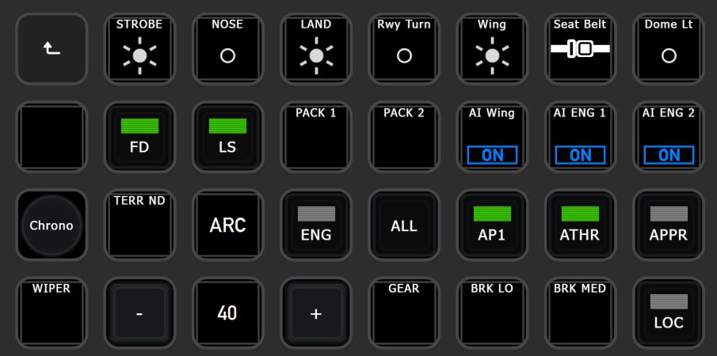

# Pilot's Deck
Directly check & control the FlightSim from your StreamDeck!
  

## 1 - Introduction
PilotsDeck is a Plugin for Elegato's StreamDeck with the Ability to **trigger Cockpit-Controls** in different Ways and especially reading & **displaying a Control's State** on the StreamDeck as Text, Image, Bar or Arc. It is lean & mean, flexible, completely Open-Source and Free-to-Use. It does not do any fancy Stuff like a PFD - it does exactly what is needed to support smooth Flight Operations 😎 

StreamDeck-wise it behaves like any other StreamDeck Plugin: it runs alongside other Plugins and you can Drag, Drop, Copy, Paste the Actions like any other Action in the StreamDeck Software between your Folders, Pages or even different StreamDecks. The Action Configuration is done through the standard "Property Inspector" of StreamDeck UI and saved in the StreamDeck Profile. You can create, export and share Profiles with the Plugin's Actions to share their Configuration. 
The Plugin supports different StreamDeck Models: **Mini**, **Standard**/15-Key, **XL**, **Mobile** and **Plus**. Other Models might work, but an indented Support for Non-Display Models is not planned. The Plugin runs only on **Windows**. There no Plans for Linux or macOS Support (the first is not supported by StreamDeck at all, both do not run or support all Sims and some essential .NET Libraries are only available on Windows). 

Simulator-wise it supports all major Platforms on Windows - **MSFS2020**, **X-Plane 12/11** and **P3D/FSX**. For MS Platforms it connects through **FSUIPC** to the Simulator, for X-Plane it connects directly via **UDP** Sockets. All Variables and Commands these Connections allow are usable with the Plugin. You can can directly connect to another Sim without reconfiguring anything (but you can't run multiple Simulators in parallel). 
Not all Variables and Commands require a registered Version of FSUIPC, but a registered (bought) Copy of FSUIPC is recommended to use the full Potential. If you only fly in X-Plane, FSUIPC is not needed at all. 
It is designed for **advanced Sim-Users** which "know how to do Stuff": it does not make any unnecessary complicated Stuff, but doesn't have Features allowing to do anything without knowing anything 😅 If you know how to read Control-States for your Plane and how to trigger these Controls, you can quickly define an Action for that on the StreamDeck. If you're eager to read & learn, you'll be fine! 😉 

Predefined StreamDeck Profiles are available under [Integrations](Integrations/), but there are not much. Either your Plane is among these for direct Use or they can at least serve as Example: 
 
 

  

### 1.1 - Supported Simulator Versions

| Simulator | Supported | Tested | Requirement |
| :-------------|:-------------:|:-----:|:-----|
| **Flight Simulator 2020** | **yes** | **yes** | FSUIPC 7 & MobiFlight WASM |
| Flight Simulator X | yes | no | FSUIPC4 |
| Flight Simulator 2004 | yes | no | FSUIPC 3 |
| **Prepar3D v5** | **yes** | **yes** | FSUIPC 6 |
| Prepar3D v4 | yes | no | FSUIPC 5/6 |
| Prepar3D v1-3 | yes | no | FSUIPC 4 |
| **X-Plane 12** | **yes** | **yes** | None - does not use XUIPC |
| X-Plane 11 | yes | yes | None - does not use XUIPC |
| X-Plane <=10 | yes | no | None - does not use XUIPC |

Supported is understood as "technical and basically supported by the Connection Method". Support in Terms of ensured Compatibility, Fixing Issues and giving Support exists only for the latest Version of the three Major Simulators: MSFS2020, X-Plane 12, P3D v5. I'm happy if it works for older Versions, but I won't make any Effort for them.
  

### 1.2 - Supported Sim-Commands & -Variables
Here a quick Overview of what you can send to the Simulator ("**Command**") or from what you can read Values from the Simulator ("**Variable**"). One of the Things which make the Plugin flexible: Variables can also be used as Commands. For Example to move a Cockpit-Control by writing a different Value to a Variable.  
How Commands and Variables are configured and the different Options how they can be executed is described under INSERTLINK. 

| ID | Description | Command | Variable | Simulators               | 
| :---: | :------------ | :---: | :---: | :-------------------- | 
| **MACRO** | Execute any Macro known to FSUIPC | ✔️ | ✖️ | MSFS*, P3D, FSX |
| **SCRIPT** | Run any Lua-Code known to FSUIPC | ✔️ | ✖️ | MSFS, P3D, FSX |
| **CONTROL** | Send any SimEvent defined by its numerical ID (also known as FS-Controls, Control-Codes. Numerical Variant of a K-Variable/K-Event) | ✔️ | ✖️ | MSFS, P3D, FSX, FS9 |
| **LVAR** | Read from / Write to any L-Var ("Local Variable") | ✔️ | ✔️ | MSFS, P3D, FSX |
| **OFFSET** | Read from / Write to any FSUIPC Offset | ✔️ | ✔️ | MSFS, P3D, FSX, FS9 |
| **VJOY** | Toggle/Clear/Set a Button of a virtual Joystick from *FSUIPC* | ✔️ | ✖️ | MSFS, P3D, FSX |
| **VJOYDRV** | Toggle/Clear/Set a Button of a virtual Joystick from the known *vJoy Device Driver* (if installed) | ✔️ | ✖️ | ALL |
| **HVAR** | Activate any H-Variable in the Simulator | ✔️ | ✖️ | MSFS |
| **CALCULATOR** | Run any Calculator/Gauge Code in the Simulator | ✔️ | ✖️ | MSFS |
| **XPCMD** | Send any Command known to X-Plane | ✔️ | ✖️ | XP |
| **XPWREF** | Read from / Write to any X-Plane DataRef | ✔️ | ✔️ | XP |
| **AVAR** | Read from / Write to any Simulation Variable (also known as A-Var) | ✔️ | ✔️ | MSFS |

\* = MSFS does not support Mouse-Macros 
:grey_exclamation: Please mind that the Command Types Script, Macro, Lvar and vJoy can only work with a **registered** Version of FSUIPC! 
:grey_exclamation: Both **vJoy** Command Types are independent of each other and are two different Things! "VJOY" can only be assigned in FSUIPC (and not in the Simulator). The "VJOYDRV" can be assigned by anything which understands a Joystick Button (Simulator, FSUIPC, Addons, ...).
  

### 1.3 - Available StreamDeck Actions
All Actions work on the **Keypads** (the normal/square StreamDeck Buttons). The Dial/Touchpad (aka **Encoder**) on the SD+ is only supported by some Actions (the ones which make the most Sense).  
On Keypads you can assign **two** different Commands, based on how long you hold it: A **Short**/Normal and **Long** Press (>= 600ms). Only one of the available Actions can be put in StreamDeck Multi-Actions. 
On Encoders you can assign **five** different Commands for each Interaction: **Left** Turn, **Right** Turn, **Touch** Tap and a **Short** & **Long** Press on the Dial. The Actions can be put in StreamDeck Encoder-Stacks, but will then lose their Short/Long Press Function.  
How these Actions can be configured and customized is described under INSERTLINK. 

|  | Action Name | Keypad / Encoder | Description |
| :---: | :-------------- | :---------: | :----------- |
|  | **Display Value** | Keypad | Display a Sim Variable as Number or Text (display "ON" instead of "1"). You can scale/round/format the Value as needed and customize the Font-Settings. Only for Display. |
|  | **Display Value with Switch** | Keypad / Encoder | Like before, but this Action also sends Commands. |
|  | **Simple Button** | Keypad | Can only send Commands and always shows the same (configurable) Image. Supported in StreamDeck Multi-Actions! |
|  | **Dynamic Button** | Keypad | This Action dynamically changes the displayed Image based on a Variable (in Addition to sending Commands). Different Values trigger different Images. |
|  | **Korry Button** | Keypad | Intended for Korry-Switches in the Cockpit: the Action displays two "Sub-Images" independently of each other. They are shown/hidden based on their own Variable, but will not change the Image based on the Value. Can be adapted to other Use-Cases. |
|  | **COM Radio** | Keypad / Encoder | Intended for Com Frequencies: the Action shows two different Variables which can be independently scaled/rounded/formatted but share the same Font-Settings. Can be adapted to other Use-Cases. |
|  | **Display Gauge** | Keypad / Encoder | This Actions renders the Value dynamically on a Bar or Arc. Size, Color, Position and Text-Settings can be tweaked. It can optionally send Commands. |
|  | **Display Gauge (Dual)** | Keypad | As before, but it renders two Values dynamically on the same Bar or Arc. |

 

### 1.4 - Installation & Requirements
The best Way to Install and Update the Plugin is via the **Installer**: Download, Execute and click Install! It will check the Requirements, informs & links what it missing and installs the Plugin in the correct Space if the Requirements are met (the StreamDeck Software will be automatically stopped). 
It is highly likely that you need to **Unblock/Exclude** the Installer & Plugin from BitDefender and other AV-/Security-Software. It's the number one Reason for "the Plugin is not working"-Issues. 
If it still does not work right or at all, please check INSERTLINK.  
The Requirements for the Plugin to run:
- Windows **10** or **11** (updated)
- [**StreamDeck Software v6**](https://www.elgato.com/downloads)
- [**.NET 7**](https://dotnet.microsoft.com/en-us/download/dotnet/7.0) x64 Runtime (Core + Desktop) installed & updated
- If not X-Plane only: The **latest** Release of the [**FSUIPC**](http://fsuipc.com/) Major Version specific to your Simulator (e.g. FSUIPC 7 for MSFS2020)
- If MSFS is installed: The **latest** Release of the WASM-Module from [**MobiFlight**](https://github.com/MobiFlight/MobiFlight-WASM-Module) installed in your Community-Folder
- Optional: If you want to use **VJOYDRV** Commands you need Version [v2.2.1.1](https://github.com/njz3/vJoy/releases/tag/v2.2.1.1) for Windows 10 and Version [2.1.9.1](https://github.com/jshafer817/vJoy/releases/tag/v2.1.9.1) for Windows 11. It is not checked by the Installer (since it is not a Requirement for the Plugin).

  
If you want to install it manually (not recommened), just put the Contents of the Zip in your Plugin-Folder here:

 > %appdata%\Elgato\StreamDeck\Plugins

When Updating manually, delete all Binaries/Libraries in the Plugin's Folder before unzipping. 
If you don't know what that means, what to do and what Software Versions you have installed: Use the Installer!!! 😅 
(Number 2 & 3 Reasons the Plugin is not working: Missing/outdated Requirements and wrong Location)

   
## 2 - Action Configuration
Since the Plugin is very flexible, there is a "little" Learning Curve 😳 In this Chapter you'll find:
- The Options and Behavior common to all Actions.
- How Commands & Variables are defined and configured.
- How each Plugin Action can be configured and customized.

 

### 2.1 - Common Syntax, Options and Behavior
Generally, most of the Configuration is defined in Text-Input-Fields. This is on Purpose so that Parts of the Configuration can quickly be changed and easily be copied between Actions.  

#### 2.1.1 - Common Syntax
If a Field requires multiple numeric Values - like Sizes, Positions and Ranges - the Values must be separated by a semicolon. For Example: `0; 10` or `9; 14; 54; 20`  
Mostly all Fields which accept numeric Values understand Float-Values also with either Decimal-Character independent of your System Locale (so `0,5` and `0.5` is the same for the Plugin). All Float-Values rendered by the Plugin will use a Decimal-Point **`.`** though!  
If a Field/Syntax requires multiple Parameters, the Parameters are separated by colon **`:`**  
If a Field/Syntax requires a Mapping or Assignment it is defined by an equal-Sign **`=`** . Some allow even simple Value-Comparisons like **`<=`**, **`>=`**, **`<`** or **`>`**.
- A single Comparison like **`>=5`** will be interpreted as "*if* the current Value is >= 5, *then* use/trigger this Option". Equality is automatically tested if just a Number is present (do not add the Equal-Sign for that).
- A Comparison in a Mapping can only be with Equality (`<=` or `>=`) and a Comparison like **`5>=X`** will be interpreted as "*if* 5 is >= the current Value, *then* use/display X".

 

#### 2.1.2 - Common Options
**Decode BCD**: If the Value is a binary coded decimal (BCD), the Plugin can decode it for you with that Checkbox! 

**Scalar**: Multiply the Value by that Number to scale it, if it needs to be converted. Defaults to 1. One Example would be "Pressure QNH as millibars" - it is delivered as multiple of 16 (e.g. 1013 = 16208). So we would scale it by "0.0625" (1/16) to have the right Value. 

**Format**: Add leading Zeros, Round the Value and/or add Text to it. Syntax: `Zeros.Fraction:Text %s Text`
  - *Zeros*: Leading Zeros will be added so that the Value has always the same number of integral Digits. Optional, but can only be specified together with *Fraction*.
  - *Fraction*: Define to how many fractional Digits the Value should be rounded (can be zero to produce an Integer). If not specified, the Value is not rounded at all.
  - *Text*: The Value is inserted at the `%s` in the Text you specify here. E.g. to add Units to the Value with `%s kg` or a Percent-Sign with `%s %`. Or put something in Front of it. Every %s will be replaced by the Value. If Zeros/Digits are not specified, you don't need to add a colon. 
  - *Examples*
    - `1`     One fractional Digit after the Decimal Point, a Value of 20.522534 will be displayed as `20.5`. Match for zero would be 0.0.
    - `2:1%s` Two fractional Digits and add an "1" before the Text - useful for the BCD encoded Frequencies!
    - `%s ft` Add "ft" after the Value, 300 will show as `300 ft`
    - `3.3`   The Value will have 3 Digits before and after the Decimal Point, a Value of 20.522534 will be displayed as `020.523`.

The Order in which these Options are applied: DecodeBCD -> Scale -> Round -> Format. If the Value is to be matched or mapped, it is done after Round and before Format. 

**Inherit Font**: Actions which render Text will default to inherit the Font Settings configured in the Title Settings. When disabled, you can specify the Font, Size, Color and Style separately! Note that the Plugin can use all Fonts installed on your System, so it offers way more Choices then the default Title Settings allow. 

 

#### 2.1.3 - Display Behavior & Images
The Plugin has 4 different Main **States** that affect how and which Images is drawn:
- When no Simulator running it is in the **Idle** State: all Actions will have a static *Default Image* which resembles/previews their current Configuration. You don't need to have a Simulator running to do basic Configurations and directly see the visual Result!
- When a Simulator is running but not connected, ready or paused it is in the **Waiting** State: all Actions will show a hardcoded *Wait Image* (three white Dots on black Background). It can't do or show anything useful in that State, so just wait!
- When a Simulator Session is running normally it is in the **Ready** State: all Actions will be drawn according to their Configuration and current Value. All Actions are refreshed and redrawn every 200ms (5 fps) - but only if one of their Variables have changed!
- When a Simulator quits, crashes or does not react it is in the **Error** State: all Actions will show their configured *Error Image* until the Simulator is reconnected (goes back to Ready) or the Simulator's Executable terminates (goes back to Idle).
The *Default Image* is also mostly used as Background on which an Action renders its Contents in the Idle or Ready State.  

**Images** are selected from Dropdown Boxes which will have a small Preview of the selected Image besides them. The Plugin **includes a basic Set** of Images with a more "iconograpic" Look for better Readability instead of realistic Looks. But if you want a **different visual Style**, you can easily add & select own Images or Images from great **IconPacks** like from Guenseli or others! Just copy/save it to the Images Sub-Folder of the Plugin:

 > %appdata%\Elgato\StreamDeck\Plugins\com.extension.pilotsdeck.sdPlugin\Images

You don't have to restart the Plugin, every new Image will be selectable/usable when you open the next Property Inspector. When an Image is updated, it needs to be "uncached" before the new File is read - make sure it is not used or configured in any Action currently visible and wait 30s (or just restart the StreamDeck Software in that Case). 
To be usable the Image needs to be in **PNG** Format and must be **"square"** - having the same Height and Width. It will be automatically scaled to fit (but not stretched on an Encoder). For Encoders the Image should be "rectangular" - having a higher Width than Height.  

But for optimal Visual Results it is recommended to provide an Image in specific and multiple **Sizes**. The Plugin will then automatically select the Image-Size which is optimal for the StreamDeck an Action is on. These are:
- The "Standard" Size of 72x72 Pixel, for Example called `myImage.png` - it will be used for the Mini, SD and Mobile.
- The "HQ" Size of 144x144 Pixel with a `@2x` Suffix: `myImage@2x.png` - it will be used for XL, Plus Keypads.
- The "Plus" Size of 200x100Pixel with a `@3x` Suffix: `myImage@3x.png` - it will be used for the Plus Encoders (Touch-Display). Make the Background transparent if possible/applicable.
- The Image will be selectable as `myImage`

You can also add new Images for the "Sub-Images" selectable in the **Korry Button** Action. These are stored in the `\korry` Sub-Folder of the above mentioned Path. These use the following Sizes (also PNG Format, preferrably with transparent Background):
- The "Standard" Size is 54x20 Pixel with no Suffix.
- The "HQ" Size is 108x40 Pixel with a `@2x` Suffix.

 

Note that the Images itself are not stored in the StreamDeck Profile: if you want to **share** a Profile with someone, you need to provide the Images you used in that Profile. ❕ *IF* you have the Permission to share these Images - check and ask if you are allowed to do so! The Images which came with the Plugin don't need to be shared, just make sure to be at the same Plugin-Version.

  

### 2.2.1 - Defining Commands & Variables
One of PilotsDeck's Core-Concepts is: everthing has/is an Address. So wether it is a Variable to read (e.g. L-Var/DataRef/Offset) or a Command to send (e.g. Control, Script, Calculator-Code): it is identified by the Address. A Command is defined by its Type and Address. A Variable only by the Address.
 

  
