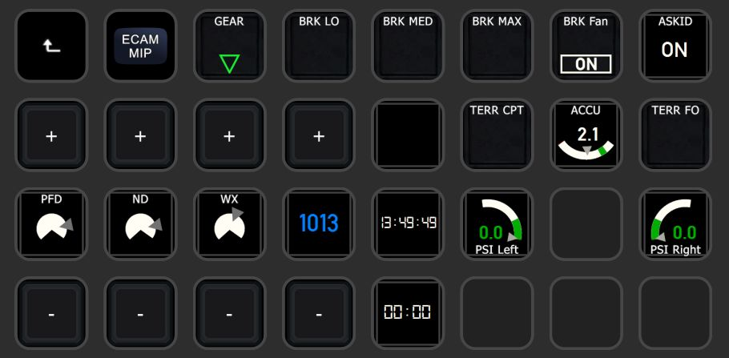

# Pilot's Deck
Directly check & control the FlightSim from your StreamDeck!
  

## Introduction
PilotsDeck is a Plugin for Elegato's StreamDeck with the Ability to **trigger Cockpit-Controls** in different Ways and especially **reading & displaying** a Control's State on the StreamDeck as Text, Image, Bar or Arc. It is lean & mean and flexible. It does not do any fancy Stuff like a PFD - it does exactly what is needed to support smooth Flight Operations 😎 

StreamDeck-wise it behaves like any other StreamDeck Plugin: it runs alongside other Plugins and you can Drag, Drop, Copy, Paste the Actions like any other Action in the StreamDeck Software between your Folders, Pages or even different StreamDecks. The Action Configuration is done through the StreamDeck Software - so you can create, export and share Profiles with the Plugin's Actions.
The Plugin supports different StreamDeck Models: **Mini**, **Standard**/15-Key, **XL**, **Mobile** and **Plus**. Other Models might work, but an indented Support for Non-Display Models is not planned. 

Simulator-wise it supports all major Platforms on **Windows** - **MSFS2020**, **X-Plane 12/11** and **P3D/FSX**. For MS Platforms it connects through **FSUIPC** to the Simulator, for X-Plane it connects directly via UDP Sockets. All Values and Commands these Connections allow are usable with the Plugin. 
It is designed for **advanced Sim-Users** which "know how to do Stuff": It does not explain an "Offset" or "DataRef" for Example. It does not tell you how to trigger the Beacon Lights for a specific Airplane or how to read the State of that Switch. But if you do know that, you can quickly define an Action for that on the Deck. So if you don't: be eager to read & learn and you'll be fine! 😉 
Predefined StreamDeck Profiles are available under [Integrations](Integrations/), but there are not much. Either your Plane is among these for direct Use or they can at least serve as Example:  
 
 

  

### Supported Simulator Versions

| Simulator | Supported | Tested | Requirement |
| :-------------|:-------------:|:-----:|:-----|
| **Flight Simulator 2020** | yes | yes | FSUIPC 7 & MobiFlight WASM |
| Flight Simulator X | yes | no | FSUIPC4 |
| Flight Simulator 2004 | yes | no | FSUIPC 3 |
| **Prepar3D v5** | yes | yes | FSUIPC 6 |
| Prepar3D v4 | yes | no | FSUIPC 5/6 |
| Prepar3D v1-3 | yes | no | FSUIPC 4 |
| **X-Plane 12** | yes | yes | None - does not use XUIPC |
| **X-Plane 11** | yes | yes | None - does not use XUIPC |
| X-Plane <=10 | yes | no | None - does not use XUIPC |

 

### Included StreamDeck Actions
All Actions work on Keypads (the normal/square StreamDeck Buttons). The Dial/Touchpad (aka Encoder) on the SD+ is only supported by some Actions (the ones which make the most Sense). 
On Keypads you can assign **two** different Commands, based on how long you hold it: A **Short**/Normal and **Long** Press (>= 600ms). 
On Encoders you can assign **five** different Commands for each Interaction: **Left** Turn, **Right** Turn, **Touch** Tap and a **Short** & **Long** Press on the Dial. 

|  | Action Name | Keypad / Encoder | Description |
| :---: | :-------------- | :---------: | :----------- |
|  | **Display Value** | Keypad | Display a Sim Variable as Number or Text (display "ON" instead of "1"). You can scale/round/format the Value as needed and customize the Font-Settings. Only for Display. |
|  | **Display Value with Switch** | Keypad / Encoder | Like before, but this Action also sends Commands. |
|  | **Simple Button** | Keypad | Can only send Commands and always shows the same (configurable) Image. But this Action can be used in StreamDeck Multi-Actions! |
|  | **Dynamic Button** | Keypad | This Action dynamically changes the displayed Image based on a Variable (in Addition to sending Commands). Different Values trigger different Images. |
|  | **Korry Button** | Keypad | Intended for Korry-Switches in the Cockpit: the Action displays two "Sub-Images" independently of each other. They are shown/hidden based on their own Variable, but will not change the Image based on the Value. Can be adapted to other Use-Cases. |
|  | **COM Radio** | Keypad / Encoder | Intended for Com Frequencies: the Action shows two different Variables which can be independently scaled/rounded/formatted but share the same Font-Settings. Can be adapted to other Use-Cases. |
|  | **Display Gauge** | Keypad / Encoder | This Actions renders the Value dynamically on a Bar or Arc. Size, Color, Position and Text-Settings can be tweaked. It can optionally send Commands. |
|  | **Display Gauge (Dual)** | Keypad | As before, but it renders two Values dynamically on the same Bar or Arc. |

 

### Supported Sim-Commands & -Variables
Here a quick Overview of what you can send to the Simulator ("Command") or what from what you can read Values from the Simulator ("Variable"). One of the Things which make the Plugin flexible: Variables can also be used as Commands. For Example to move a Cockpit-Control by writing a different Value to a Variable.

| ID | Description | Command | Variable | Simulators               | 
| --- | :------------ | :---: | :---: | :-------------------- | 
| **MACRO** | Execute Macros known to FSUIPC | ✔️ | ✖️ | MSFS*, P3D, FSX |
| **SCRIPT** | Run Lua-Code known to FSUIPC | ✔️ | ✖️ | MSFS, P3D, FSX |
| **CONTROL** | Send a SimEvent defined by its numerical ID (also known as FS-Controls or Control-Codes) | ✔️ | ✖️ | MSFS, P3D, FSX, FS9 |
| **LVAR** | Read from / Write to a Local Variable | ✔️ | ✔️ | MSFS, P3D, FSX |
| **OFFSET** | Read from / Write to a FSUIPC Offset | ✔️ | ✔️ | MSFS, P3D, FSX, FS9 |
| **VJOY** | Toggle/Clear/Set a Button of a virtual Joystick from *FSUIPC* | ✔️ | ✖️ | MSFS, P3D, FSX |
| **VJOYDRV** | Toggle/Clear/Set a Button of a virtual Joystick from the known *vJoy Device Driver* (if installed, no Requirement)  | ✔️ | ✖️ | ALL |
| **HVAR** | Activate a H-Variable in the Simulator | ✔️ | ✖️ | MSFS |
| **CALCULATOR** | Run any Calculator/Gauge Code in the Simulator | ✔️ | ✖️ | MSFS |
| **XPCMD** | Send any Command known to X-Plane | ✔️ | ✖️ | XP |
| **XPWREF** | Read from / Write to a X-Plane DataRef | ✔️ | ✔️ | XP |
| **AVAR** | Read from / Write to a Simulation Variable (also known as A-Var) | ✔️ | ✔️ | MSFS |

How Commands and Variables are defined and the different Options how they are executed can be found under INSERTLINK.
  
