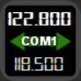
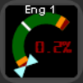

# Pilot's Deck
Directly check & control the FlightSim from your StreamDeck!
  

## 1 - Introduction
PilotsDeck is a Plugin for Elegato's StreamDeck with the Ability to **trigger Cockpit-Controls** in different Ways and especially **reading & displaying** a Control's State on the StreamDeck as Text, Image, Bar or Arc. It is lean & mean, flexible, completely Open-Source and Free-to-Use. It does not do any fancy Stuff like a PFD - it does exactly what is needed to support smooth Flight Operations 😎 

StreamDeck-wise it behaves like any other StreamDeck Plugin: it runs alongside other Plugins and you can Drag, Drop, Copy, Paste the Actions like any other Action in the StreamDeck Software between your Folders, Pages or even different StreamDecks. The Action Configuration is done through the StreamDeck Software - so you can create, export and share Profiles with the Plugin's Actions.
The Plugin supports different StreamDeck Models: **Mini**, **Standard**/15-Key, **XL**, **Mobile** and **Plus**. Other Models might work, but an indented Support for Non-Display Models is not planned. The Plugin runs only on **Windows**. There no Plans for Linux or macOS Support (the first is not supported by StreamDeck at all, both do not run or support all Sims and some essential .NET Libraries are only available on Windows). 

Simulator-wise it supports all major Platforms on Windows - **MSFS2020**, **X-Plane 12/11** and **P3D/FSX**. For MS Platforms it connects through **FSUIPC** to the Simulator, for X-Plane it connects directly via **UDP** Sockets. All Variables and Commands these Connections allow are usable with the Plugin. Not all Variables and Commands require a registered Version of FSUIPC, but a registered (bought) Copy of FSUIPC is recommended to use the full Potential. If you only fly in X-Plane, FSUIPC is not needed at all. 
It is designed for **advanced Sim-Users** which "know how to do Stuff": It does not explain an "Offset" or "DataRef" for Example. It does not tell you how to trigger the Beacon Lights for a specific Airplane or how to read the State of that Switch. But if you do know that, you can quickly define an Action for that on the Deck. So if you don't: be eager to read & learn and you'll be fine! 😉 

Predefined StreamDeck Profiles are available under [Integrations](Integrations/), but there are not much. Either your Plane is among these for direct Use or they can at least serve as Example: 
 
 

  

### 1.1 - Supported Simulator Versions

| Simulator | Supported | Tested | Requirement |
| :-------------|:-------------:|:-----:|:-----|
| **Flight Simulator 2020** | **yes** | **yes** | FSUIPC 7 & MobiFlight WASM |
| Flight Simulator X | yes | no | FSUIPC4 |
| Flight Simulator 2004 | yes | no | FSUIPC 3 |
| **Prepar3D v5** | **yes** | **yes** | FSUIPC 6 |
| Prepar3D v4 | yes | no | FSUIPC 5/6 |
| Prepar3D v1-3 | yes | no | FSUIPC 4 |
| **X-Plane 12** | **yes** | **yes** | None - does not use XUIPC |
| X-Plane 11 | yes | yes | None - does not use XUIPC |
| X-Plane <=10 | yes | no | None - does not use XUIPC |

Supported is understood as "technical and basically supported by the Connection Method". Support in Terms of ensured Compatibility, Fixing Issues and giving Support exists only for the latest Version of the three Major Simulators: MSFS2020, X-Plane 12, P3D v5. I'm happy if it works for older Versions, but I won't make any Effort for them.
  

### 1.2 - Supported Sim-Commands & -Variables
Here a quick Overview of what you can send to the Simulator ("Command") or from what you can read Values from the Simulator ("Variable"). One of the Things which make the Plugin flexible: Variables can also be used as Commands. For Example to move a Cockpit-Control by writing a different Value to a Variable.  
How Commands and Variables are configured and the different Options how they can be executed is described under INSERTLINK. 

| ID | Description | Command | Variable | Simulators               | 
| :---: | :------------ | :---: | :---: | :-------------------- | 
| **MACRO** | Execute any Macro known to FSUIPC | ✔️ | ✖️ | MSFS*, P3D, FSX |
| **SCRIPT** | Run any Lua-Code known to FSUIPC | ✔️ | ✖️ | MSFS, P3D, FSX |
| **CONTROL** | Send any SimEvent defined by its numerical ID (also known as FS-Controls, Control-Codes. Numerical Variant of a K-Variable/K-Event) | ✔️ | ✖️ | MSFS, P3D, FSX, FS9 |
| **LVAR** | Read from / Write to any L-Var ("Local Variable") | ✔️ | ✔️ | MSFS, P3D, FSX |
| **OFFSET** | Read from / Write to any FSUIPC Offset | ✔️ | ✔️ | MSFS, P3D, FSX, FS9 |
| **VJOY** | Toggle/Clear/Set a Button of a virtual Joystick from *FSUIPC* | ✔️ | ✖️ | MSFS, P3D, FSX |
| **VJOYDRV** | Toggle/Clear/Set a Button of a virtual Joystick from the known *vJoy Device Driver* (if installed) | ✔️ | ✖️ | ALL |
| **HVAR** | Activate any H-Variable in the Simulator | ✔️ | ✖️ | MSFS |
| **CALCULATOR** | Run any Calculator/Gauge Code in the Simulator | ✔️ | ✖️ | MSFS |
| **XPCMD** | Send any Command known to X-Plane | ✔️ | ✖️ | XP |
| **XPWREF** | Read from / Write to any X-Plane DataRef | ✔️ | ✔️ | XP |
| **AVAR** | Read from / Write to any Simulation Variable (also known as A-Var) | ✔️ | ✔️ | MSFS |

\* = MSFS does not support Mouse-Macros 
:grey_exclamation: Please mind that the Command Types Script, Macro, Lvar and vJoy can only work with a **registered** Version of FSUIPC! 
:grey_exclamation: Both vJoy Command Types are independent of each other and are two different Things! "VJOY" can only be assigned in FSUIPC (and not in the Simulator). The "VJOYDRV" can be assigned by anything which understands a Joystick Button (Simulator, FSUIPC, Addons, ...).
  

### 1.3 - Available StreamDeck Actions
All Actions work on the Keypads (the normal/square StreamDeck Buttons). The Dial/Touchpad (aka Encoder) on the SD+ is only supported by some Actions (the ones which make the most Sense).  
On Keypads you can assign **two** different Commands, based on how long you hold it: A **Short**/Normal and **Long** Press (>= 600ms). Only one of the available Actions can be put in StreamDeck Multi-Actions. 
On Encoders you can assign **five** different Commands for each Interaction: **Left** Turn, **Right** Turn, **Touch** Tap and a **Short** & **Long** Press on the Dial. The Actions can be put in StreamDeck Encoder-Stacks, but will then lose their Short/Long Press Function.  
How these Actions can be configured and customized is described under INSERTLINK. 

|  | Action Name | Keypad / Encoder | Description |
| :---: | :-------------- | :---------: | :----------- |
|  | **Display Value** | Keypad | Display a Sim Variable as Number or Text (display "ON" instead of "1"). You can scale/round/format the Value as needed and customize the Font-Settings. Only for Display. |
|  | **Display Value with Switch** | Keypad / Encoder | Like before, but this Action also sends Commands. |
|  | **Simple Button** | Keypad | Can only send Commands and always shows the same (configurable) Image. Supported in StreamDeck Multi-Actions! |
|  | **Dynamic Button** | Keypad | This Action dynamically changes the displayed Image based on a Variable (in Addition to sending Commands). Different Values trigger different Images. |
|  | **Korry Button** | Keypad | Intended for Korry-Switches in the Cockpit: the Action displays two "Sub-Images" independently of each other. They are shown/hidden based on their own Variable, but will not change the Image based on the Value. Can be adapted to other Use-Cases. |
|  | **COM Radio** | Keypad / Encoder | Intended for Com Frequencies: the Action shows two different Variables which can be independently scaled/rounded/formatted but share the same Font-Settings. Can be adapted to other Use-Cases. |
|  | **Display Gauge** | Keypad / Encoder | This Actions renders the Value dynamically on a Bar or Arc. Size, Color, Position and Text-Settings can be tweaked. It can optionally send Commands. |
|  | **Display Gauge (Dual)** | Keypad | As before, but it renders two Values dynamically on the same Bar or Arc. |

 

### 1.4 - Installation & Requirements
The best Way to Install and Update the Plugin is via the **Installer**: Download, Execute and click Install! It will check the Requirements, informs & links what it missing and installs the Plugin in the correct Space if the Requirements are met (the StreamDeck Software will be automatically stopped). 
It is highly likely that you need to **Unblock/Exclude** the Installer & Plugin from BitDefender and other AV-/Security-Software. It's the number one Reason for "the Plugin is not working"-Issues. 
If it still does not work right or at all, please check INSERTLINK.  
The Requirements for the Plugin to run:
- Windows **10** or **11** (updated)
- [**StreamDeck Software v6**](https://www.elgato.com/downloads)
- [**.NET 7**](https://dotnet.microsoft.com/en-us/download/dotnet/7.0) x64 Runtime (Core + Desktop) installed & updated
- If not X-Plane only: The **latest** Release of the [**FSUIPC**](http://fsuipc.com/) Major Version specific to your Simulator (e.g. FSUIPC 7 for MSFS2020)
- If MSFS is installed: The **latest** Release of the WASM-Module from [**MobiFlight**](https://github.com/MobiFlight/MobiFlight-WASM-Module) installed in your Community-Folder
- Optional: If you want to use VJOYDRV Commands you need Version [v2.2.1.1](https://github.com/njz3/vJoy/releases/tag/v2.2.1.1) for Windows 10 and Version [2.1.9.1](https://github.com/jshafer817/vJoy/releases/tag/v2.1.9.1) for Windows 11. It is not checked by the Installer (since it is not a Requirement for the Plugin).

  
If you want to install it manually (not recommened), just put the Contents of the Zip in your Plugin-Folder under

 > **%appdata%\Elgato\StreamDeck\Plugins**

When Updating manually, delete all Binaries/Libraries in the Plugin's Folder before unzipping. 
If you don't know what that means, what to do and what Software Versions you have installed: Use the Installer!!! 😅 
(Number 2 & 3 Reasons the Plugin is not working: Missing/outdated Requirements and wrong Location)
